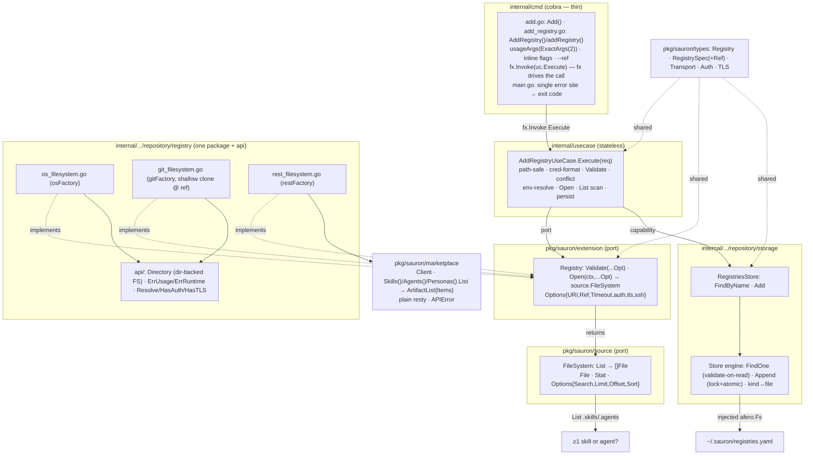

# Implementation Plan — Add Registry

Implementation plan for the [Add Registry](spec.md) feature, **aligned to the
code as built**. It captures **what** was delivered, **how** the pieces fit, and
the **status** of each checkpoint — not the code itself. It conforms to the
[architecture contract](../contracts/architecture.md), the
[CLI contract](../contracts/cli.md), and the
[state data contract](../contracts/state.md), and realizes the
[`add registry` command contract](contracts/add-registry.md), the
[HTTP Registry API](../contracts/registry-http-api.oas3.yaml), and the
[git](capabilities/git.md) / [http](capabilities/http.md) /
[filesystem](capabilities/filesystem.md) transport capabilities.

## 1. Goal & scope

`sauron add registry` registers a named source (`<name> <uri>` + `--kind` +
auth/TLS/timeout flags, and **`--ref` for git**), proves it is reachable **and
hosts ≥1 skill or agent**, and appends one `Registry` document to
`registries.yaml` atomically. All three transports (filesystem, http, git) ship,
git honoring `--ref`, and the black-box `test/e2e` BDD suite covers every
`add registry` scenario.

The feature also established the foundations every later feature reuses: the
`extension.Registry` transport port (returning a `source.FileSystem` content
view), the `pkg/sauron/marketplace` REST client, the storage engine + typed
`RegistriesStore`, the `usecase.Error{Type,Reason}` model, and the wired
`internal/cmd` command surface.

**Delivered (this feature):**

- Registration across the three transports + the git `--ref` pin, the presence
  scan, atomic persistence, and the e2e suite.

**Out of scope — deferred to later features (YAGNI):**

- Browsing and downloading registry content. This feature only proves presence
  (a listing); it computes no per-artifact metadata, digest, or `version`. The
  persisted `spec.ref` records the resolution point for later use.
- The `Skill` / `Agent` / `Persona` / `Provider` / `Schedule` stores, and
  `List` / `Remove` on the registries store.
- Result `total` / pagination: the listing returns items only (Zalando #254 — no
  total count); `add` reads `len(items) > 0`.

## 2. Pre-requirements

Before executing the tasks in [TASKS.md](TASKS.md):

- **Toolchain** — Go `1.26`, the [Task](https://taskfile.dev) runner, a
  `CGO_ENABLED=0` build; `golangci-lint`, `gofmt`, and `trivy` for the gates.
- **Specification surface** — the contracts this plan realizes are in place: the
  [`add registry` command contract](contracts/add-registry.md), the
  [git](capabilities/git.md) / [http](capabilities/http.md) /
  [filesystem](capabilities/filesystem.md) capabilities, the
  [HTTP Registry API](../contracts/registry-http-api.oas3.yaml), and the
  [state data contract](../contracts/state.md) plus the `Registry` JSON schema
  under [`schemas/`](../contracts/schemas/).
- **Approved dependencies** — `go-git/v5`, `google/jsonschema-go`, and
  `go-resty/resty/v2` are on the
  [architecture contract](../contracts/architecture.md) approved list.
- **Existing scaffolding** — the cobra root command, the uberfx wiring
  (`NewFxOptions` per module, the `NewApp` bootstrap, the pond pool), the
  `internal/config` home resolution, and the zap+ECS telemetry, as fixed by the
  architecture contract.
- **Integration tooling** — the `test/e2e` module's godog + testcontainers stack
  for `task gate-integration`; its git scenarios run on a Linux runner.

## 3. Component & dependency flow (as built)



Two content views never mix: the storage engine's **home-rooted `afero.Fs`** for
`~/.sauron/*.yaml` (fx-injected by `newFilesystem`), and the per-call
**registry-content `source.FileSystem`** the `Registry` port returns — a
`Directory` over a git shallow-clone (checked out at `Ref`) or a local dir, or a
[Registry HTTP API](../contracts/registry-http-api.oas3.yaml) client.

## 4. Runtime sequence

```text
User                 cmd           UseCase           Registry       FileSystem        Store
  │                   │               │                  │               │              │
  │ add registry (1)  │               │                  │               │              │
  │───────────────────▶               │                  │               │              │
  │                   │ Execute(req)  (2)                │               │              │
  │                   │───────────────▶                  │               │              │
  │                   │               │                  │               │              │
  │                   │               │ Validate(opts)   │               │              │
  │                   │               │──────────────────▶               │              │
  │                   │               ◀─ ─ ─ ─ ─ ─ ─ ─ ─ │ ok            │              │
  │                   │               │ FindByName(name) │               │              │
  │                   │               │─────────────────────────────────────────────────▶
  │                   │               ◀─ ─ ─ ─ ─ ─ ─ ─ ─ ─ ─ ─ ─ ─ ─ ─ ─ ─ ─ ─ ─ ─ ─ ─ ─│ nil
  │                   │               │ Open(ctx, ref)   │               │              │
  │                   │               │──────────────────▶               │              │
  │                   │               ◀─ ─ ─ ─ ─ ─ ─ ─ ─ │ source.FS     │              │
  │                   │               │ List(roots, 1)   │               │              │
  │                   │               │──────────────────────────────────▶              │
  │                   │               ◀─ ─ ─ ─ ─ ─ ─ ─ ─ ─ ─ ─ ─ ─ ─ ─ ─ │ files        │
  │                   │               │ Add(registry)    │               │              │
  │                   │               │─────────────────────────────────────────────────▶
  │                   │               ◀─ ─ ─ ─ ─ ─ ─ ─ ─ ─ ─ ─ ─ ─ ─ ─ ─ ─ ─ ─ ─ ─ ─ ─ ─│ ok
  │                   │               │                  │               │              │
  │                   ◀─ ─ ─ ─ ─ ─ ─ ─│ stdout           │               │              │
  ◀─ ─ ─ ─ ─ ─ ─ ─ ─ ─│ exit 0        │                  │               │              │
```

Solid `──▶` is a synchronous call, dashed `◀─ ─` a return. The pipeline stops at
the first failing step, with the exit code shown.

- `(1)` `sauron add registry --kind git --ref release-2.0 acme <uri> --username ${env:VAR}`
- `(2)` `cmd` runs it via `NewApp(ctx, fx.Invoke(uc.Execute))` — fx drives the call;
  the use case is never extracted and hand-invoked. `roots` = `.skills` + `.agents`.
- path-safe `name` + credentials-are-`${env:VAR}` — invalid -> **usage (2)**
- `Validate(opts)` — flags inapplicable to the transport (`--ref` on http/fs) -> **usage (2)**
- `FindByName` — name already exists -> **conflict (1)**
- resolve `${env:VAR}` — unset -> **unreachable (1)**
- `Open` — unreachable / auth / bad ref -> **unreachable (1)**; git shallow-clones at
  the ref, fs opens the directory, http connects the REST API
- `List(roots, 1)` — no entries -> **unreachable (1, "hosts no artifact")**
- `Add` — lock + atomic append to `~/.sauron/registries.yaml`; write error -> **io (1)**
- success -> writes `registered registry "acme" (git)` to stdout, **exit 0**


## 5. Interfaces (as built)

```go
// pkg/sauron/types — RegistrySpec carries Ref (git only; persisted; omitempty).
type RegistrySpec struct {
    Transport Transport `json:"transport" yaml:"transport"`
    URI       string    `json:"uri" yaml:"uri"`
    Ref       string    `json:"ref,omitempty" yaml:"ref,omitempty"`
    Auth      *Auth     `json:"auth,omitempty" yaml:"auth,omitempty"`
    TLS       *TLS      `json:"tls,omitempty" yaml:"tls,omitempty"`
    SSHKey    string    `json:"sshKey,omitempty" yaml:"sshKey,omitempty"`
    Timeout   string    `json:"timeout,omitempty" yaml:"timeout,omitempty"`
}

// pkg/sauron/source — the cross-transport content view this feature relies on.
type FileSystem interface {
    List(ctx context.Context, uri string, opts ...Option) ([]File, error)
    // the port declares further read methods not exercised by this feature
}
type File interface { Stat; Read(ctx context.Context) (io.ReadCloser, error) }
type Stat interface { Name() string; IsDirectory() bool; Size() int64; Version() string }
type Options struct { Search *string; Limit, Offset *int64; Sort *string }

// pkg/sauron/extension — the transport port.
type Registry interface {
    Validate(opts ...Option) error                                  // inapplicable flags → usage
    Open(ctx context.Context, opts ...Option) (source.FileSystem, error) // construct + reach → runtime
}
type Options struct {
    URI, Ref                      string
    Timeout                       time.Duration
    Username, Password, SSHKey    string
    SkipTLSVerify                 bool
    CACert, ClientCert, ClientKey string
}

// pkg/sauron/marketplace — fluent, plain-resty client of the HTTP Registry API.
type Client interface { Skills() ArtifactClient; Agents() ArtifactClient; Personas() ArtifactClient }
type ArtifactClient interface { List(ctx context.Context, opts ...ListOption) (*ArtifactList, error) }
type ArtifactList struct { Items []ArtifactSummary } // no total (Zalando #254)
// + APIError + IsNotFound/IsUnauthorized/IsForbidden/IsBadRequest, sentinels ErrInvalidConfig/ErrTransport.

// internal/.../storage — engine over yaml.Node + typed facade.
func (s *Store) FindOne(ctx, kind, name string) (*yaml.Node, error) // nil if absent; validate-on-read
func (s *Store) Append(ctx, kind string, doc *yaml.Node) error      // lock + atomic; no re-validation
type RegistriesStore interface {
    FindByName(ctx context.Context, name string) (*types.Registry, error)
    Add(ctx context.Context, r types.Registry) error // stamps APIVersion + Kind=Registry
}

// internal/usecase
type Error struct { Type, Reason string } // cmd maps Type → exit code; Reason → stderr
// Type ∈ {usage,conflict,unreachable,validation,io};  cmd: usage → 2, else → 1
```

## 6. Delivered file layout

### `pkg/sauron/`
| Path | Holds |
|---|---|
| `types/registry.go` (+ `manifest.go`, `skill.go`, `agent.go`, `persona.go`, `provider.go`, `schedule.go`) | domain & manifest types; `RegistrySpec.Ref` added |
| `source/source.go` (+ `mock_based_file_system.go`) | the `FileSystem`/`File`/`Stat` port, `Options`/`WithX`, `ErrNotImplemented` |
| `extension/registry.go` (+ `mock_based_registry.go`, `provider.go`, `doc.go`) | `Registry{Validate,Open→source.FileSystem}`, `Options`/`WithX` |
| `marketplace/{client,resources,types,options,errors}.go` (+ `mock_based_client.go`, `doc.go`) | the List-only resty client + `APIError` |
| `telemetry/fields.go` | standard ECS field-key constants |

### `internal/`
| Path | Holds |
|---|---|
| `infrastructure/repository/registry/{os,git,rest}_filesystem.go` (+ `fx.go`, `doc.go`) | the three `extension.Registry` adapters as one package; `fx.go` provides them named `registry.filesystem|git|http` |
| `infrastructure/repository/registry/api/{directory,errors,options,doc}.go` | shared `Directory` (dir-backed `source.FileSystem`), `ErrUsage`/`ErrRuntime`, `Resolve`/`HasAuth`/`HasTLS` |
| `infrastructure/repository/storage/{store,registries_store,schema,lock,filesystem,fx}.go` (+ `mock_based_registries_store.go`) | the engine + typed `RegistriesStore`; `go:embed schemas/*.json` validate-on-read |
| `usecase/{usecase_add_registry,api,fx}.go` | `AddRegistryUseCase` (+ methods) / `AddRegistryRequest`; `Error` model |
| `cmd/{add,add_registry,helper,helper_flags,helper_fx,root}.go` | `Add()` group, `AddRegistry()` builder + `addRegistry()` handler (fx.Invoke), `usageArgs`, `kindFlags`, `exitCode` |
| `telemetry/fields.go` | `sauron.registry.*` ECS custom keys |
| `cmd/main.go` (repo root) | the single error site: one `error: <msg>` line + `cmd.ExitCode(err)` |

### Build & governance
| File | State |
|---|---|
| `go.mod` | `go-git/v5`, `go-resty/resty/v2`, `google/jsonschema-go` (direct) |
| `Taskfile.yml` | `generate` target stages `spec/contracts/schemas/*.json` → `storage/schemas/`; `test`/`build` depend on it |
| `.gitignore` | ignores `internal/infrastructure/repository/storage/schemas/` (generated) |

## 7. Checkpoints

Ordered, verifiable milestones — each met when its single command passes (these
back the tasks in [TASKS.md](TASKS.md)):

| Milestone | Verify |
|---|---|
| Deps added + schemas staged | `task generate && go build ./...` |
| `RegistrySpec.Ref` round-trips | `go test ./pkg/sauron/types/...` |
| `source` + `extension` ports + mocks | `go build ./pkg/... && go test ./pkg/sauron/source/... ./pkg/sauron/extension/...` |
| Registry adapters (os/git/rest + `api`) | `go test ./internal/infrastructure/repository/registry/...` |
| Marketplace client | `go test ./pkg/sauron/marketplace/...` |
| Storage engine + `RegistriesStore` | `go test ./internal/infrastructure/repository/storage/...` |
| Use-case pipeline + `Error` classes | `go test ./internal/usecase/...` |
| cmd surface + exit-code mapping | `go test ./internal/cmd/...` |
| Lint / format / coverage / security | `task gate-lint && task gate-coverage && task gate-security` |
| e2e scenarios | `task build && task gate-integration` |
| Full gate | `task all` |

## 8. Tasks

The work is split into independently **verifiable** tasks in
[TASKS.md](TASKS.md) — each names the files it owns and the single command that
confirms it. Dependency order:

`T1 deps → T2 types → T3 ports → T5 marketplace → T4 adapters`; `T6 storage` runs
alongside; then `→ T7 use case → T8 cmd → T9 e2e → T10 full gate`.

Executed sequentially in the working tree with no commits — the chain depends on
uncommitted work, so git-worktree isolation (which branches from the last commit)
was not used.

## 9. Testing

### Unit
- **Arrange / Act / Assert**, table-driven; `testify` `assert`/`require`;
  `MockBased<Iface>` beside each interface (`source`, `extension`, `marketplace`,
  `storage`).
- No real filesystem (storage/adapters over `afero.MemMapFs`; the http client and
  adapter over `httptest`), no env mutation (the env-ref resolver is exercised
  with `t.Setenv`, process-scoped), no real network. `--ref` is covered by cloning
  a local fixture repo at a seeded ref.
- Coverage target 90%, floor 80% (`task gate-coverage`, currently 88.9%).

### Integration / end-to-end (`test/e2e`, own module)
godog under `go test` (strict mode, host vs docker-compose runtime, graybox via
`SAURON_BIN`, state read-back via `pkg/sauron/types.Registry`,
`depguard`-restricted to `pkg/`). See
[`sauron-implementing-integration-tests`](../../.claude/skills/sauron-implementing-integration-tests/SKILL.md).

| Requirement | Scenario | File |
|---|---|---|
| FR-001/FR-005 (register + report) | filesystem from a local folder; from authored content | `add_registry_filesystem.feature` |
| FR-004/FR-010 (hosts no artifact → runtime error) | fails when empty | `add_registry_filesystem.feature` |
| FR-001 (http) | http registry served by the Registry HTTP API | `add_registry_http.feature` |
| FR-003/FR-011 (env-ref secret, persisted not resolved) | http behind basic auth, secret stored as a reference | `add_registry_http.feature` |
| FR-001 (git over ssh) + FR-013 (ref pin) | git over ssh; git pinned to `v1.0.0` asserting `spec.ref` | `add_registry_git.feature` |
| Root banner | reports build identity | `version.feature` |

Fixtures (under `test/e2e/internal/runtime/docker/`): `git.go` — an sshd git
server (testcontainers; seeds a repo with a non-default tag `v1.0.0` for the ref
scenario); `source.go` — the http source serving the Registry HTTP API (`/skills`,
`/agents` as `{items}` JSON, Basic auth). Git scenarios are gated to the Linux
runner via `gitScenarioTags()`.

**Run:** `task build && task gate-integration`.

## 10. Key decisions

1. **One registry package + `api`.** The three adapters live in a single
   `registry` package (one file per transport); shared primitives — the `Directory`
   `source.FileSystem`, the `ErrUsage`/`ErrRuntime` classes, the option helpers —
   live in `registry/api`, imported by the adapters and (for classification) the
   use case.
2. **`extension.Registry` returns `source.FileSystem`.** `Open` proves
   reachability; the use case depends on the two ports (DIP), not on go-git /
   resty / the OS filesystem.
3. **`source.FileSystem` is the List-based content seam (total-free).**
   `List → ([]File, error)` (no total count — Zalando #254); the presence scan is
   `List(".skills"/".agents", limit:1)`, reused across all three transports.
4. **`http` transport = the Registry HTTP API**, consumed through the fluent
   `pkg/sauron/marketplace` client (plain resty). Pagination follows Zalando — `q`
   filter, `limit`/`offset`, sort — and **carries no total count** (#254). The
   adapter is a thin map from the client to `source.FileSystem`.
5. **Git `--ref`** — a branch, tag, or commit; absent → the remote's default
   branch. The git adapter does a **shallow clone (depth 1)** checked out at the
   ref (sufficient because only `List` is read); an unresolvable ref is a runtime
   error. `spec.ref` is persisted (configuration, not a secret); per-artifact
   version pinning is out of scope.
6. **Secrets** — credentials must be `${env:VAR}` references (a literal → usage);
   refs are persisted verbatim, resolved only into `Options` for connecting, and an
   unset variable at connect time is a runtime error. Never written to disk.
7. **Store engine + typed facade** — `Store` (kind-agnostic, `yaml.Node`,
   multi-doc, validate-on-read against the embedded JSON schema, lockfile + atomic
   temp+rename) over the home `afero.Fs`; `RegistriesStore` is the typed, mockable
   facade. Validation on load, not on app-authored writes.
8. **Error model** — `usecase.Error{Type,Reason}`; adapters/storage return
   `api`/sentinel errors, the use case classifies, `cmd/main.go` is the **single
   error site** (one `error: <reason>` line + `usage → 2, else → 1`).
9. **cmd shape** — verb-named: `Add()` group, `AddRegistry()` builder,
   `addRegistry()` handler. The handler builds the request and runs it via
   `fx.Invoke(uc.Execute)` — fx drives the call; the use case is never extracted
   and hand-invoked. Flags bind inline in the builder; `usageArgs(cobra.ExactArgs(2))`
   classifies a wrong arg count as a usage error.
10. **ECS logging** — custom log fields are namespaced under `sauron.*`
    (`sauron.registry.name`, `sauron.registry.transport`) via `telemetry`
    constants, never bare keys.
11. **Positional `<name> <uri>`** — the command contract is authoritative; the
    e2e harness was corrected to match it.
