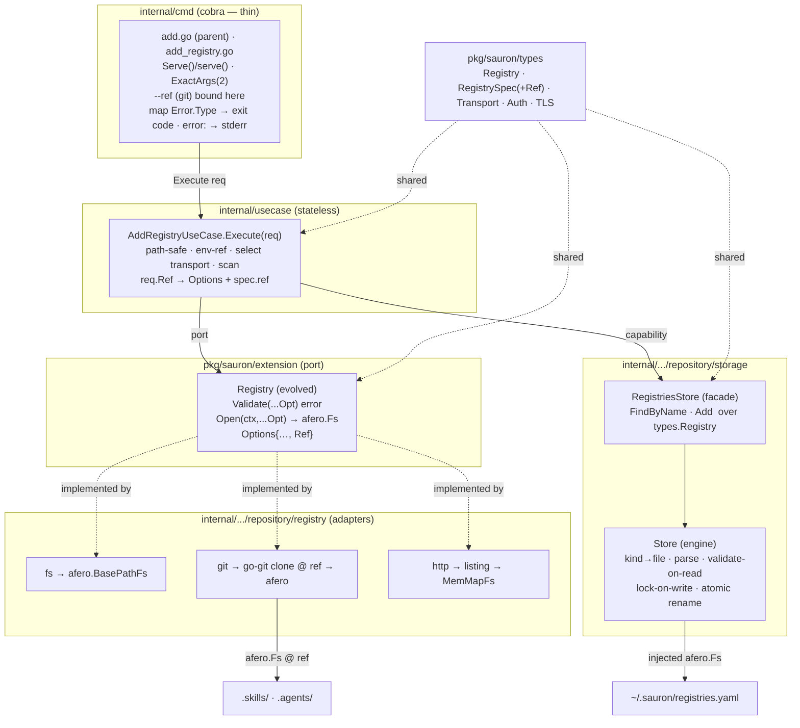
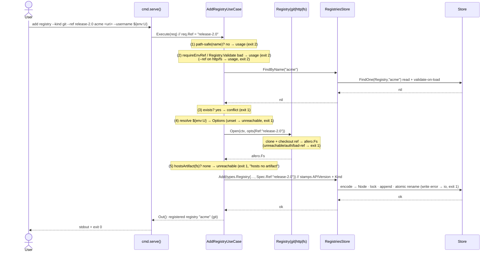
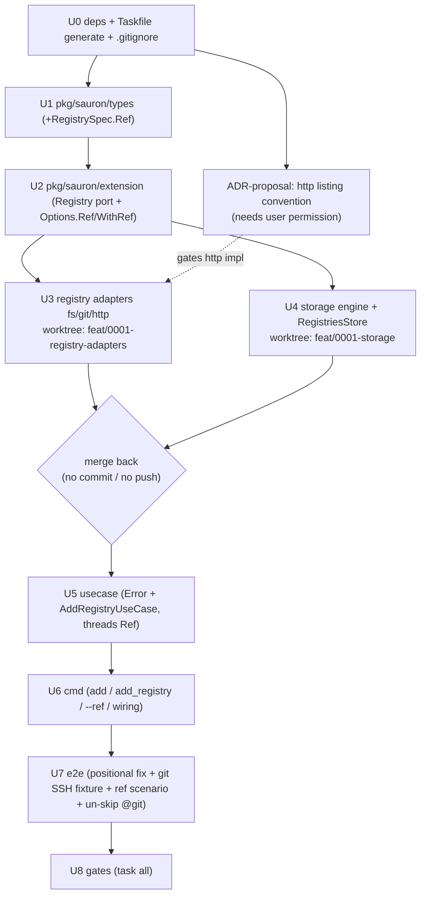

# Implementation Plan — Add Registry

Implementation plan for the [Add Registry](spec.md) feature. It captures **what**
changes, **how** the pieces fit, and the **execution** order — not the code
itself. It conforms to the [architecture contract](../contracts/architecture.md),
the [CLI contract](../contracts/cli.md), and the
[state data contract](../contracts/state.md), and realizes the
[`add registry` command contract](contracts/add-registry.md) and the
[git](capabilities/git.md) / [http](capabilities/http.md) /
[filesystem](capabilities/filesystem.md) transport capabilities.

> **This is a rewrite.** It is aligned to the repository as it stands after the
> *repository/artifact-model* refactor and the *integration-test bootstrap*, and
> to the **git `--ref` flag** added across the spec/contract surface in this
> change. It states precisely what is **done**, what must be **added / renamed /
> removed**, and covers the `test/e2e` suite in full.

## 0. What changed in this revision (delta vs. the prior draft)

1. **Git `--ref` flag.** A git registry may be pinned to a ref — a branch, tag,
   or commit — persisted as `spec.ref` and resolved at every later read. The
   spec/contract surface is **already updated** (see §5 *Spec & contract*):
   `spec.md` FR-013, `git.md` FR-007/FR-008, the command contract, the state
   contract, the `Registry` JSON schema, the `AUTHORING.md` glossary (`ref`), the
   `0001` field-realization table, and the `list`/`describe` `--fields` sets.
2. **`pkg/sauron/types` is no longer fully DONE.** `RegistrySpec` gains one field
   — `Ref string` — so the types package moves from **verify-only** to **EDIT**.
3. **Audit reconciliation.** Against the current tree, every other "already in
   place" claim holds (types, `usecase/api.go`, the `Store` skeleton +
   `newFilesystem`, the empty registry `fx.go`, the `Name()/Ping()` extension
   port, the `cmd` bootstrap, and the full `test/e2e` harness with the
   `--name/--uri` divergence and the `~@git` filter). The new go-git /
   jsonschema-go deps and the `generate` target / `.gitignore` entry are genuinely
   absent — already marked **NEW/EDIT** below, not regressions.

## 1. Goal & scope

Implement `sauron add registry`: register a named source (`<name> <uri>` +
`--kind` + auth/TLS/timeout flags, and **`--ref` for git**), prove it is reachable
**and hosts ≥1 skill or agent**, and append one `Registry` document to
`registries.yaml` atomically. Establish the foundations every later feature
reuses: the `extension.Registry` transport port (producing an `afero.Fs` content
view), the storage engine + typed `RegistriesStore`, the `usecase.Error{Type,Reason}`
model, and the wired `internal/cmd` command surface. **All three transports
(filesystem, http, git) ship working** — git honoring `--ref` — and the black-box
`test/e2e` BDD suite goes green for every `add registry` scenario.

**Already in place (no work, or verify-only):**

- `pkg/sauron/types` — `Registry`, `RegistrySpec` (`Transport`, `URI`, `Auth`,
  `TLS`, `SSHKey`, `Timeout`), `Auth`, `TLS`, `Transport` (+consts), `TypeMeta`,
  `Metadata`, `Kind*` constants — **present and schema-faithful**, **except** the
  new `Ref` field (this change). No generic `Manifest[S]`; the repo models each
  document as a concrete typed struct embedding `TypeMeta`.
- `internal/usecase/api.go` — `Request`, `UseCase[R]`, `Action[R,P]` — present
  (no `Error` type yet).
- `internal/infrastructure/repository/storage` — `Store` **skeleton** (`{fs}` +
  `NewStore`), `newFilesystem` (home-rooted `afero.BasePathFs`), and `fx.go`
  (`NewFxOptions` providing `NewStore` + `newFilesystem`).
- `internal/infrastructure/repository/registry` — `fs/`, `git/`, `http/` exist as
  `doc.go`-only placeholders; `fx.go` is an empty `fx.Options()`.
- `pkg/sauron/extension` — `registry.go` defines `Registry{Name(),Ping()}`;
  `provider.go` defines `Provider{Name(),Available()}`. No `Options`/`Option`,
  no mock.
- `internal/cmd` — `root.go` (`New`), `helper_flags.go` (`timeoutFlags` + the
  listing/paging/dry-run groups), `helper.go`, `helper_fx.go`. No `add.go`.
- **`test/e2e` harness — 100% built.** godog runner (strict, `~@git` filter,
  host vs docker-compose runtime), all six controllers, the source/content/
  resolve fixtures, and `state_controller.go` (reads `registries.yaml` back and
  decodes via `pkg/sauron/types.Registry`). Feature files exist for filesystem,
  http, git, and version. Only the **production command**, the **git SSH
  fixture**, and the **`--ref` scenario** are missing.

**Out of scope (YAGNI):**

- Digest & version computation (needed by `install` / `list catalogue`, not by
  `add`). The persisted `spec.ref` *defines the resolution point* those later
  features read against ([git.md](capabilities/git.md) FR-005, FR-003), but `add`
  computes no digest/version.
- The `Skill` / `Agent` / `Persona` / `Provider` / `Schedule` **stores**, and
  `List` / `Remove` on the registries store (arrive with 0002 / 0004). The
  `track`/`settings` files stay untouched.
- A reusable `ScanRegistryAction` — the `.skills`/`.agents` scan is a use-case
  helper for now; it graduates to an `Action` when `list catalogue` / `install`
  need richer enumeration.
- Full HTTP/git **content download** (file bodies). For `add`, each transport's
  `afero.Fs` need only expose enough to enumerate `.skills/`/`.agents/` and detect
  ≥1 artifact; lazy/full content read is an `install`-time concern. (Git's clone
  is checked out **at the resolved ref**, so the presence scan already reflects
  the pin.)
- An **artifact-level** `--ref` / per-artifact version pin — not in scope and
  **not reserved** (YAGNI); the registry-level `spec.ref` is the only pin. See
  [artifact-versioning.md](../0006-install-artifacts/capabilities/artifact-versioning.md).

## 2. Component & dependency flow



Two distinct `afero.Fs` are in play and never mix: the engine's **home-rooted**
fs for `~/.sauron/*.yaml` (fx-injected, already provided by `newFilesystem`), and
the per-call **registry-content** fs the `Registry` port produces (git temp clone
**checked out at `Ref`** / fs base path / http listing into a MemMapFs).

## 3. Runtime sequence



## 4. Interfaces (final)

`pkg/sauron/types` needs **one field added** — `RegistrySpec.Ref` — see
[`registry.go`](../../pkg/sauron/types/registry.go); everything else is unchanged.

```go
// pkg/sauron/types — RegistrySpec gains Ref (git only; persisted; omitempty).
type RegistrySpec struct {
    Transport Transport `json:"transport" yaml:"transport"`
    URI       string    `json:"uri" yaml:"uri"`
    Ref       string    `json:"ref,omitempty" yaml:"ref,omitempty"` // NEW — git ref (branch/tag/commit)
    Auth      *Auth     `json:"auth,omitempty" yaml:"auth,omitempty"`
    TLS       *TLS      `json:"tls,omitempty" yaml:"tls,omitempty"`
    SSHKey    string    `json:"sshKey,omitempty" yaml:"sshKey,omitempty"`
    Timeout   string    `json:"timeout,omitempty" yaml:"timeout,omitempty"`
}
```

```go
// pkg/sauron/extension — the Registry port is EVOLVED IN PLACE (name kept; the
// architecture contract fixes the port name as "Registry"). The old Name()/Ping()
// shape is removed: Ping is subsumed by Open (opening proves reachability), and a
// transport adapter carries no stable identity.
type Options struct {
    URI                string
    Ref                string // git ref (branch/tag/commit); empty → default branch
    Timeout            time.Duration
    Username, Password string // RESOLVED values, for connecting only — never persisted
    SSHKey             string
    SkipTLSVerify      bool
    CACert, ClientCert, ClientKey string
}
type Option func(*Options) // WithURI, WithRef, WithTimeout, WithBasicAuth, WithSSHKey, WithTLS…

// Registry is one transport's seam: validate flag-appropriateness, then open a
// read-only afero.Fs view of the source's content. One implementation per
// transport (fs/git/http).
type Registry interface {
    Validate(opts ...Option) error                            // inapplicable flags → usage (exit 2)
    Open(ctx context.Context, opts ...Option) (afero.Fs, error) // construct + reach → runtime (exit 1)
}
```

*What `Registry` contributes (SOLID/DRY):* **DIP** — the use case depends on this
port, not on go-git / net/http / the OS filesystem, and selects an implementation
by `--kind`. **ISP** — two cohesive methods, nothing a transport doesn't need.
The `afero.Fs` return is the **DRY pivot**: the artifact-presence scan
(`.skills`/`.agents`) is written once over an `afero.Fs` and reused by every
transport and by every later feature (`list catalogue`, `install`). `Ref` rides on
`Options`: only the git adapter reads it, and the git adapter's `Validate` is the
single place that rejects `--ref` on a non-git transport (usage, exit 2).

```go
// internal/infrastructure/repository/storage
//
// Store — the kind-agnostic file ENGINE (evolves the existing skeleton): kind→file
// map, multi-document stream parse, validate-on-read against the embedded JSON
// schema, lockfile-serialized writes, atomic temp+rename. Operates on yaml.Node so
// pkg/ types never couple to the engine.
type Store struct { /* fs afero.Fs; lock; validator */ }
func (s *Store) FindOne(ctx context.Context, kind, name string) (*yaml.Node, error) // nil if absent; validates on read
func (s *Store) Append(ctx context.Context, kind string, doc *yaml.Node) error      // lock + atomic; no re-validation

// RegistriesStore — typed, use-case-facing facade over Store for the Registry kind.
type RegistriesStore interface {
    FindByName(ctx context.Context, name string) (*types.Registry, error) // nil if absent
    Add(ctx context.Context, r types.Registry) error                      // stamps APIVersion + Kind=Registry
}
```

```go
// internal/usecase (added to api.go)
type Error struct { Type, Reason string } // cmd maps Type → exit code; Reason → stderr
func (e *Error) Error() string { return e.Reason }
// Type ∈ {"usage","conflict","unreachable","validation","io"};  cmd: usage → 2, else → 1
```

## 5. Affected files

Legend: **DONE** = exists as needed, no change. **EDIT** = modify in place.
**NEW** = create. **RENAME/REMOVE** = as noted.

### Spec & contract — **DONE in this change**

These were edited as part of this revision (the source of truth the code below
realizes); no further spec work remains:

| File | Change |
|---|---|
| `spec.md` | FR-013 (Optional) — `--ref` for git, persisted as `spec.ref`. |
| `capabilities/git.md` | FR-007 (resolve from ref / default branch), FR-008 (unresolvable ref → runtime error). |
| `contracts/add-registry.md` | `--ref <ref>` in the synopsis + flags table (git only). |
| `../contracts/state.md` | `Registry` per-kind: `spec.ref` semantics (git only, default-branch fallback). |
| `../contracts/schemas/Registry.schema.json` | optional `ref` string property on `spec`. |
| `../AUTHORING.md` | glossary term `ref` (canonical vocabulary). |
| `data/state.md` | field-realization row `spec.ref` → FR-013. |
| `../0002-list-registries/contracts/list-registries.md` | `ref` added to `--fields` valid set. |
| `../0003-describe-registry/contracts/describe-registry.md` | `ref` added to `--fields` valid set. |
| `../0006-install-artifacts/capabilities/artifact-versioning.md` | Notes disambiguate registry-level `spec.ref` (v1) from a future artifact-level pin. |

### `pkg/sauron/types/` — **EDIT**

| File | Change |
|---|---|
| `registry.go` | **EDIT** — add `Ref string` (`json/yaml:"ref,omitempty"`) to `RegistrySpec`, between `URI` and `Auth`. |
| `registry_test.go` (or equivalent) | **EDIT/NEW** — round-trip a `Registry` with `Spec.Ref` set and unset (omitempty). |
| `manifest.go`, `doc.go` | **DONE** — `TypeMeta`/`Metadata`/`Kind*`; no `Manifest[S]`. |

### `pkg/sauron/extension/` — **EDIT**

| File | Change |
|---|---|
| `registry.go` | **EDIT** — remove `Registry{Name(),Ping()}`; define `Registry{Validate,Open}` plus `Options` (incl. `Ref`) and `Option` (+`WithRef` and the other `With*` constructors). |
| `mock_based_registry.go` | **NEW** — `MockBasedRegistry` (testify) beside the interface, for use-case tests. |
| `provider.go` | **DONE** — untouched. |

### `internal/infrastructure/repository/registry/` — **NEW/EDIT**

| File | Change |
|---|---|
| `fs/factory.go` (+`fs/factory_test.go`) | **NEW** — `extension.Registry`; `Validate` rejects auth/tls/ssh **and `--ref`**; `Open` = `afero.NewBasePathFs(OsFs, uri)` + existence/readability check. |
| `git/factory.go` (+test) | **NEW** — `extension.Registry`; `Validate` accepts ssh/auth/tls **and `ref`**; `Open` = go-git clone → ctx-bound temp dir, **checked out at `opts.Ref` (branch/tag/commit; empty → remote default branch)** → `afero.BasePathFs`; auth (ssh key / basic-auth refs) resolved into `Options`; cleanup on ctx done. Unresolvable ref → error (→ runtime, exit 1). |
| `http/factory.go` (+test) | **NEW** — `extension.Registry`; `Validate` accepts auth/tls, **rejects `--ref`**; `Open` GETs the root + `.skills/`/`.agents/` and parses the server's directory-listing page into a read-only `MemMapFs` (see §10 ADR). |
| `fx.go` | **EDIT** — replace empty `fx.Options()`; provide the three as **named** `extension.Registry` (`name:"registry.filesystem|git|http"`). |
| `{fs,git,http}/doc.go` | **EDIT** — trim package docs to the adapter's responsibility. |

### `internal/infrastructure/repository/storage/` — **NEW/EDIT**

| File | Change |
|---|---|
| `store.go` | **EDIT** — evolve `Store` from `{fs}` skeleton into the engine: hold the lock + validator; add `FindOne` (validate-on-read) and `Append` (lock + atomic temp+rename); kind→file map (`Registry`→`registries.yaml`). |
| `registries_store.go` (+test) | **NEW** — `RegistriesStore` interface + impl over `Store` (`types.Registry` ↔ `yaml.Node`, stamps `TypeMeta`; carries `spec.ref` through unchanged). |
| `lock.go` | **NEW** — home lockfile guard for writes. |
| `schema.go` (+test) | **NEW** — `go:embed schemas/*.json`; validate a `yaml.Node` (as JSON) for a kind via `github.com/google/jsonschema-go`. |
| `schemas/` | **NEW (generated, git-ignored)** — `task generate` copies `spec/contracts/schemas/*.json` here for `go:embed` (go:embed cannot reach `..`). The copied `Registry.schema.json` now carries `spec.ref`. |
| `mock_based_registries_store.go` | **NEW** — `MockBasedRegistriesStore`, beside the interface, for use-case tests. |
| `fx.go` | **EDIT** — provide `Store`, `RegistriesStore`; keep `newFilesystem`. |
| `filesystem.go` | **DONE** — home-rooted `afero.Fs`, untouched. |
| `store_test.go` | **EDIT** — engine round-trip / validate-on-read (incl. a `spec.ref` doc) / lock tests over `MemMapFs`. |

### `internal/usecase/` — **NEW/EDIT**

| File | Change |
|---|---|
| `api.go` | **EDIT** — add `Error{Type,Reason}` + `Error()` + Type constants/constructors. |
| `usecase_add_registry.go` (+test) | **NEW** — `AddRegistryUseCase`, `AddRegistryRequest` (**incl. `Ref`**), fx `In` (the three named `extension.Registry`, `RegistriesStore`, logger), `Execute` + private helpers: `isPathSafe`, `requireEnvRef`/`resolveEnvRef`, `hostsArtifact(fs)`, transport selection. Threads `req.Ref` → `WithRef(...)` on the git `Open` and into `types.Registry.Spec.Ref` on persist. |
| `fx.go` | **EDIT** — provide `AddRegistryUseCase`. |

### `internal/cmd/` — **NEW/EDIT**

| File | Change |
|---|---|
| `add.go` | **NEW** — `add` parent command (group, no `RunE`); attaches the `registry` subcommand. |
| `add_registry.go` (+test) | **NEW** — the `registry` command builder (`Args: ExactArgs(2)`) + cobra-free private logic (the `Serve()`/`serve()` split), `addRegistryFlags` (**binds `--ref`**), build `AddRegistryRequest` (incl. `Ref`), `fx.Populate`, run, map `*usecase.Error` → exit code, write `error: <reason>` to stderr on failure. |
| `helper_flags.go` | **EDIT** — add the shared `--kind` binder (`kindFlags`, default `http` per FR-002). `--ref` is git-specific and lives in `addRegistryFlags` (which embeds `timeoutFlags`), alongside auth/tls/ssh. |
| `helper.go` | **EDIT (if needed)** — exit-code mapping helper (`*usecase.Error`→code; cobra arg/flag parse error→2). |
| `root.go` | **EDIT** — `New` wires `add` via `root.AddCommand`. |

### `test/e2e/` — **EDIT/NEW** (see §8)

| File | Change |
|---|---|
| `internal/gherkin/command_controller.go` | **EDIT** — `addRegistryArgs` emits `--name/--uri` **flags**; the contract mandates **positional** `<name> <uri>`. Emit `add registry --kind <t> [--ref ..][--username ..][--password ..] <name> <uri>` (thread an optional `ref`). |
| `internal/gherkin/registry_git_controller.go` | **EDIT** — complete the deferred git steps once the SSH fixture exists; add a step for the ref-pinned scenario. |
| `internal/runtime/*` (git source) | **NEW/EDIT** — build the **git SSH server testcontainers fixture** backing `#{.git.default.url}` (ADR-0002: ssh-only remotes), seeding a **non-default branch/tag** so the `--ref` scenario is meaningful. |
| `internal/runtime/*` (webserver) | **EDIT (if needed)** — ensure the nginx fixture serves the chosen `.skills/`/`.agents/` listing convention (§10 ADR). |
| `integration_test.go` | **EDIT** — drop the `Tags: "~@git"` filter once git is green (or scope it to CI). |
| `testdata/add_registry_git.feature` | **EDIT** — add a scenario pinning a git registry to a ref and asserting `spec.ref` read-back + content from that ref. |
| `testdata/*.feature` (others) | **VERIFY** — scenarios already encode the FRs; adjust step wording only if a fixed step phrasing changes. |

### Build & governance

| File | Change |
|---|---|
| `go.mod` / `go.sum` | **EDIT** — add `github.com/go-git/go-git/v5` and `github.com/google/jsonschema-go` (`gopkg.in/yaml.v3` is already direct). The `test/e2e` module keeps godog/testcontainers in its own `go.mod`. |
| `Taskfile.yml` | **EDIT** — add a `generate` target (copy `spec/contracts/schemas/*.json` → `storage/schemas/`); make `test` and `build` depend on it so the `go:embed` dir exists. |
| `.gitignore` | **EDIT** — ignore `internal/infrastructure/repository/storage/schemas/` (generated). |
| `spec/0001-add-registry/architecture/ADR-NNNN-http-listing.md` | **PROPOSE ONLY** — the HTTP listing convention. **Do not author without explicit user permission** (§10). |

## 6. Checkpoints

| # | Milestone | Verify |
|---|---|---|
| C0 | deps added + `task generate` produces `storage/schemas/` (incl. `Registry.schema.json` with `ref`) | `go build ./...` |
| C1 | `pkg/sauron/types` — `RegistrySpec.Ref` added; round-trips set/unset | `go test ./pkg/sauron/types/...` |
| C2 | `extension.Registry` evolved + `Options{Ref}`/`Option`/`WithRef` + `MockBasedRegistry` | `go build ./pkg/...` |
| C3 | adapters: fs (rejects ref), git (`Validate` accepts ref; clone+checkout at ref via a local fixture; bad ref → error), http (rejects ref; listing→MemMapFs) | `go test ./internal/infrastructure/repository/registry/...` |
| C4 | storage: `FindOne` nil-if-absent, validate-on-read rejects a bad doc + accepts a `spec.ref` doc, `Append` atomic round-trip + lock, `RegistriesStore` stamps `TypeMeta` and carries `spec.ref` | `go test ./internal/infrastructure/repository/storage/...` |
| C5 | use case — table-driven over the ordered paths (path-safe, env-ref, **`--ref` on non-git → usage**, conflict, unreachable, empty, persist-with-ref) + `Type` classification | `go test ./internal/usecase/...` |
| C6 | `serve()` without cobra (`--ref` bound) + manual run | `go test ./internal/cmd/...`; `go run ./cmd add registry --kind filesystem acme <dir>` |
| C7 | e2e: positional fix + git SSH fixture (with a non-default branch/tag) + ref scenario; all `add registry` scenarios green | `task build && task gate-integration` |
| C8 | full gate | `task all` (test, gate-lint, build, gate-coverage ≥80%, gate-security, gate-integration) |

## 7. Execution flow & parallelization



- **Spec & contract are already updated** (this revision) — not a code unit.
- **U1 (`pkg/sauron/types`) is now a small EDIT** — add `RegistrySpec.Ref`; it
  precedes U2 because the port's `Options.Ref` mirrors it.
- **U3 ‖ U4 are parallel and worktree-isolated.** Each executing agent works on
  its own branch in a fresh worktree (`feat/0001-registry-adapters`,
  `feat/0001-storage`); on completion its branch is **merged back into the working
  tree without committing and without pushing**. They share only `pkg/` (frozen
  after U2), so no file collisions.
- **U0 → U1 → U2, U5 → U6 → U7 → U8** are sequential in the working tree.
- **The http listing ADR gates U3's http adapter.** Draft the convention, obtain
  **explicit user permission**, then author the ADR (§10) — only then implement
  the http `Open`. fs and git adapters do not depend on it; the git adapter's ref
  work proceeds immediately.
- Agents: `sauron-developer` for U1–U6, `sauron-integration-test-developer` for
  U7, `sauron-ci-operator` only if CI parity needs the new `generate`/git gate,
  `sauron-adr-author` for the ADR (permission-gated), then `sauron-architect` +
  `sauron-gatekeeper` before merge.

## 8. Testing

### Unit tests (in scope)

- **Arrange / Act / Assert**, table-driven by default; `testify` `assert`/`require`.
- Collaborators substituted with `MockBased<Iface>` mocks defined **beside the
  interface they implement** (`pkg/sauron/extension/mock_based_registry.go`,
  `storage/mock_based_registries_store.go`). `RegistriesStore`/`Store` are
  exercised over an `afero.NewMemMapFs()`.
- **`--ref` coverage:** the git adapter test clones a local fixture repo and
  asserts `Open` returns content **at the requested ref** (branch vs tag vs commit)
  and errors on an unknown ref; the fs/http adapter tests assert `Validate`
  **rejects** `--ref` (usage); the use-case test asserts `req.Ref` reaches the git
  `Open` and is persisted as `spec.ref`, and that a `--ref` against a non-git
  transport classifies as `usage`.
- **No real filesystem, no env mutation**: all fs interaction is through
  `MemMapFs`; tests never write the real disk; the env-ref resolver is tested by
  injecting a lookup func / `t.Setenv` on the **test process only**.
- Coverage target 90%, project floor 80% (`task gate-coverage`).

### Integration / end-to-end tests (`test/e2e`) — **in scope, now complete**

The harness is already built (godog under `go test`, strict mode, host vs
docker-compose runtime per `@no-sandbox`, graybox via `SAURON_BIN`, state
read-back via `pkg/sauron/types.Registry`). This plan finishes it: implement the
production command so the existing scenarios pass, correct the one harness
divergence, build the git fixture, and add the `--ref` scenario. See
[`sauron-implementing-integration-tests`](../../.claude/skills/sauron-implementing-integration-tests/SKILL.md).

**FR → scenario coverage** (files under `test/e2e/testdata/`):

| Requirement | Scenario | File |
|---|---|---|
| FR-001, FR-005 (register + report) | adds a filesystem registry from a local folder | `add_registry_filesystem.feature` |
| FR-001 (authored content) | adds a filesystem registry from an authored content directory | `add_registry_filesystem.feature` |
| FR-004, FR-010 (hosts no artifact → runtime error) | fails when the registry hosts no artifacts | `add_registry_filesystem.feature` |
| FR-001 (http transport, default) | adds an http registry served over http | `add_registry_http.feature` |
| FR-003, FR-011 (env-ref secret, persisted not resolved) | adds an http registry behind basic auth, storing the secret as a reference | `add_registry_http.feature` |
| FR-001 (git over ssh) | adds a git registry over ssh | `add_registry_git.feature` |
| FR-013 + git FR-007 (ref pin, persisted) | adds a git registry pinned to a ref, storing `spec.ref` and reading content from it | `add_registry_git.feature` |
| Root banner (arch contract) | reports its build identity | `version.feature` (already green) |

**Required harness work:**

1. **Positional-args fix.** `command_controller.go:addRegistryArgs` emits
   `--name/--uri`; the contract mandates positional `<name> <uri>`. Change it to
   `add registry --kind <t> [--ref ..][--username ..][--password ..] <name> <uri>`,
   threading an optional `ref`. (One function; all step routes go through it.)
2. **Git SSH fixture.** Build the testcontainers-backed git-over-ssh server that
   `#{.git.default.url}` resolves to, **seeding a non-default branch/tag** for the
   ref scenario, and complete `registry_git_controller.go`. Then remove the `~@git`
   filter (or pin it to the Linux CI runner). Per ADR-0002, git remotes are
   ssh-only.
3. **HTTP listing fixture.** Ensure the nginx webserver source exposes the
   `.skills/`/`.agents/` listing in whatever form the http adapter consumes
   (the §10 ADR).
4. **No new harness primitives needed** beyond the above — controllers, content
   generation, reference resolution, and config read-back already exist and are
   `depguard`-clean (`pkg/` only). `state_controller.go` decodes `types.Registry`,
   so `spec.ref` read-back comes for free once the field exists; add only the
   assertion step.

**State read-back & secrets.** `state_controller.go` already decodes
`$SAURON_HOME/registries.yaml` into `types.Registry` to assert transport,
metadata, and the `${env:VAR}` reference, and checks the raw bytes do **not**
contain the resolved secret (FR-003/FR-006/FR-011). The ref scenario adds an
assertion that `spec.ref` equals the pinned ref. `SAURON_HOME` is the
`gate-integration` temp dir, so the real `~/.sauron` is never touched.

**Run:** `task gate-integration`.

## 9. Key decisions

1. **No `Manifest[S]` generic.** The repo models documents as concrete typed
   structs embedding `TypeMeta` (`types.Registry`); the prior draft's generic
   envelope is dropped (DRY).
2. **The port stays named `extension.Registry`** (the architecture contract fixes
   it), but its shape evolves from `Name()/Ping()` to `Validate(...Opt)` +
   `Open(ctx,...Opt) (afero.Fs, error)` — no contract amendment or ADR.
3. **Closed transport set** — the use case injects the three named `Registry`
   values and switches on `transport`; not runtime-pluggable (YAGNI).
4. **`Options` is a typed superset**; each `Registry.Validate` rejects flags that
   do not apply to its transport → usage (exit 2). **`--ref` applies to git only**;
   fs and http `Validate` reject it.
5. **Git `--ref` semantics** — a single flag accepting a branch, tag, or commit.
   When omitted, the git adapter resolves the remote's **default branch**. The ref
   is **not** regex-validated by the use case; an unknown/unresolvable ref surfaces
   from go-git as a **runtime** error (exit 1, [git.md](capabilities/git.md)
   FR-008), the same class as an unreachable repo. Only `<name>` carries a
   path-safety regex.
6. **`spec.ref` is persisted** verbatim (it is configuration, not a secret), so
   `list catalogue` / `install` resolve content against the same pin. It is
   **registry-level only**; per-artifact version pinning is out of scope and not
   reserved (YAGNI), per [artifact-versioning.md](../0006-install-artifacts/capabilities/artifact-versioning.md).
7. **Secrets** — a literal (non-`${env:VAR}`) auth value → usage (exit 2); refs
   are persisted verbatim; resolved only into `Options` for connecting; an unset
   env var at connect time → runtime (exit 1). Never written to disk. (`--ref` is
   not a secret and is stored as-is.)
8. **`afero.Fs` is the cross-transport content seam** — fs = `BasePathFs`, git =
   `BasePathFs` over a temp clone **checked out at `Ref`**, http = `MemMapFs` from
   the listing. `hostsArtifact(fs)` is one scan reused across all three.
9. **Store engine + typed facade** — `Store` (kind-agnostic, `yaml.Node`) carries
   the multi-doc / validate-on-read / lock / atomic machinery; `RegistriesStore`
   is the typed, mockable facade. Only `RegistriesStore` is wired now.
10. **Validation on load, not on app-authored writes** — `Store.FindOne` validates
    against the embedded JSON schema; `Append` does not. Recorded in the
    [state data contract](../contracts/state.md) (no ADR).
11. **Path-safe** = the `Registry.schema.json` regex
    `^[a-z0-9]([a-z0-9-]*[a-z0-9])?$`, enforced by the use case before contacting
    the source (FR-008 → exit 2); storage does not re-check on write.
12. **Error model** — `usecase.Error{Type,Reason}`; storage/adapters return
    plain/sentinel errors, the use case classifies, cmd maps `usage → 2, else → 1`
    and writes one `error: <reason>` line to stderr.
13. **Positional `<name> <uri>`** — the harness's `--name/--uri` invocation is a
    bootstrap divergence; the contract is authoritative, so the harness is
    corrected, not the CLI.

## 10. Open items / ADRs

- **HTTP listing convention (needs an ADR — and explicit user permission to
  author it).** Directory-listing over HTTP: the registry is served by a static
  file server (`http.FileServer(afero.NewHttpFs(src).Dir("/"))`), and the http
  `Open` lists by parsing the server's directory-listing page (`<a href>` anchors
  that Go's `http.FileServer` and nginx `autoindex` emit). The ADR fixes which
  paths are GET'd (root, `.skills/`, `.agents/`), the anchor-parsing rules, and the
  "≥1 artifact" criterion. **Propose, wait for approval, then author** under
  `spec/0001-add-registry/architecture/`. Until decided, the http adapter and its
  e2e scenarios are blocked (fs and git, including ref, proceed independently).
- **Confirm the git-ssh ADR.** ADR-0002 ("remotes are ssh-only") is referenced by
  the integration-test skill; verify it exists/covers the git fixture before
  building the SSH testcontainers source, and reference it rather than re-deciding.
- **No ADR for `--ref`.** Ref pinning is a contract/schema-level addition (already
  applied) realized by a single `Options` field and a go-git checkout; it needs no
  architectural decision record.
- **Architecture-contract drift (note, not a task).** The contract's prose names
  the storage package `internal/infrastructure/storage` and the ports
  `pkg/registry`/`pkg/provider` in two places, while its own layout tree and the
  actual code use `internal/infrastructure/repository/storage` and
  `pkg/sauron/extension`. This plan follows the layout/code. Flag for a future
  contract cleanup (no ADR).
