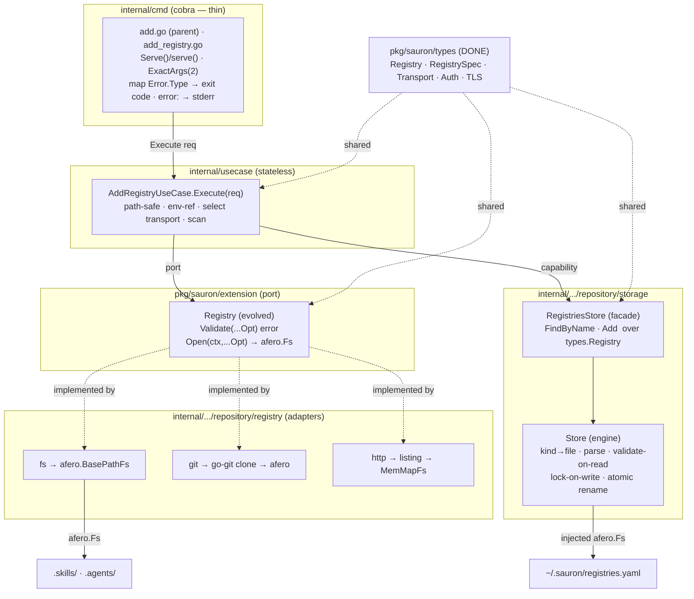
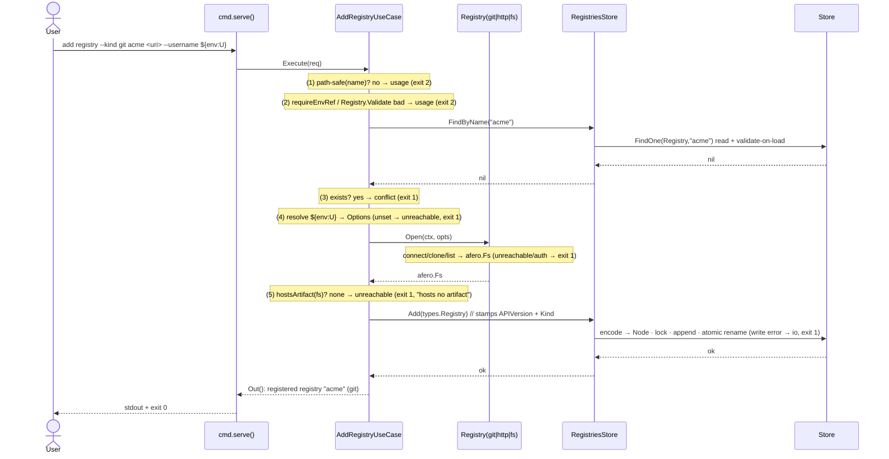
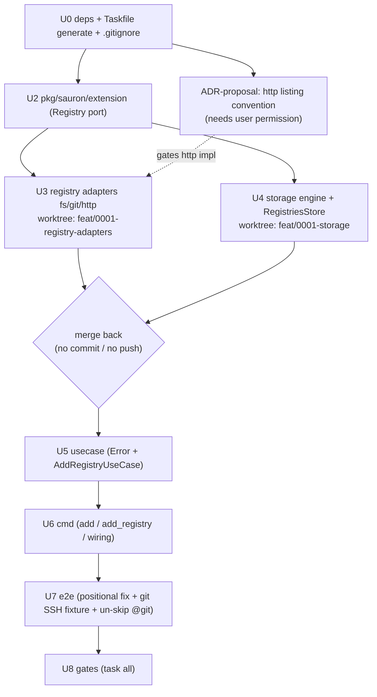

# Implementation Plan — Add Registry

Implementation plan for the [Add Registry](spec.md) feature. It captures **what**
changes, **how** the pieces fit, and the **execution** order — not the code
itself. It conforms to the [architecture contract](../contracts/architecture.md),
the [CLI contract](../contracts/cli.md), and the
[state data contract](../contracts/state.md), and realizes the
[`add registry` command contract](contracts/add-registry.md) and the
[git](capabilities/git.md) / [http](capabilities/http.md) /
[filesystem](capabilities/filesystem.md) transport capabilities.

> **This is a rewrite.** It is aligned to the repository as it stands after the
> *repository/artifact-model* refactor and the *integration-test bootstrap*. Much
> of what the previous draft proposed to **create** already exists; this plan
> states precisely what is **done**, what must be **added / renamed / removed**,
> and now covers the `test/e2e` suite in full (the previous draft deferred it).

## 1. Goal & scope

Implement `sauron add registry`: register a named source (`<name> <uri>` +
`--kind` + auth/TLS/timeout flags), prove it is reachable **and hosts ≥1 skill or
agent**, and append one `Registry` document to `registries.yaml` atomically.
Establish the foundations every later feature reuses: the `extension.Registry`
transport port (producing an `afero.Fs` content view), the storage engine +
typed `RegistriesStore`, the `usecase.Error{Type,Reason}` model, and the wired
`internal/cmd` command surface. **All three transports (filesystem, http, git)
ship working**, and the black-box `test/e2e` BDD suite goes green for every
`add registry` scenario.

**Already in place (no work, or verify-only):**

- `pkg/sauron/types` — `Registry`, `RegistrySpec`, `Auth`, `TLS`, `Transport`
  (+consts), `TypeMeta`, `Metadata`, `Kind*` constants — **complete and
  schema-faithful**. The previous draft's generic `Manifest[S]` is **abandoned**:
  the repo models each document as a concrete typed struct embedding `TypeMeta`,
  not a generic envelope.
- `internal/usecase/api.go` — `Request`, `UseCase[R]`, `Action[R,P]` — present.
- `internal/infrastructure/repository/storage` — `Store` **skeleton** (`{fs}` +
  `NewStore`) and `newFilesystem` (home-rooted `afero.BasePathFs`) + `fx.go`.
- `internal/cmd` — `root.go` (`New`), `helper_flags.go` (`timeoutFlags` and the
  listing/paging/dry-run groups).
- **`test/e2e` harness — 100% built.** godog runner (strict, `~@git` filter,
  host vs docker-compose runtime), all six controllers, the source/content/
  resolve fixtures, and `state_controller.go` (reads `registries.yaml`
  back and decodes via `pkg/sauron/types.Registry`). Feature files exist for
  filesystem, http, git, and version. Only the **production command** and the
  **git SSH fixture** are missing.

**Out of scope (YAGNI):**

- Digest & version computation (needed by `install` / `list catalogue`, not by
  `add`; each capability's `digest`/`version` FRs are deferred).
- The `Skill` / `Agent` / `Persona` / `Provider` / `Schedule` **stores**, and
  `List` / `Remove` on the registries store (arrive with 0002 / 0004). The
  `track`/`settings` files stay untouched.
- A reusable `ScanRegistryAction` — the `.skills`/`.agents` scan is a use-case
  helper for now; it graduates to an `Action` when `list catalogue` / `install`
  need richer enumeration.
- Full HTTP/git **content download** (file bodies). For `add`, each transport's
  `afero.Fs` need only expose enough to enumerate `.skills/`/`.agents/` and
  detect ≥1 artifact; lazy/full content read is an `install`-time concern.

## 2. Component & dependency flow



Two distinct `afero.Fs` are in play and never mix: the engine's **home-rooted**
fs for `~/.sauron/*.yaml` (fx-injected, already provided by `newFilesystem`), and
the per-call **registry-content** fs the `Registry` port produces (git temp
clone / fs base path / http listing into a MemMapFs).

## 3. Runtime sequence



## 4. Interfaces (final)

`pkg/sauron/types` is **unchanged** — see [`registry.go`](../../pkg/sauron/types/registry.go)
and [`manifest.go`](../../pkg/sauron/types/manifest.go). The relevant additions /
evolutions:

```go
// pkg/sauron/extension — the Registry port is EVOLVED IN PLACE (name kept; the
// architecture contract fixes the port name as "Registry"). The old Name()/Ping()
// shape is removed: Ping is subsumed by Open (opening proves reachability), and a
// transport adapter carries no stable identity.
type Options struct {
    URI                string
    Timeout            time.Duration
    Username, Password string // RESOLVED values, for connecting only — never persisted
    SSHKey             string
    SkipTLSVerify      bool
    CACert, ClientCert, ClientKey string
}
type Option func(*Options) // WithURI, WithTimeout, WithBasicAuth, WithSSHKey, WithTLS…

// Registry is one transport's seam: validate flag-appropriateness, then open a
// read-only afero.Fs view of the source's content. One implementation per
// transport (fs/git/http).
type Registry interface {
    Validate(opts ...Option) error                            // inapplicable flags → usage (exit 2)
    Open(ctx context.Context, opts ...Option) (afero.Fs, error) // construct + reach → runtime (exit 1)
}
```

*What `Registry` contributes (SOLID/DRY):* **DIP** — the use case depends on this
port, not on go-git / net/http / the OS filesystem, and selects an implementation
by `--kind`. **ISP** — two cohesive methods, nothing a transport doesn't need.
The `afero.Fs` return is the **DRY pivot**: the artifact-presence scan
(`.skills`/`.agents`) is written once over an `afero.Fs` and reused by every
transport and by every later feature (`list catalogue`, `install`) that
enumerates registry content. It is also the unit-test seam (`MockBasedRegistry`).

```go
// internal/infrastructure/repository/storage
//
// Store — the kind-agnostic file ENGINE (evolves the existing skeleton): kind→file
// map, multi-document stream parse, validate-on-read against the embedded JSON
// schema, lockfile-serialized writes, atomic temp+rename. Operates on yaml.Node so
// pkg/ types never couple to the engine.
type Store struct { /* fs afero.Fs; lock; validator */ }
func (s *Store) FindOne(ctx context.Context, kind, name string) (*yaml.Node, error) // nil if absent; validates on read
func (s *Store) Append(ctx context.Context, kind string, doc *yaml.Node) error      // lock + atomic; no re-validation

// RegistriesStore — typed, use-case-facing facade over Store for the Registry kind.
type RegistriesStore interface {
    FindByName(ctx context.Context, name string) (*types.Registry, error) // nil if absent
    Add(ctx context.Context, r types.Registry) error                      // stamps APIVersion + Kind=Registry
}
```

*What this layering contributes:* `RegistriesStore` is the **mockable
collaborator** the use case sees; `Store` is the **shared substrate** the
track/settings stores reuse later (the contract mandates per-type stores over one
engine). Only `RegistriesStore` is wired now (YAGNI), but the multi-doc /
validate / lock / atomic machinery is needed by `add` itself, so the engine is
built now and exercised over a `MemMapFs` in tests.

```go
// internal/usecase (added to api.go)
type Error struct { Type, Reason string } // cmd maps Type → exit code; Reason → stderr
func (e *Error) Error() string { return e.Reason }
// Type ∈ {"usage","conflict","unreachable","validation","io"};  cmd: usage → 2, else → 1
```

## 5. Affected files

Legend: **DONE** = exists as needed, no change. **EDIT** = modify in place.
**NEW** = create. **RENAME/REMOVE** = as noted.

### `pkg/sauron/types/` — **DONE**

| File | State |
|---|---|
| `manifest.go`, `registry.go`, `doc.go` | **DONE** — `Registry`/`RegistrySpec`/`Auth`/`TLS`/`Transport`/`TypeMeta`/`Metadata`/`Kind*` already present and schema-faithful. No `Manifest[S]`; do **not** add one. |

### `pkg/sauron/extension/` — **EDIT**

| File | Change |
|---|---|
| `registry.go` | **EDIT** — remove `Registry{Name(),Ping()}`; define the evolved `Registry{Validate,Open}` plus `Options` and `Option` (+`With*` constructors). |
| `mock_based_registry.go` | **NEW** — `MockBasedRegistry` (testify) beside the interface, for use-case tests. |
| `provider.go` | **DONE** — untouched. |

### `internal/infrastructure/repository/registry/` — **NEW/EDIT**

| File | Change |
|---|---|
| `fs/factory.go` (+`fs/factory_test.go`) | **NEW** — `extension.Registry`; `Validate` rejects auth/tls/ssh; `Open` = `afero.NewBasePathFs(OsFs, uri)` + existence/readability check (filesystem FR-003/FR-004). |
| `git/factory.go` (+test) | **NEW** — `extension.Registry`; `Validate` accepts ssh/auth/tls; `Open` = go-git clone → ctx-bound temp dir → `afero.BasePathFs` (auth: ssh key / basic-auth refs resolved into `Options`; cleanup on ctx done). |
| `http/factory.go` (+test) | **NEW** — `extension.Registry`; `Validate` accepts auth/tls; `Open` GETs the registry root + `.skills/`/`.agents/` and parses the server's **directory-listing page** (`<a href>` anchors — see §10 ADR) to enumerate artifacts, returning a read-only `afero.Fs` (MemMapFs populated from the listing) — honoring basic-auth + TLS. (`afero.HttpFs` is the *serving* side, used by the host/fixture as `http.FileServer(afero.NewHttpFs(src).Dir("/"))`, not by this client.) |
| `fx.go` | **EDIT** — replace empty `fx.Options()`; provide the three as **named** `extension.Registry` (`name:"registry.filesystem|git|http"`). |
| `{fs,git,http}/doc.go` | **EDIT** — trim package docs to the adapter's responsibility. |

### `internal/infrastructure/repository/storage/` — **NEW/EDIT**

| File | Change |
|---|---|
| `store.go` | **EDIT** — evolve `Store` from `{fs}` skeleton into the engine: hold the lock + validator; add `FindOne` (validate-on-read) and `Append` (lock + atomic temp+rename); kind→file map (`Registry`→`registries.yaml`). |
| `registries_store.go` (+test) | **NEW** — `RegistriesStore` interface + impl over `Store` (`types.Registry` ↔ `yaml.Node`, stamps `TypeMeta`). |
| `lock.go` | **NEW** — home lockfile guard for writes. |
| `schema.go` (+test) | **NEW** — `go:embed schemas/*.json`; validate a `yaml.Node` (as JSON) for a kind via `github.com/google/jsonschema-go`. |
| `schemas/` | **NEW (generated, git-ignored)** — `task generate` copies `spec/contracts/schemas/*.json` here for `go:embed` (go:embed cannot reach `..`). |
| `mock_based_registries_store.go` | **NEW** — `MockBasedRegistriesStore`, beside the interface, for use-case tests. |
| `fx.go` | **EDIT** — provide `Store`, `RegistriesStore`; keep `newFilesystem`. |
| `filesystem.go` | **DONE** — home-rooted `afero.Fs`, untouched. |
| `store_test.go` | **EDIT** — engine round-trip / validate-on-read / lock tests over `MemMapFs`. |

### `internal/usecase/` — **NEW/EDIT**

| File | Change |
|---|---|
| `api.go` | **EDIT** — add `Error{Type,Reason}` + `Error()` + Type constants/constructors. |
| `usecase_add_registry.go` (+test) | **NEW** — `AddRegistryUseCase`, `AddRegistryRequest`, fx `In` (the three named `extension.Registry`, `RegistriesStore`, logger), `Execute` + private helpers: `isPathSafe` (the `Registry.schema.json` regex), `requireEnvRef`/`resolveEnvRef`, `hostsArtifact(fs)`, transport selection. |
| `fx.go` | **EDIT** — provide `AddRegistryUseCase`. |

### `internal/cmd/` — **NEW/EDIT**

| File | Change |
|---|---|
| `add.go` | **NEW** — `add` parent command (group, no `RunE`); attaches the `registry` subcommand. |
| `add_registry.go` (+test) | **NEW** — the `registry` command builder (`Args: ExactArgs(2)`) + cobra-free private logic (the `Serve()`/`serve()` split, command-qualified to avoid the package-level name collision), `addRegistryFlags`, build `AddRegistryRequest`, `fx.Populate`, run, map `*usecase.Error` → exit code, write `error: <reason>` to stderr on failure. |
| `helper_flags.go` | **EDIT** — add the **shared** `--kind` binder (`kindFlags`, default `http` per FR-002); the auth/tls/ssh flags stay in `addRegistryFlags` (command-specific, embeds `timeoutFlags`). |
| `helper.go` | **EDIT (if needed)** — exit-code mapping helper (`*usecase.Error`→code; cobra arg/flag parse error→2) used by `cmd/main.go`. |
| `root.go` | **EDIT** — `New` wires `add` via `root.AddCommand`. |

### `test/e2e/` — **EDIT/NEW** (see §8)

| File | Change |
|---|---|
| `internal/gherkin/command_controller.go` | **EDIT** — `addRegistryArgs` currently emits `--name/--uri` **flags**; the contract mandates **positional** `<name> <uri>`. Emit `add registry --kind <t> [--username..][--password..] <name> <uri>`. |
| `internal/gherkin/registry_git_controller.go` | **EDIT** — complete the deferred git steps once the SSH fixture exists. |
| `internal/runtime/*` (git source) | **NEW/EDIT** — build the **git SSH server testcontainers fixture** backing `#{.git.default.url}` (ADR-0002: ssh-only remotes). |
| `internal/runtime/*` (webserver) | **EDIT (if needed)** — ensure the nginx fixture serves the chosen `.skills/`/`.agents/` listing convention (§10 ADR). |
| `integration_test.go` | **EDIT** — drop the `Tags: "~@git"` filter once git is green (or scope it to CI as needed). |
| `testdata/*.feature` | **VERIFY** — scenarios already encode the FRs; adjust step wording only if a fixed step phrasing changes. |

### Build & governance

| File | Change |
|---|---|
| `go.mod` / `go.sum` | **EDIT** — add `github.com/go-git/go-git/v5` and `github.com/google/jsonschema-go` (both already in the approved-dependency table; `gopkg.in/yaml.v3` is already direct). The `test/e2e` module keeps godog/testcontainers in its own `go.mod`. |
| `Taskfile.yml` | **EDIT** — add a `generate` target (copy `spec/contracts/schemas/*.json` → `storage/schemas/`); make `test` and `build` depend on it so the `go:embed` dir exists. |
| `.gitignore` | **EDIT** — ignore `internal/infrastructure/repository/storage/schemas/` (generated). |
| `spec/0001-add-registry/architecture/ADR-NNNN-http-listing.md` | **PROPOSE ONLY** — the HTTP listing convention. **Do not author without explicit user permission** (§10). |

## 6. Checkpoints

| # | Milestone | Verify |
|---|---|---|
| C0 | deps added + `task generate` produces `storage/schemas/` | `go build ./...` |
| C1 | `pkg/sauron/types` confirmed sufficient (no change) | `go test ./pkg/sauron/types/...` |
| C2 | `extension.Registry` evolved + `Options`/`Option` + `MockBasedRegistry` | `go build ./pkg/...` |
| C3 | registry adapters: fs (over MemMap/temp dir), git (`Validate`/clone via a local fixture), http (listing→MemMapFs) | `go test ./internal/infrastructure/repository/registry/...` |
| C4 | storage: `FindOne` nil-if-absent, validate-on-read rejects a bad doc, `Append` atomic round-trip + lock, `RegistriesStore` stamps `TypeMeta` | `go test ./internal/infrastructure/repository/storage/...` |
| C5 | use case — table-driven over the ordered paths (path-safe, env-ref, conflict, unreachable, empty, persist) + `Type` classification (mock store + mock registries) | `go test ./internal/usecase/...` |
| C6 | `serve()` without cobra + manual run | `go test ./internal/cmd/...`; `go run ./cmd add registry --kind filesystem acme <dir>` |
| C7 | e2e: harness positional fix + git SSH fixture; all six `add registry` scenarios green | `task build && task gate-integration` |
| C8 | full gate | `task all` (test, gate-lint, build, gate-coverage ≥80%, gate-security, gate-integration) |

## 7. Execution flow & parallelization



- **U1 (`pkg/sauron/types`) is already done** — verify-only, not a work unit.
- **U3 ‖ U4 are parallel and worktree-isolated.** Each executing agent works on
  its own branch in a fresh worktree (`feat/0001-registry-adapters`,
  `feat/0001-storage`); on completion its branch is **merged back into the
  working tree without committing and without pushing**. They share only `pkg/`
  (frozen after U2), so no file collisions.
- **U0 → U2, U5 → U6 → U7 → U8** are sequential in the working tree.
- **The http listing ADR gates U3's http adapter.** It is a separate, early
  proposal step: draft the convention, obtain **explicit user permission**, then
  author the ADR (see §10) — and only then implement the http `Open`. fs and git
  adapters do not depend on it and proceed immediately.
- Agents: `sauron-developer` for U2–U6, `sauron-integration-test-developer` for
  U7, `sauron-ci-operator` only if CI parity needs the new `generate`/git gate,
  `sauron-adr-author` for the ADR (permission-gated), then `sauron-architect` +
  `sauron-gatekeeper` before merge.

## 8. Testing

### Unit tests (in scope)

- **Arrange / Act / Assert**, table-driven by default; `testify` `assert`/`require`.
- Collaborators substituted with `MockBased<Iface>` mocks defined **beside the
  interface they implement** (`pkg/sauron/extension/mock_based_registry.go`,
  `storage/mock_based_registries_store.go`). The use case mocks the named
  `Registry` values and `RegistriesStore`; `RegistriesStore`/`Store` are exercised
  over an `afero.NewMemMapFs()`.
- **No real filesystem, no env mutation**: all fs interaction is through
  `MemMapFs`; tests never write the real disk; the env-ref resolver is tested by
  injecting a lookup func / `t.Setenv` on the **test process only**, never by
  exporting a global the suite leaks.
- Coverage target 90%, project floor 80% (`task gate-coverage`).

### Integration / end-to-end tests (`test/e2e`) — **in scope, now complete**

The harness is **already built** (godog under `go test`, strict mode, host vs
docker-compose runtime per `@no-sandbox`, graybox via `SAURON_BIN`, state
read-back via `pkg/sauron/types.Registry`). This plan finishes it: implement the
production command so the existing scenarios pass, correct the one harness
divergence, and build the git fixture. See
[`sauron-implementing-integration-tests`](../../.claude/skills/sauron-implementing-integration-tests/SKILL.md).

**FR → scenario coverage** (files under `test/e2e/testdata/`):

| Requirement | Scenario | File |
|---|---|---|
| FR-001, FR-005 (register + report) | adds a filesystem registry from a local folder | `add_registry_filesystem.feature` |
| FR-001 (authored content) | adds a filesystem registry from an authored content directory | `add_registry_filesystem.feature` |
| FR-004, FR-010 (hosts no artifact → runtime error) | fails when the registry hosts no artifacts | `add_registry_filesystem.feature` |
| FR-001 (http transport, default) | adds an http registry served over http | `add_registry_http.feature` |
| FR-003, FR-011 (env-ref secret, persisted not resolved) | adds an http registry behind basic auth, storing the secret as a reference | `add_registry_http.feature` |
| FR-001 (git over ssh) | adds a git registry over ssh | `add_registry_git.feature` |
| Root banner (arch contract) | reports its build identity | `version.feature` (already green) |

**Required harness work:**

1. **Positional-args fix.** `command_controller.go:addRegistryArgs` emits
   `--name/--uri`; the contract mandates positional `<name> <uri>`. Change it to
   `add registry --kind <t> [--username ..][--password ..] <name> <uri>`. (One
   function; the negative/auth/table steps all route through it.)
2. **Git SSH fixture.** Build the testcontainers-backed git-over-ssh server that
   `#{.git.default.url}` resolves to, and complete `registry_git_controller.go`
   (currently only `declare`s). Then remove the `~@git` filter (or pin it to the
   Linux CI runner). Per ADR-0002, git remotes are ssh-only.
3. **HTTP listing fixture.** Ensure the nginx webserver source exposes the
   `.skills/`/`.agents/` **listing** in whatever form the http adapter consumes
   (the §10 ADR), so the http `Open` can enumerate artifacts.
4. **No new harness primitives needed** for fs/http — controllers, content
   generation, reference resolution, and config read-back already exist and are
   `depguard`-clean (`pkg/` only).

**State read-back & secrets.** `state_controller.go` already decodes
`$SAURON_HOME/registries.yaml` into `types.Registry` to assert transport,
metadata, and the `${env:VAR}` reference, and checks the raw bytes do **not**
contain the resolved secret — which exercises FR-003/FR-006/FR-011 end-to-end.
The basic-auth scenario's `ACME_TOKEN` is set on the **spawned binary's** process
env by the runtime, not by mutating the test's own environment; `SAURON_HOME` is
the `gate-integration` temp dir, so the real `~/.sauron` is never touched.

**Run:** `task gate-integration` (builds the host binary, sets `SAURON_BIN`/
`SAURON_HOME`, runs `go test ./...` in `test/e2e`).

## 9. Key decisions

1. **No `Manifest[S]` generic.** The repo already models documents as concrete
   typed structs embedding `TypeMeta` (`types.Registry`). The previous draft's
   generic envelope is dropped to avoid duplicating the existing, schema-faithful
   types (DRY).
2. **The port stays named `extension.Registry`** (the architecture contract fixes
   it), but its **shape evolves** from `Name()/Ping()` to `Validate(...Opt)` +
   `Open(ctx,...Opt) (afero.Fs, error)`. This reconciles the prior draft's
   `Factory` idea with the contract **without** a contract amendment or ADR.
3. **Closed transport set** — the use case injects the three named `Registry`
   values and switches on `transport`; not runtime-pluggable (YAGNI). The port's
   value is DIP + mocking.
4. **`Options` is a typed superset**; each `Registry.Validate` rejects flags that
   do not apply to its transport → usage (exit 2).
5. **Secrets** — a literal (non-`${env:VAR}`) auth value → usage (exit 2); refs
   are persisted verbatim; resolved only into `Options` for connecting; an unset
   env var at connect time → runtime (exit 1). Never written to disk.
6. **`afero.Fs` is the cross-transport content seam** — fs = `BasePathFs`, git =
   `BasePathFs` over a temp clone, http = `MemMapFs` populated from the listing.
   `hostsArtifact(fs)` is one scan reused across all three (and by later
   features).
7. **Store engine + typed facade** — `Store` (kind-agnostic, `yaml.Node`) carries
   the multi-doc / validate-on-read / lock / atomic machinery; `RegistriesStore`
   is the typed, mockable facade. Only `RegistriesStore` is wired now; the engine
   is shared substrate for the later track/settings stores.
8. **Validation on load, not on app-authored writes** — `Store.FindOne` validates
   against the embedded JSON schema; `Append` does not. Already recorded in the
   [architecture contract](../contracts/architecture.md) (no ADR).
9. **Path-safe** = the `Registry.schema.json` regex
   `^[a-z0-9]([a-z0-9-]*[a-z0-9])?$`, enforced by the use case **before**
   contacting the source (FR-008 → exit 2); storage does not re-check on write.
10. **Error model** — `usecase.Error{Type,Reason}`; storage/adapters return
    plain/sentinel errors, the use case classifies, cmd maps `usage → 2, else → 1`
    and writes one `error: <reason>` line to stderr.
11. **Positional `<name> <uri>`** — the harness's `--name/--uri` invocation is a
    bootstrap divergence; the contract (and its Example) is authoritative, so the
    harness is corrected, not the CLI.

## 10. Open items / ADRs

- **HTTP listing convention (needs an ADR — and explicit user permission to
  author it).** The model is **directory-listing over HTTP**: the registry is
  served by a static file server — the reference being
  `http.FileServer(afero.NewHttpFs(src).Dir("/"))`, whose `afero.HttpFs` is the
  *server-side* adapter (verified: it issues no requests; there is no client-side
  afero web fs). The http `Open` therefore **lists by parsing the server's
  directory-listing page** — the `<a href>` anchors Go's `http.FileServer` (and
  nginx default `autoindex`) emit for a directory with no `index.html`. A tolerant
  anchor-parser works against both, so the e2e fixture only needs directory
  listing enabled. The ADR fixes: which paths are GET'd (root, `.skills/`,
  `.agents/`), the anchor-parsing rules (trailing-slash = directory; ignore `../`),
  and the "≥1 artifact" criterion. **Propose the ADR, wait for approval, then
  author** under `spec/0001-add-registry/architecture/`. Until decided, the http
  adapter and its e2e scenarios are blocked (fs and git proceed independently).
- **Confirm the git-ssh ADR.** ADR-0002 ("remotes are ssh-only") is referenced by
  the integration-test skill; verify it exists/covers the git fixture before
  building the SSH testcontainers source, and reference it rather than re-deciding.
- **Architecture-contract drift (note, not a task).** The contract's prose names
  the storage package `internal/infrastructure/storage` (§"State storage") and the
  ports `pkg/registry`/`pkg/provider` (§"Use Case orchestration") in two places,
  while its own layout tree and the actual code use
  `internal/infrastructure/repository/storage` and `pkg/sauron/extension`. This
  plan follows the layout/code. Flag for a future contract cleanup (no ADR).
