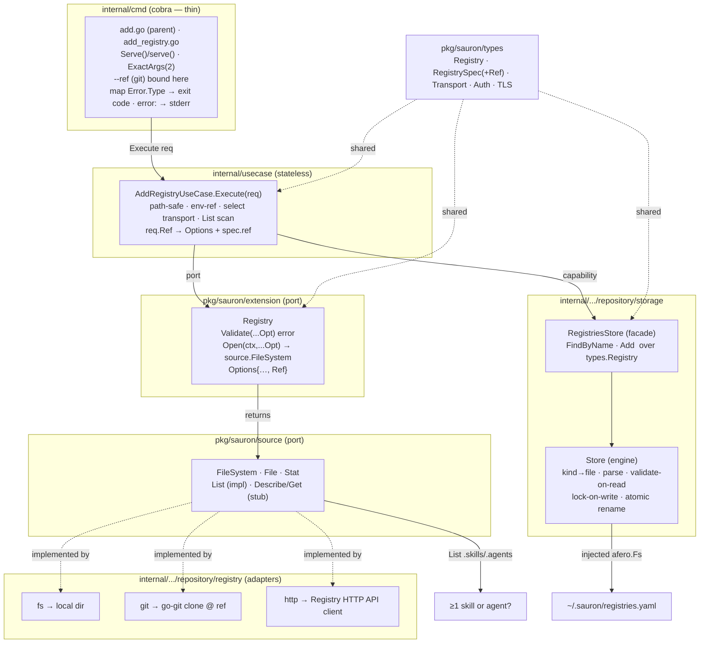
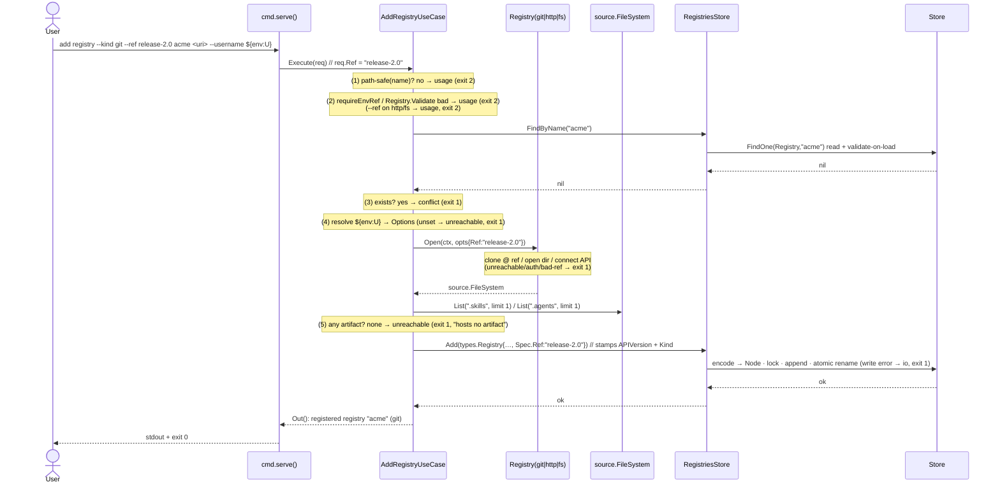
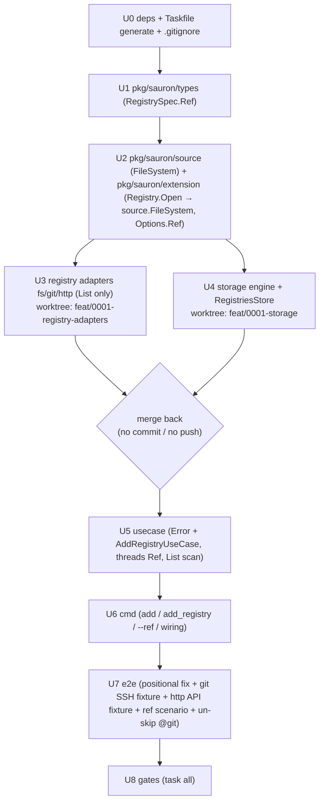

# Implementation Plan — Add Registry

Implementation plan for the [Add Registry](spec.md) feature. It captures **what**
changes, **how** the pieces fit, and the **execution** order — not the code
itself. It conforms to the [architecture contract](../contracts/architecture.md),
the [CLI contract](../contracts/cli.md), and the
[state data contract](../contracts/state.md), and realizes the
[`add registry` command contract](contracts/add-registry.md), the
[HTTP Registry API](../contracts/registry-http-api.oas3.yaml), and the
[git](capabilities/git.md) / [http](capabilities/http.md) /
[filesystem](capabilities/filesystem.md) transport capabilities.

## 1. Goal & scope

Implement `sauron add registry`: register a named source (`<name> <uri>` +
`--kind` + auth/TLS/timeout flags, and **`--ref` for git**), prove it is reachable
**and hosts ≥1 skill or agent**, and append one `Registry` document to
`registries.yaml` atomically. Establish the foundations every later feature
reuses: the `extension.Registry` transport port (producing a `source.FileSystem`
content view), the storage engine + typed `RegistriesStore`, the
`usecase.Error{Type,Reason}` model, and the wired `internal/cmd` command surface.
All three transports ship a `source.FileSystem` adapter — git honoring `--ref`,
http speaking the [Registry HTTP API](../contracts/registry-http-api.oas3.yaml) —
with **only `List` implemented** this round, and the black-box `test/e2e` BDD suite
goes green for every `add registry` scenario.

**Foundations present and reused:**

- `pkg/sauron/types` — `Registry`, `RegistrySpec` (`Transport`, `URI`, `Auth`,
  `TLS`, `SSHKey`, `Timeout`), `Auth`, `TLS`, `Transport` (+consts), `TypeMeta`,
  `Metadata`, `Kind*`. Each document is a concrete typed struct embedding
  `TypeMeta` — no generic envelope.
- `internal/usecase/api.go` — `Request`, `UseCase[R]`, `Action[R,P]`.
- `internal/infrastructure/repository/storage` — `Store` skeleton (`{fs}` +
  `NewStore`), `newFilesystem` (home-rooted `afero.BasePathFs` for `~/.sauron/*`),
  and `fx.go`.
- `internal/infrastructure/repository/registry` — `fs/`, `git/`, `http/`
  placeholders and an empty `fx.go`.
- `pkg/sauron/extension` — `Registry` and `Provider` ports.
- `internal/cmd` — `root.go` (`New`), `helper_flags.go` (`timeoutFlags` + the
  listing/paging/dry-run groups), `helper.go`, `helper_fx.go`.
- `test/e2e` — godog runner (strict, `~@git` filter, host vs docker-compose
  runtime), the six controllers, the source/content/resolve fixtures, and
  `state_controller.go` (decodes `registries.yaml` via `pkg/sauron/types.Registry`).
  Feature files exist for filesystem, http, git, and version.

**Out of scope (YAGNI):**

- The `Describe` and `Get` halves of `source.FileSystem`. For `add`, only **`List`**
  is implemented — enough to detect ≥1 artifact via a `limit:1` query. `Describe`
  (per-artifact metadata, incl. `version`) and `Get` (gzip content download) are
  stubs that land with `list catalogue` (0005) / `install` (0006).
- Digest & version computation. The persisted `spec.ref` *defines the resolution
  point* later features read against ([git.md](capabilities/git.md)), but `add`
  computes no digest/version.
- The `Skill` / `Agent` / `Persona` / `Provider` / `Schedule` stores, and
  `List` / `Remove` on the registries store (arrive with 0002 / 0004). The
  `track`/`settings` files stay untouched.
- A reusable `ScanRegistryAction` — the `.skills`/`.agents` presence scan is a
  use-case helper for now; it graduates to an `Action` when `list catalogue` /
  `install` need richer enumeration. Git's clone is checked out **at the resolved
  ref**, so the `List` scan reflects the pin.
- An artifact-level `--ref` / per-artifact version pin — the registry-level
  `spec.ref` is the only pin.

## 2. Component & dependency flow



Two distinct content views are in play and never mix: the storage engine's
**home-rooted `afero.Fs`** for `~/.sauron/*.yaml` (fx-injected by `newFilesystem`,
unchanged), and the per-call **registry-content `source.FileSystem`** the
`Registry` port produces — a git temp clone checked out at `Ref`, a local base
directory, or a [Registry HTTP API](../contracts/registry-http-api.oas3.yaml)
client.

## 3. Runtime sequence



## 4. Interfaces (final)

```go
// pkg/sauron/types — RegistrySpec carries Ref (git only; persisted; omitempty).
type RegistrySpec struct {
    Transport Transport `json:"transport" yaml:"transport"`
    URI       string    `json:"uri" yaml:"uri"`
    Ref       string    `json:"ref,omitempty" yaml:"ref,omitempty"` // git ref (branch/tag/commit)
    Auth      *Auth     `json:"auth,omitempty" yaml:"auth,omitempty"`
    TLS       *TLS      `json:"tls,omitempty" yaml:"tls,omitempty"`
    SSHKey    string    `json:"sshKey,omitempty" yaml:"sshKey,omitempty"`
    Timeout   string    `json:"timeout,omitempty" yaml:"timeout,omitempty"`
}
```

```go
// pkg/sauron/source — the cross-transport content view of a registry. Only List
// is implemented in this feature; Describe/Get are stubs returning a
// not-implemented sentinel until list catalogue / install.
type FileSystem interface {
    List(ctx context.Context, uri string, opts ...Option) ([]File, int, error) // items, total — IMPLEMENTED
    Describe(ctx context.Context, uri string) (Stat, error)                     // STUB
    Get(ctx context.Context, uri string) (File, error)                          // STUB
}
type File interface {
    Stat
    Read(ctx context.Context) (io.ReadCloser, error)
}
type Stat interface {
    Name() string
    IsDirectory() bool
    Size() int64
    Version() string // git: commit SHA · http: Artifact-Version header · fs: ""
}
type Option func(*Options)
type Options struct { Search *string; Limit, Offset *int64; Sort *string }
```

```go
// pkg/sauron/extension — the Registry port. Validate flag-appropriateness, then
// open a source.FileSystem view of the registry's content. One implementation per
// transport (fs/git/http).
type Options struct {
    URI                string
    Ref                string // git ref (branch/tag/commit); empty → default branch
    Timeout            time.Duration
    Username, Password string // RESOLVED values, for connecting only — never persisted
    SSHKey             string
    SkipTLSVerify      bool
    CACert, ClientCert, ClientKey string
}
type Option func(*Options) // WithURI, WithRef, WithTimeout, WithBasicAuth, WithSSHKey, WithTLS…

type Registry interface {
    Validate(opts ...Option) error                                  // inapplicable flags → usage (exit 2)
    Open(ctx context.Context, opts ...Option) (source.FileSystem, error) // construct + reach → runtime (exit 1)
}
```

*What these ports contribute (SOLID/DRY):* **DIP** — the use case depends on
`extension.Registry` + `source.FileSystem`, not on go-git / net/http / the OS
filesystem, and selects an implementation by `--kind`. **ISP** — `Registry` is two
cohesive methods; `source.FileSystem` separates listing (`List`) from metadata
(`Describe`) from content (`Get`), so `add` pulls in only `List`. The
`source.FileSystem` return is the **DRY pivot**: the artifact-presence scan
(`List` over `.skills`/`.agents`, `limit:1`) is written once and reused by every
transport and by every later feature (`list catalogue`, `install`). `Ref` rides on
`extension.Options`: only the git adapter reads it, and the git adapter's
`Validate` is the single place that rejects `--ref` on a non-git transport (usage,
exit 2).

```go
// internal/infrastructure/repository/storage
//
// Store — the kind-agnostic file ENGINE: kind→file map, multi-document stream
// parse, validate-on-read against the embedded JSON schema, lockfile-serialized
// writes, atomic temp+rename. Operates on yaml.Node so pkg/ types never couple to
// the engine.
type Store struct { /* fs afero.Fs; lock; validator */ }
func (s *Store) FindOne(ctx context.Context, kind, name string) (*yaml.Node, error) // nil if absent; validates on read
func (s *Store) Append(ctx context.Context, kind string, doc *yaml.Node) error      // lock + atomic; no re-validation

// RegistriesStore — typed, use-case-facing facade over Store for the Registry kind.
type RegistriesStore interface {
    FindByName(ctx context.Context, name string) (*types.Registry, error) // nil if absent
    Add(ctx context.Context, r types.Registry) error                      // stamps APIVersion + Kind=Registry
}
```

```go
// internal/usecase (added to api.go)
type Error struct { Type, Reason string } // cmd maps Type → exit code; Reason → stderr
func (e *Error) Error() string { return e.Reason }
// Type ∈ {"usage","conflict","unreachable","validation","io"};  cmd: usage → 2, else → 1
```

## 5. Affected files

Legend: **DONE** = exists as needed, no change. **EDIT** = modify in place.
**NEW** = create. **RENAME/REMOVE** = as noted.

### `pkg/sauron/source/` — **NEW**

| File | Change |
|---|---|
| `source.go` | **NEW** — `FileSystem`, `File`, `Stat`, `Options`, `Option` (+`With*`) and a `ErrNotImplemented` sentinel for the stubbed `Describe`/`Get`. |
| `mock_based_file_system.go` | **NEW** — `MockBasedFileSystem` (testify) beside the interface, for use-case tests. |

### `pkg/sauron/types/`

| File | Change |
|---|---|
| `registry.go` | **EDIT** — add `Ref string` (`json/yaml:"ref,omitempty"`) to `RegistrySpec`, between `URI` and `Auth`. |
| `registry_test.go` | **EDIT/NEW** — round-trip a `Registry` with `Spec.Ref` set and unset (omitempty). |
| `manifest.go`, `doc.go` | **DONE** — `TypeMeta`/`Metadata`/`Kind*`; no generic envelope. |

### `pkg/sauron/extension/`

| File | Change |
|---|---|
| `registry.go` | **EDIT** — define `Registry{Validate,Open}` where `Open` returns `source.FileSystem`; plus `Options` (incl. `Ref`) and `Option` (+`WithRef` and the other `With*`). |
| `mock_based_registry.go` | **NEW** — `MockBasedRegistry` (testify), for use-case tests. |
| `provider.go` | **DONE** — untouched. |

### `internal/infrastructure/repository/registry/`

| File | Change |
|---|---|
| `fs/factory.go` (+`fs/factory_test.go`) | **NEW** — `extension.Registry`; `Validate` rejects auth/tls/ssh **and `--ref`**; `Open` returns a `source.FileSystem` over `uri` (local dir) + existence/readability check; `List` enumerates `.skills/`/`.agents/`, `Describe`/`Get` stubbed. |
| `git/factory.go` (+test) | **NEW** — `extension.Registry`; `Validate` accepts ssh/auth/tls **and `ref`**; `Open` = go-git clone → ctx-bound temp dir, **checked out at `opts.Ref` (empty → remote default branch)**, returned as a `source.FileSystem`; auth resolved into `Options`; cleanup on ctx done; unresolvable ref → error. `List` over the checkout; `Describe`/`Get` stubbed. |
| `http/factory.go` (+test) | **NEW** — `extension.Registry`; `Validate` accepts auth/tls, **rejects `--ref`**; `Open` returns a `source.FileSystem` that is a **client of the [Registry HTTP API](../../../../spec/contracts/registry-http-api.oas3.yaml)** (Basic auth + TLS from `Options`). `List` = `GET /skills` / `GET /agents` (`limit=1` for the presence scan), parsing `{items,total}`; `Describe`/`Get` stubbed. |
| `fx.go` | **EDIT** — replace empty `fx.Options()`; provide the three as **named** `extension.Registry` (`name:"registry.filesystem|git|http"`). |
| `{fs,git,http}/doc.go` | **EDIT** — trim package docs to the adapter's responsibility. |

### `internal/infrastructure/repository/storage/`

| File | Change |
|---|---|
| `store.go` | **EDIT** — evolve `Store` into the engine: hold the lock + validator; add `FindOne` (validate-on-read) and `Append` (lock + atomic temp+rename); kind→file map (`Registry`→`registries.yaml`). Home fs stays `afero`. |
| `registries_store.go` (+test) | **NEW** — `RegistriesStore` interface + impl over `Store` (`types.Registry` ↔ `yaml.Node`, stamps `TypeMeta`; carries `spec.ref` through unchanged). |
| `lock.go` | **NEW** — home lockfile guard for writes. |
| `schema.go` (+test) | **NEW** — `go:embed schemas/*.json`; validate a `yaml.Node` (as JSON) for a kind via `github.com/google/jsonschema-go`. |
| `schemas/` | **NEW (generated, git-ignored)** — `task generate` copies `spec/contracts/schemas/*.json` here for `go:embed` (cannot reach `..`). The copied `Registry.schema.json` carries `spec.ref`. |
| `mock_based_registries_store.go` | **NEW** — `MockBasedRegistriesStore`, for use-case tests. |
| `fx.go` | **EDIT** — provide `Store`, `RegistriesStore`; keep `newFilesystem`. |
| `filesystem.go` | **DONE** — home-rooted `afero.Fs`, untouched. |
| `store_test.go` | **EDIT** — engine round-trip / validate-on-read (incl. a `spec.ref` doc) / lock tests over `afero.MemMapFs`. |

### `internal/usecase/`

| File | Change |
|---|---|
| `api.go` | **EDIT** — add `Error{Type,Reason}` + `Error()` + Type constants/constructors. |
| `usecase_add_registry.go` (+test) | **NEW** — `AddRegistryUseCase`, `AddRegistryRequest` (**incl. `Ref`**), fx `In` (the three named `extension.Registry`, `RegistriesStore`, logger), `Execute` + private helpers: `isPathSafe`, `requireEnvRef`/`resolveEnvRef`, `hostsArtifact(fs)` (a `source.FileSystem.List` with `limit:1`), transport selection. Threads `req.Ref` → `WithRef(...)` on the git `Open` and into `types.Registry.Spec.Ref` on persist. |
| `fx.go` | **EDIT** — provide `AddRegistryUseCase`. |

### `internal/cmd/`

| File | Change |
|---|---|
| `add.go` | **NEW** — `add` parent command (group, no `RunE`); attaches the `registry` subcommand. |
| `add_registry.go` (+test) | **NEW** — the `registry` command builder (`Args: ExactArgs(2)`) + cobra-free private logic (`Serve()`/`serve()` split), `addRegistryFlags` (**binds `--ref`**), build `AddRegistryRequest` (incl. `Ref`), `fx.Populate`, run, map `*usecase.Error` → exit code, write `error: <reason>` to stderr on failure. |
| `helper_flags.go` | **EDIT** — add the shared `--kind` binder (`kindFlags`, default `http` per FR-002). `--ref` is git-specific and lives in `addRegistryFlags` (embeds `timeoutFlags`), alongside auth/tls/ssh. |
| `helper.go` | **EDIT (if needed)** — exit-code mapping helper (`*usecase.Error`→code; cobra arg/flag parse error→2). |
| `root.go` | **EDIT** — `New` wires `add` via `root.AddCommand`. |

### `test/e2e/`

| File | Change |
|---|---|
| `internal/gherkin/command_controller.go` | **EDIT** — `addRegistryArgs` builds positional `<name> <uri>`: `add registry --kind <t> [--ref ..][--username ..][--password ..] <name> <uri>`, threading an optional `ref`. |
| `internal/gherkin/registry_git_controller.go` | **EDIT** — implement the git steps against the SSH fixture; add the ref-pinned scenario step. |
| `internal/runtime/*` (git source) | **NEW/EDIT** — git SSH server testcontainers fixture backing `#{.git.default.url}` (ADR-0002: ssh-only), seeding a **non-default branch/tag** for the ref scenario. |
| `internal/runtime/*` (http source) | **NEW/EDIT** — the http fixture now serves the **[Registry HTTP API](../contracts/registry-http-api.oas3.yaml)** (at minimum `GET /skills` / `GET /agents` for the presence scan), replacing any directory-listing webserver. |
| `integration_test.go` | **EDIT** — drop the `Tags: "~@git"` filter once git is green (or scope it to CI). |
| `testdata/add_registry_git.feature` | **EDIT** — add a scenario pinning a git registry to a ref and asserting `spec.ref` read-back + content from that ref. |
| `testdata/*.feature` (others) | **VERIFY** — adjust step wording only if a fixed step phrasing changes. |

### Build & governance

| File | Change |
|---|---|
| `spec/contracts/registry-http-api.oas3.yaml` | **DONE (authored)** — the HTTP Registry API the `http` adapter implements; recommend a `spectral lint` where tooling exists. |
| `go.mod` / `go.sum` | **EDIT** — add `github.com/go-git/go-git/v5` and `github.com/google/jsonschema-go` (`gopkg.in/yaml.v3` is already direct). The `test/e2e` module keeps godog/testcontainers in its own `go.mod`. |
| `Taskfile.yml` | **EDIT** — add a `generate` target (copy `spec/contracts/schemas/*.json` → `storage/schemas/`); make `test` and `build` depend on it. |
| `.gitignore` | **EDIT** — ignore `internal/infrastructure/repository/storage/schemas/` (generated). |

## 6. Checkpoints

| # | Milestone | Verify |
|---|---|---|
| C0 | deps added + `task generate` produces `storage/schemas/` (incl. `Registry.schema.json` with `ref`) | `go build ./...` |
| C1 | `pkg/sauron/types` — `RegistrySpec.Ref` added; round-trips set/unset | `go test ./pkg/sauron/types/...` |
| C2 | `pkg/sauron/source` (`FileSystem`/`File`/`Stat`/`Options`) + `MockBasedFileSystem`; `extension.Registry.Open` returns it; `MockBasedRegistry` | `go build ./pkg/...` |
| C3 | adapters: fs (rejects ref; `List` over a dir), git (`Validate` accepts ref; clone+checkout at ref; `List` over the checkout; bad ref → error), http (rejects ref; `List` via `GET /skills`/`/agents` against a stub API server) — `Describe`/`Get` return the stub sentinel | `go test ./internal/infrastructure/repository/registry/...` |
| C4 | storage: `FindOne` nil-if-absent, validate-on-read rejects a bad doc + accepts a `spec.ref` doc, `Append` atomic round-trip + lock, `RegistriesStore` stamps `TypeMeta` and carries `spec.ref` | `go test ./internal/infrastructure/repository/storage/...` |
| C5 | use case — table-driven over the ordered paths (path-safe, env-ref, **`--ref` on non-git → usage**, conflict, unreachable, empty `List`, persist-with-ref) + `Type` classification | `go test ./internal/usecase/...` |
| C6 | `serve()` without cobra (`--ref` bound) + manual run | `go test ./internal/cmd/...`; `go run ./cmd add registry --kind filesystem acme <dir>` |
| C7 | e2e: positional fix + git SSH fixture (non-default branch/tag) + ref scenario + http API fixture; all `add registry` scenarios green | `task build && task gate-integration` |
| C8 | full gate | `task all` (test, gate-lint, build, gate-coverage ≥80%, gate-security, gate-integration) |

## 7. Execution flow & parallelization



- **U3 ‖ U4 are parallel and worktree-isolated.** Each executing agent works on
  its own branch in a fresh worktree (`feat/0001-registry-adapters`,
  `feat/0001-storage`); on completion its branch is **merged back into the working
  tree without committing and without pushing**. They share only `pkg/` (frozen
  after U2), so no file collisions.
- **U0 → U1 → U2, U5 → U6 → U7 → U8** are sequential in the working tree. U2
  introduces both ports together (`source.FileSystem` and `extension.Registry`'s
  new `Open` signature) since the adapters in U3 implement both.
- The HTTP adapter is gated only on the **OAS3 contract** (authored), not an ADR.
  fs and git adapters proceed immediately; the git adapter's ref work is part of U3.
- Agents: `sauron-developer` for U1–U6, `sauron-integration-test-developer` for
  U7, `sauron-ci-operator` only if CI parity needs the new `generate`/git gate,
  then `sauron-architect` + `sauron-gatekeeper` before merge.

## 8. Testing

### Unit tests (in scope)

- **Arrange / Act / Assert**, table-driven by default; `testify` `assert`/`require`.
- Collaborators substituted with `MockBased<Iface>` mocks defined **beside the
  interface they implement** (`pkg/sauron/source/mock_based_file_system.go`,
  `pkg/sauron/extension/mock_based_registry.go`,
  `storage/mock_based_registries_store.go`). `RegistriesStore`/`Store` are
  exercised over an `afero.NewMemMapFs()` (home fs).
- **Adapter `List` coverage:** fs over a temp/`MemMapFs` dir; git by cloning a
  local fixture repo **at a given ref** and listing the checkout; http against an
  in-process `httptest` server that implements the Registry HTTP API's
  `GET /skills`/`GET /agents` (asserting `{items,total}` parsing, Basic auth, and
  `limit=1`). `Describe`/`Get` assert the not-implemented sentinel.
- **`--ref` coverage:** the git adapter test asserts `Open` lists content **at the
  requested ref** and errors on an unknown ref; the fs/http adapter tests assert
  `Validate` **rejects** `--ref` (usage); the use-case test asserts `req.Ref`
  reaches the git `Open` and is persisted as `spec.ref`, and that `--ref` against a
  non-git transport classifies as `usage`.
- **No real filesystem, no env mutation**: all home-fs interaction is through
  `MemMapFs`; tests never write the real disk; the env-ref resolver is tested by
  injecting a lookup func / `t.Setenv` on the **test process only**.
- Coverage target 90%, project floor 80% (`task gate-coverage`).

### Integration / end-to-end tests (`test/e2e`)

The harness runs godog under `go test` (strict mode, host vs docker-compose
runtime per `@no-sandbox`, graybox via `SAURON_BIN`, state read-back via
`pkg/sauron/types.Registry`). This plan implements the production command so the
scenarios pass, corrects the positional-args divergence, builds the git SSH and
http-API fixtures, and adds the `--ref` scenario. See
[`sauron-implementing-integration-tests`](../../.claude/skills/sauron-implementing-integration-tests/SKILL.md).

**FR → scenario coverage** (files under `test/e2e/testdata/`):

| Requirement | Scenario | File |
|---|---|---|
| FR-001, FR-005 (register + report) | adds a filesystem registry from a local folder | `add_registry_filesystem.feature` |
| FR-001 (authored content) | adds a filesystem registry from an authored content directory | `add_registry_filesystem.feature` |
| FR-004, FR-010 (hosts no artifact → runtime error) | fails when the registry hosts no artifacts | `add_registry_filesystem.feature` |
| FR-001 (http transport, default) | adds an http registry served by the Registry HTTP API | `add_registry_http.feature` |
| FR-003, FR-011 (env-ref secret, persisted not resolved) | adds an http registry behind basic auth, storing the secret as a reference | `add_registry_http.feature` |
| FR-001 (git over ssh) | adds a git registry over ssh | `add_registry_git.feature` |
| FR-013 + git FR-007 (ref pin, persisted) | adds a git registry pinned to a ref, storing `spec.ref` and reading content from it | `add_registry_git.feature` |
| Root banner (arch contract) | reports its build identity | `version.feature` |

**Harness work:**

1. **Positional-args fix.** `command_controller.go:addRegistryArgs` builds
   `add registry --kind <t> [--ref ..][--username ..][--password ..] <name> <uri>`,
   threading an optional `ref`. One function; all step routes go through it.
2. **Git SSH fixture.** testcontainers-backed git-over-ssh server that
   `#{.git.default.url}` resolves to, seeding a non-default branch/tag for the ref
   scenario, and complete `registry_git_controller.go`. Then remove the `~@git`
   filter (or pin it to the Linux CI runner). Per ADR-0002, git remotes are
   ssh-only.
3. **HTTP API fixture.** A test source that serves the
   [Registry HTTP API](../contracts/registry-http-api.oas3.yaml) — at minimum the
   list endpoints used by the presence scan, plus Basic auth for the auth scenario.
4. **State read-back & secrets.** `state_controller.go` decodes
   `$SAURON_HOME/registries.yaml` into `types.Registry` to assert transport,
   metadata, and the `${env:VAR}` reference, and checks the raw bytes do **not**
   contain the resolved secret (FR-003/FR-006/FR-011). The ref scenario asserts
   `spec.ref` equals the pinned ref. `SAURON_HOME` is the `gate-integration` temp
   dir, so the real `~/.sauron` is never touched.

**Run:** `task gate-integration`.

## 9. Key decisions

1. **No generic manifest envelope.** Documents are concrete typed structs
   embedding `TypeMeta` (`types.Registry`) (DRY).
2. **`extension.Registry`** is `Validate(...Opt)` +
   `Open(ctx,...Opt) (source.FileSystem, error)`: opening proves reachability, and
   a transport adapter carries no stable identity.
3. **`source.FileSystem` is the cross-transport content seam** — fs = a local
   directory, git = a clone **checked out at `Ref`**, http = a
   [Registry HTTP API](../contracts/registry-http-api.oas3.yaml) client. The
   presence scan is `List(".skills"/".agents", limit:1)`, written once and reused
   across all three and by later features. `Describe` (metadata/`version`) and
   `Get` (gzip download) are **stubbed** until `list catalogue` / `install`.
4. **The `http` transport is the Registry HTTP API** (it *replaces* static
   directory listing). Servers implement the OAS3 contract; Sauron is the client.
   `version` comes from the `Artifact-Version` header; `digest` (not modeled by the
   API) is computed from downloaded content. This removes the previous HTTP-listing
   ADR entirely.
5. **Closed transport set** — the use case injects the three named `Registry`
   values and switches on `transport`; not runtime-pluggable (YAGNI).
6. **`extension.Options` is a typed superset**; each `Registry.Validate` rejects
   flags that do not apply to its transport → usage (exit 2). `--ref` applies to
   git only; fs and http `Validate` reject it.
7. **Git `--ref` semantics** — a single flag accepting a branch, tag, or commit.
   When omitted, the git adapter resolves the remote's **default branch**. The ref
   is **not** regex-validated by the use case; an unresolvable ref surfaces from
   go-git as a **runtime** error (exit 1, [git.md](capabilities/git.md) FR-008).
   For git, an artifact's `version` is the commit SHA that last touched it. Only
   `<name>` carries a path-safety regex.
8. **`spec.ref` is persisted** verbatim (configuration, not a secret), so
   `list catalogue` / `install` resolve content against the same pin. It is
   **registry-level only**; per-artifact version pinning is out of scope (YAGNI).
9. **Secrets** — a literal (non-`${env:VAR}`) auth value → usage (exit 2); refs
   are persisted verbatim; resolved only into `Options` for connecting; an unset
   env var at connect time → runtime (exit 1). Never written to disk. `--ref` is
   not a secret and is stored as-is.
10. **Store engine + typed facade** — `Store` (kind-agnostic, `yaml.Node`) carries
    the multi-doc / validate-on-read / lock / atomic machinery over the home
    `afero.Fs`; `RegistriesStore` is the typed, mockable facade. Only
    `RegistriesStore` is wired now; the engine is shared substrate for later stores.
11. **Validation on load, not on app-authored writes** — `Store.FindOne` validates
    against the embedded JSON schema; `Append` does not. Recorded in the
    [state data contract](../contracts/state.md) (no ADR).
12. **Path-safe** = the `Registry.schema.json` regex
    `^[a-z0-9]([a-z0-9-]*[a-z0-9])?$`, enforced by the use case **before**
    contacting the source (FR-008 → exit 2); storage does not re-check on write.
13. **Error model** — `usecase.Error{Type,Reason}`; storage/adapters return
    plain/sentinel errors, the use case classifies, cmd maps `usage → 2, else → 1`
    and writes one `error: <reason>` line to stderr.
14. **Positional `<name> <uri>`** — the command contract is authoritative; the
    e2e harness is corrected to match it, not the CLI.

## 10. Open items / ADRs

- **Confirm the git-ssh ADR.** ADR-0002 ("remotes are ssh-only") is referenced by
  the integration-test skill; verify it exists/covers the git fixture before
  building the SSH testcontainers source, and reference it rather than re-deciding.
- **No ADR for `--ref` or the HTTP API.** Ref pinning is a contract/schema-level
  addition realized by a single `Options` field + a go-git checkout; the HTTP
  Registry API is captured by the [OAS3 contract](../contracts/registry-http-api.oas3.yaml).
  Neither needs an architectural decision record.
- **Lint the OAS3** where tooling exists (`spectral lint
  spec/contracts/registry-http-api.oas3.yaml`); it was validated structurally only.
- **Architecture-contract drift (note, not a task).** The contract's prose names
  the storage package `internal/infrastructure/storage` and the ports
  `pkg/registry`/`pkg/provider` in two places, while its own layout tree and the
  actual code use `internal/infrastructure/repository/storage` and
  `pkg/sauron/extension`. This plan follows the layout/code. Flag for a future
  contract cleanup (no ADR).
