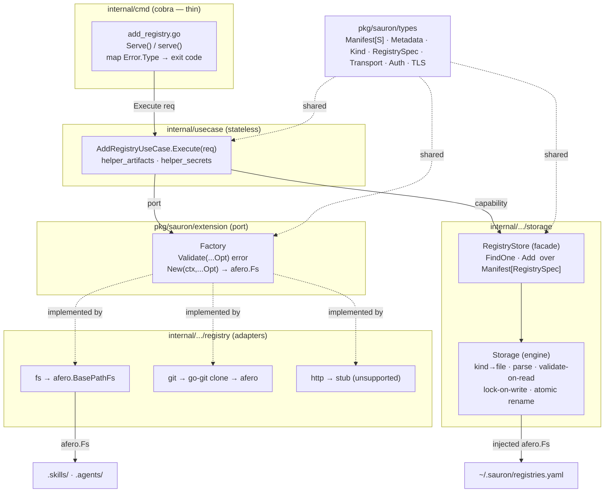
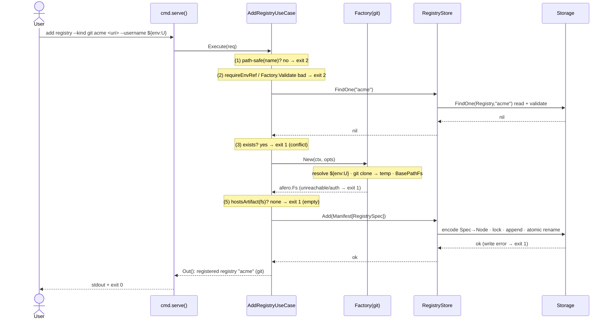
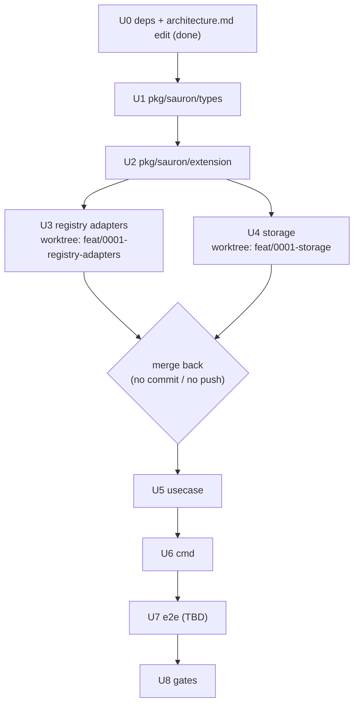

# Implementation Plan — Add Registry

Implementation plan for the [Add Registry](spec.md) feature. It captures **what**
changes, **how** the pieces fit, and the **execution** order — not the code
itself. It conforms to the [architecture contract](../contracts/architecture.md),
the [CLI contract](../contracts/cli.md), and the
[configuration data contract](../contracts/configuration.md), and realizes the
[`add registry` command contract](contracts/add-registry.md) and the
[git](capabilities/git.md) / [http](capabilities/http.md) /
[filesystem](capabilities/filesystem.md) transport capabilities.

## 1. Goal & scope

Implement `sauron add registry`: register a named source
(`<name> <uri>` + `--kind` + auth/TLS/timeout flags), prove it is reachable
**and hosts ≥1 skill or agent**, and append one `Registry` document to
`registries.yaml` atomically. Establish the foundations every later feature
reuses: the generic `Manifest[S]`, the `Storage` / `RegistryStore` layering, the
`extension.Factory` transport seam, and the `usecase.Error{Type,Reason}` model.

**Out of scope (YAGNI):**

- Digest & version computation (needed by `install` / `list catalogue`, not by `add`).
- The `http` transport content path — shipped as a **typed stub** returning a
  runtime "not yet supported" error (the HTTP listing convention is unspecified).
- The `Skill` / `Agent` / `Persona` / `Provider` / `Schedule` types and their
  stores; `List` / `Remove` on the registries store (arrive with 0002 / 0004).
- A reusable `Action` — the only reusable step here (the `.skills` / `.agents`
  scan) is a use-case helper for now; it graduates to `ScanRegistryAction` when
  `list catalogue` / `install` need richer enumeration.

## 2. Component & dependency flow



Two distinct `afero.Fs` are in play: the engine's **home-rooted** fs for
`~/.sauron/*.yaml` (fx-injected), and the per-call **registry-content** fs the
`Factory` produces (git temp clone / fs base path). They never mix.

## 3. Runtime sequence



## 4. Interfaces (final)

```go
// pkg/sauron/types  — public; the Manifest[S] definition carries no yaml.Node
type Kind string
const KindRegistry Kind = "Registry"

type Manifest[S any] struct {
    APIVersion string            `yaml:"apiVersion"`
    Kind       Kind              `yaml:"kind"`
    Metadata   Metadata          `yaml:"metadata"`
    Spec       S                 `yaml:"spec"`
}
type Metadata struct {
    Name   string            `yaml:"name"`
    Labels map[string]string `yaml:"labels,omitempty"`
}

type Transport string
const (
    TransportGit        Transport = "git"
    TransportHTTP       Transport = "http"
    TransportFilesystem Transport = "filesystem"
)
type RegistrySpec struct {
    Transport Transport `yaml:"transport"`
    URI       string    `yaml:"uri"`
    Auth      *Auth     `yaml:"auth,omitempty"`
    TLS       *TLS      `yaml:"tls,omitempty"`
    SSHKey    string    `yaml:"sshKey,omitempty"`
    Timeout   string    `yaml:"timeout,omitempty"`
}
type Auth struct { Username, Password string `yaml:",omitempty"` }
type TLS  struct {
    SkipVerify bool   `yaml:"skipVerify,omitempty"`
    CACert     string `yaml:"caCert,omitempty"`
    ClientCert string `yaml:"clientCert,omitempty"`
    ClientKey  string `yaml:"clientKey,omitempty"`
}
```

```go
// pkg/sauron/extension
type FactoryOptions struct {
    URI                string
    Timeout            time.Duration
    Username, Password string // RESOLVED values for connecting; the ${env:VAR} refs are persisted, not these
    SSHKey             string
    SkipTLSVerify      bool
    CACert, ClientCert, ClientKey string
}
type FactoryOption func(*FactoryOptions)

// Factory builds an afero.Fs view of a registry's content; one impl per transport.
type Factory interface {
    Validate(opts ...FactoryOption) error                            // flag-appropriateness → usage (exit 2)
    New(ctx context.Context, opts ...FactoryOption) (afero.Fs, error) // construct + reach → runtime (exit 1)
}
```

```go
// internal/infrastructure/repository/storage
type RawManifest = types.Manifest[yaml.Node] // engine view: spec deferred

// Storage — the file engine: kind→file, parse the multi-doc stream, validate on
// read, serialize writes with a lockfile, write atomically (temp + rename).
type Storage interface {
    FindOne(ctx context.Context, kind types.Kind, name string) (*RawManifest, error) // nil if absent
    Add(ctx context.Context, m RawManifest) error                                    // lock-on-write; no validation
}

// RegistryStore — typed facade over Storage for the Registry resource.
type RegistryStore interface {
    FindOne(ctx context.Context, name string) (*types.Manifest[types.RegistrySpec], error) // nil if absent
    Add(ctx context.Context, m types.Manifest[types.RegistrySpec]) error                    // stamps Kind = Registry
}
```

```go
// internal/usecase
type Error struct { Type, Reason string } // cmd maps Type → exit code; Reason → stderr
func (e *Error) Error() string { return e.Reason }
// Type ∈ {"usage","conflict","unreachable","validation","io"};  cmd: usage → 2, else → 1
```

## 5. Affected files

### `pkg/sauron/types/` (new)

| File | Change |
|---|---|
| `doc.go` | package comment |
| `manifest.go` | `Manifest[S]`, `Metadata`, `Kind`, `KindRegistry` |
| `registry.go` | `RegistrySpec`, `Transport` (+consts), `Auth`, `TLS` |

### `pkg/sauron/extension/` (edit)

| File | Change |
|---|---|
| `registry.go` → `factory.go` | remove old `Registry` (`Name`/`Ping`); add `Factory`, `FactoryOptions`, `FactoryOption` |
| `provider.go` | untouched |

### `internal/infrastructure/repository/registry/` (new/edit)

| File | Change |
|---|---|
| `fs/factory.go` (+test) | `New() extension.Factory`; `Validate` rejects auth/tls flags; `New` = `afero.NewBasePathFs(OsFs, uri)` + accessibility check |
| `git/factory.go` (+test) | `New() extension.Factory`; `Validate` accepts ssh/auth/tls; `New` = go-git clone → temp dir → `afero.BasePathFs` (ctx-bound, cleanup) |
| `http/factory.go` (+test) | stub `Factory`; `Validate` ok; `New` returns runtime "http transport not yet supported" |
| `fx.go` | provide the three as **named** `extension.Factory` (`name:"registry.git|http|filesystem"`); replace empty `fx.Options()` |
| `{fs,git,http}/doc.go` | keep/trim package docs |

### `internal/infrastructure/repository/storage/` (new/edit)

| File | Change |
|---|---|
| `storage.go` (+test) | `Storage` interface + engine impl (kind→file map, stream parse, validate-on-read, atomic write) |
| `registry_store.go` (+test) | `RegistryStore` interface + impl over `Storage` (encode/decode `RegistrySpec` ↔ `yaml.Node`) |
| `lock.go` | lockfile guard for writes |
| `validate.go` | JSON-schema validation from embedded schemas |
| `schemas/` (generated) | copy of `spec/contracts/schemas/*.json` for `go:embed` |
| `mock_based_storage.go`, `mock_based_registry_store.go` | testify mocks |
| `fx.go` | provide `Storage` + `RegistryStore`; drop `NewStore` |
| `store.go` | placeholder folded into `storage.go` |
| `filesystem.go` | unchanged (home-rooted `afero.Fs`) |

### `internal/usecase/` (new/edit)

| File | Change |
|---|---|
| `usecase_add_registry.go` (+test) | `AddRegistryUseCase`, `AddRegistryRequest`, fx `In` params (named factories + store + logger), `Execute` + private helpers |
| `helper_artifacts.go` (+test) | `hostsArtifact(fs afero.Fs) (bool, error)` over `.skills` / `.agents` |
| `helper_secrets.go` (+test) | `requireEnvRef` (format → exit 2), `resolveEnvRef` (lookup → exit 1) |
| `api.go` | add `Error{Type,Reason}` + Type constants + constructors |
| `fx.go` | provide `AddRegistryUseCase` |

### `internal/cmd/` (new/edit)

| File | Change |
|---|---|
| `add_registry.go` (+test) | `Serve()` / `serve()`, `addRegistryFlags` (embeds `timeoutFlags` + `--kind`/auth/tls/ssh), build request, `fx.Populate`, run, map error → exit |
| `root.go` | wire `add` → `registry` subcommand |
| `helper_flags.go` | add `--kind` + connection-flag binders (or keep them local to `add_registry.go`) |

### Build & governance

| File | Change |
|---|---|
| `go.mod` / `go.sum` | `gopkg.in/yaml.v3` (→ direct), `github.com/google/jsonschema-go`, `github.com/go-git/go-git/v5` |
| `Taskfile.yml` | `generate` target: copy `spec/contracts/schemas` → `storage/schemas` (feeds `go:embed`) |
| `spec/contracts/architecture.md` | **DONE** — storage validation narrowed to reads (validate-on-load); app-authored writes exempt |

## 6. Checkpoints

| # | Milestone | Verify |
|---|---|---|
| C0 | deps added + `task generate` | `go build ./...` |
| C1 | `types` compile + tests | `go test ./pkg/sauron/types/...` |
| C2 | `extension.Factory` + port edit | `go build ./pkg/...` |
| C3 | registry factories (fs over memmap; git `Validate`/options; http stub) | `go test ./internal/infrastructure/repository/registry/...` |
| C4 | storage (FindOne nil-if-absent, dup re-check, atomic round-trip on memmap, validate-on-read rejects bad doc, lock) | `go test ./internal/infrastructure/repository/storage/...` |
| C5 | use case — table-driven over all 7 ordered paths + Type classification (mock store + mock factories) | `go test ./internal/usecase/...` |
| C6 | `serve()` without cobra + manual run | `go test ./internal/cmd/...`; `sauron add registry …` |
| C7 | gates | `task gate-lint && task test && task gate-coverage` (≥80%) |

## 7. Execution flow & parallelization



- **U3 ‖ U4 are parallel and worktree-isolated.** Each executing agent works on
  its own branch in a fresh worktree (`feat/0001-registry-adapters`,
  `feat/0001-storage`); on completion its branch is **merged back into the working
  tree without committing and without pushing**. They share only `pkg/` (frozen
  after U2), so no file collisions.
- **U1 → U2, U5 → U6, U8** are sequential in the working tree.
- **U0** (dependencies + `task generate`) is sequential and first. The
  validation-policy edit to the [architecture contract](../contracts/architecture.md)
  is already applied — no ADR; the policy is recorded directly in the contract.

## 8. Testing

### Unit tests (in scope)

- **Arrange / Act / Assert**, table-driven by default; `testify` `assert`/`require`.
- Collaborators substituted with `MockBased<Iface>` mocks
  (`mock_based_<iface>.go`) — the use case mocks `RegistryStore` and the named
  `Factory` values; `RegistryStore` is exercised over a memmap-backed `Storage`.
- **No real filesystem**: all fs interaction is through `afero.NewMemMapFs()`;
  tests neither write the real disk nor mutate process environment variables.
- Coverage target 90%, project floor 80% (`task gate-coverage`).
- Per-checkpoint scope is listed in [§6](#6-checkpoints).

### Integration / end-to-end tests (BDD)

**Yet to be defined.** The black-box BDD suite (godog + testcontainers, graybox
against the built binary, asserting via `pkg/` types) will cover the criteria and
use cases in [spec.md](spec.md). The scenario map, fixtures (filesystem vs a git
server), the state read-back strategy, and any `test/e2e` harness extension are
deferred to a follow-up and will be added here, then wired into the `U7` unit and
the `gate-integration` checkpoint.

## 9. Key decisions

1. **No `Registry` object port** — transports are `extension.Factory` producing an
   `afero.Fs`; scanning is generic over that fs.
2. **Closed transport set** — the use case injects the three named factories and
   switches on `transport`; not runtime-pluggable (YAGNI). `Factory`'s value is
   DIP + mocking.
3. **`FactoryOptions` typed superset**; each `Factory.Validate` rejects flags that
   do not apply to its transport → exit 2.
4. **Secrets** — a literal (non-`${env:VAR}`) auth value → exit 2; refs are
   persisted as-is; resolved only into `FactoryOptions` for connecting; an unset
   env var at connect time → exit 1.
5. **Generic `Manifest[S]`** lives in `pkg/types`; the engine uses
   `Manifest[yaml.Node]`, the facade uses `Manifest[RegistrySpec]`; `yaml.Node`
   never leaks into `pkg/`.
6. **Lock on writes only**; reads are lock-free, consistent via atomic temp + rename.
7. **Validation on load, not on app-authored writes** — `Storage.FindOne`
   validates against the embedded JSON schema; `Add` does not. Recorded in the
   [architecture contract](../contracts/architecture.md) (no ADR).
8. **Path-safe** = the `Registry.schema.json` regex
   `^[a-z0-9]([a-z0-9-]*[a-z0-9])?$`.
9. **Error model** — `usecase.Error{Type,Reason}`; storage returns plain/sentinel
   errors, the use case classifies, cmd maps `usage → 2, else → 1`.

## 10. Open items

- **e2e definition** (see [§8](#8-testing)).
