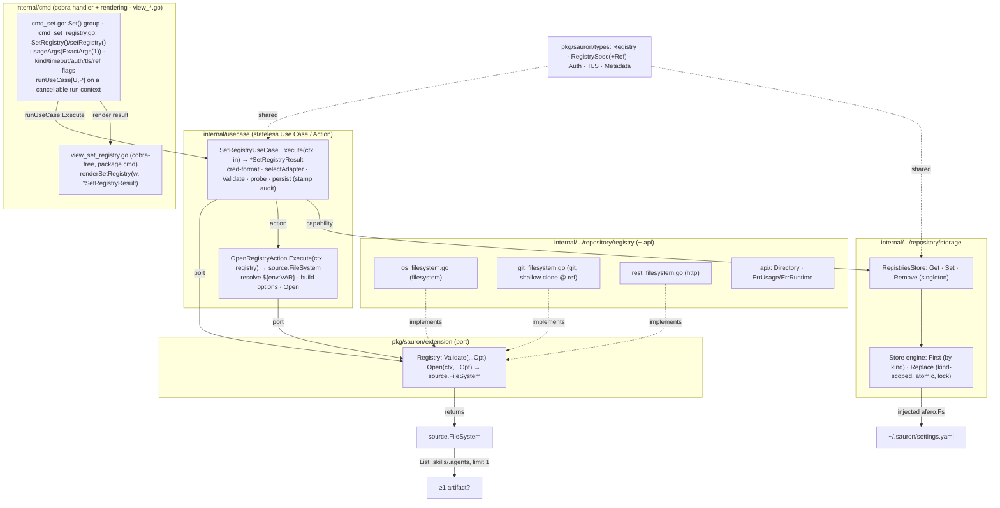

# Implementation Plan — Set Registry

Implementation plan for the [Set Registry](spec.md) feature, **aligned to the
code as built**. It captures **what** was delivered, **how** the pieces fit, and
the **status** of each checkpoint — not the code itself. It conforms to the
[architecture contract](../contracts/architecture.md), the
[CLI contract](../contracts/cli.md), and the
[state data contract](../contracts/state.md), and realizes the
[`set registry` command contract](contracts/set-registry.md) and the
[git](capabilities/git.md) / [http](capabilities/http.md) /
[filesystem](capabilities/filesystem.md) transport capabilities. The work is
split into verifiable tasks in [TASKS.md](TASKS.md).

## 1. Goal & scope

`sauron set registry <uri>` configures the **single** artifact source — its URI
plus `--kind` and the transport's auth/TLS/timeout flags (and `--ref` for git) —
proves the source is reachable **and hosts ≥1 skill or agent**, then persists it
as the one `Registry` document in `settings.yaml`, **replacing** any registry
already set (an upsert; FR-001, FR-004, FR-007). All three transports
(filesystem, http, git) ship, git honoring `--ref` (FR-013), and the black-box
`test/e2e` BDD suite covers every `set registry` scenario.

As the first built feature, Set Registry also establishes the **foundations
every later feature reuses**:

- the **Use Case / Action** model: a stateless
  `UseCase[I, P].Execute(ctx, in) (*P, error)` returning a
  **presentation-agnostic** product, with collaborators injected by uberfx and
  per-invocation data arriving as the input — the use case **never renders**;
- the **`OpenRegistry` Action** — the shared open-a-stored-registry step
  (select transport, resolve `${env:VAR}`, build options, open) the probe and
  the later catalogue/listing use cases compose;
- the singleton **`RegistriesStore`** (`Get` / `Set` / `Remove`) over the
  kind-agnostic `Store` engine, persisting the one `Registry` to
  `settings.yaml`;
- the classified `usecase.Error{Type, Reason}` model and the single exit-code
  site (`cmd`'s `exitCode`), plus the `runUseCase[U, P]` fx bootstrap and the
  `view_*.go` rendering convention in `package cmd`.

**Delivered (this feature):**

- The upsert across all three transports + the git `--ref` pin, credential
  format enforcement, the presence scan, audit-timestamp stamping, atomic
  replace persistence, and the e2e suite.

**Out of scope — deferred to later features (YAGNI):**

- Reading or downloading registry content beyond the presence probe — the scan
  proves only that a listing yields ≥1 entry; no per-artifact metadata, digest,
  or version is computed.
- Describing (`describe registry`, [0002](../0002-describe-registry/spec.md)) and
  removing (`unset registry`, [0003](../0003-unset-registry/spec.md)) the
  registry.

## 2. Pre-requirements

Before executing the tasks in [TASKS.md](TASKS.md):

- **Toolchain** — Go `1.26`, the [Task](https://taskfile.dev) runner, a
  `CGO_ENABLED=0` build; `golangci-lint`, `gofmt`, and `trivy` for the gates.
- **Specification surface** — the contracts this plan realizes are in place: the
  [`set registry` command contract](contracts/set-registry.md), the
  [git](capabilities/git.md) / [http](capabilities/http.md) /
  [filesystem](capabilities/filesystem.md) capabilities, and the
  [state data contract](../contracts/state.md) with the `Registry` JSON schema.
- **Existing scaffolding** — the cobra root command, the uberfx wiring
  (`NewFxOptions` per module, the `NewApp` bootstrap, the pond pool), the
  `internal/config` home resolution, the zap+ECS telemetry, the
  `extension.Registry` / `source.FileSystem` ports, and the three transport
  adapters under `infrastructure/repository/registry`, as fixed by the
  architecture contract.
- **Integration tooling** — the `test/e2e` module's godog + testcontainers stack
  for `task gate-integration`; its git scenarios run on a Linux runner.

## 3. Component & dependency flow (as built)



The handler maps flags+args onto `SetRegistryInput`, runs the use case through
`runUseCase` (which builds a minimal fx app, resolves the use case, and tears it
down), and renders the returned `*SetRegistryResult` through `view_set_registry.go`.
The use case depends only on the `extension.Registry` port, the `OpenRegistry`
Action, and the singleton `RegistriesStore`; it knows nothing of cobra or
stdout.

## 4. Runtime sequence

```text
User            cmd            UseCase          OpenAction      Registry        Store         view
 │ set registry <uri> (1)       │                  │              │              │             │
 │──────────────▶│              │                  │              │              │             │
 │               │ flags.validate() (kind) — bad → usage (2)      │              │             │
 │               │ Execute(ctx, in)                │              │              │             │
 │               │─────────────▶│                  │              │              │             │
 │               │              │ cred-format · selectAdapter     │              │             │
 │               │              │ Validate(opts)   │              │              │             │
 │               │              │────────────────────────────────▶│              │             │
 │               │              ◀─ ─ ─ ─ ─ ─ ─ ─ ─ ─ ─ ─ ─ ─ ─ ─ ─│ ok           │             │
 │               │              │ probe → Open(ctx, registry)     │              │             │
 │               │              │─────────────────▶│ Open ────────▶│             │             │
 │               │              ◀─ ─ ─ ─ ─ ─ ─ ─ ─ │ source.FS    │              │             │
 │               │              │ List(.skills/.agents, 1) → ≥1?  │              │             │
 │               │              │ persist: stamp audit · Set ─────────────────────▶│           │
 │               │              ◀─ ─ ─ ─ ─ ─ ─ ─ ─ ─ ─ ─ ─ ─ ─ ─ ─ ─ ─ ─ ─ ─ ─ ─ │ ok          │
 │               ◀─ ─ ─ ─ ─ ─ ─ │ *SetRegistryResult{URI,Transport}              │             │
 │               │ renderSetRegistry(stdout, result) ────────────────────────────────────────▶│
 ◀─ ─ ─ ─ ─ ─ ─ │ exit 0        │                  │              │              │             │
```

Solid `──▶` is a synchronous call, dashed `◀─ ─` a return. The pipeline stops at
the first failing step, with the exit code shown.

- `(1)` `sauron set registry --kind git --ref release-2.0 <uri> --username ${env:U} --password ${env:T}`
- `kind` not a known transport (handler) → **usage (2)**; a literal (non-`${env:VAR}`) password → **usage (2)**
- `Validate(opts)` — a flag inapplicable to the transport (`--ref` on http/fs) → **usage (2)**, else unreachable
- `Open` / `${env:VAR}` unset / bad ref → **unreachable (1)**
- `List(.skills/.agents, 1)` — no entries → **unreachable (1, "hosts no artifact")**
- `Set` — atomic kind-scoped replace into `settings.yaml`; write error → **io (1)**
- success → `registry set to <uri> (<transport>)` on stdout, **exit 0**

## 5. Interfaces (as built)

```go
// internal/usecase — the Use Case / Action shapes share one signature; the use
// case returns a presentation-agnostic product and renders nothing.
type UseCase[I, P any] interface { Execute(ctx context.Context, in I) (*P, error) }
type Action[I, P any]  interface { Execute(ctx context.Context, in I) (*P, error) }

type SetRegistryUseCase struct{ /* adapters, open, registries, logger */ }
func (uc *SetRegistryUseCase) Execute(ctx context.Context, in SetRegistryInput) (*SetRegistryResult, error)

type SetRegistryInput struct {
    URI, Transport, Ref, Username, Password, SSHKey  string
    SkipTLSVerify                                     bool
    CACert, ClientCert, ClientKey                     string
    Timeout                                           time.Duration
}
type SetRegistryResult struct { URI string; Transport types.Transport } // presentation-agnostic

// the shared open-a-stored-registry step (resolves ${env:VAR}, opens the source).
type OpenRegistry interface {
    Execute(ctx context.Context, registry types.Registry) (source.FileSystem, error)
}

// the classified failure model — cmd maps Type → exit code, Reason → stderr.
type Error struct { Type Type; Reason string } // Type ∈ {usage,conflict,unreachable,io,not_found}

// internal/.../storage — the singleton typed view over the one Registry document.
type RegistriesStore interface {
    Get(ctx context.Context) (*types.Registry, error)        // nil when none set
    Set(ctx context.Context, r types.Registry) error          // stamps envelope; replaces the one present
    Remove(ctx context.Context) error                         // absent → no-op
}
// Store engine (kind-scoped within a shared file):
func (s *Store) First(ctx, kind) (*yaml.Node, error)          // first doc of kind, validate-on-read
func (s *Store) Replace(ctx, kind, *yaml.Node) error          // drop kind's docs, append new; keep other kinds

// internal/cmd — the fx bootstrap and the rendering seam.
func runUseCase[U, P any](ctx, exec func(context.Context, U) (*P, error), opts ...fx.Option) (*P, error)
func renderSetRegistry(w io.Writer, result *usecase.SetRegistryResult) error // view_set_registry.go, package cmd
```

## 6. Delivered file layout

### `internal/`
| Path | Holds |
|---|---|
| `usecase/usecase_set_registry.go` (+ test) | `SetRegistryUseCase` (cred-format → selectAdapter → Validate → probe → persist), `SetRegistryInput`/`SetRegistryResult`, `classifyAdapterErr`, audit stamping (FR-014) |
| `usecase/action_open_registry.go` (+ mock, test) | `OpenRegistryAction`/`OpenRegistry` — transport select, `${env:VAR}` resolve, option build, `Open`; classifies an open failure as unreachable |
| `usecase/api.go`, `usecase/fx.go`, `usecase/helper.go` | the `UseCase`/`Action` interfaces and `Error{Type,Reason}` model; the fx provider; `selectFields` and shared field constants |
| `infrastructure/repository/storage/{store,registries_store,singleton,schema,lock,filesystem,fx}.go` (+ mock) | the kind-scoped `Store` engine (`First`/`Replace`, validate-on-read, lock + atomic temp+rename), the singleton `RegistriesStore` (`Get`/`Set`/`Remove`) over `settings.yaml`, the embedded `Registry` schema |
| `cmd/{set,set_registry}.go` (+ tests) | the `Set()` group, the `SetRegistry()` builder + `setRegistry()` handler (maps flags → input, `runUseCase`, render) |
| `cmd/{helper,helper_flags,helper_fx,root}.go` | `runUseCase[U,P]`, `exitCode`, `usageArgs`, the `kindFlags`/`timeoutFlags` binders and `kind` validation, root wiring |
| `cmd/view_set_registry.go` (+ test) | `renderSetRegistry` — the cobra-free confirmation line |
| `telemetry/fields.go` | the `sauron.registry.*` ECS field-key constants |

## 7. Checkpoints

Ordered, verifiable milestones — each met when its single command passes (these
back the tasks in [TASKS.md](TASKS.md)):

| Milestone | Verify |
|---|---|
| Storage engine + singleton `RegistriesStore` | `go test ./internal/infrastructure/repository/storage/...` |
| `OpenRegistry` Action (env-resolve + open) | `go test ./internal/usecase/...` |
| Use-case pipeline + `Error` classes | `go test ./internal/usecase/...` |
| cmd surface + view rendering + exit-code mapping | `go test ./internal/cmd/...` |
| Lint / format / coverage / security | `task gate-lint && task gate-coverage && task gate-security` |
| e2e scenarios | `task build && task gate-integration` |
| Full gate | `task all` |

## 8. Key decisions

1. **Use Case returns a presentation-agnostic product; the command renders.**
   `SetRegistryUseCase.Execute` returns `*SetRegistryResult{URI, Transport}` and
   never writes to an `io.Writer`. The handler maps flags+args onto
   `SetRegistryInput`, runs the use case through `runUseCase`, and renders the
   result through `view_set_registry.go` (cobra-free, `package cmd`). The
   `usecase` package imports neither cobra nor `internal/cmd`.
2. **`set` is an upsert against a singleton, not a named create.** The registry
   carries no user-given name (Sauron has exactly one); `RegistriesStore.Set`
   replaces the one present, so there is no "already exists" conflict (FR-007).
   The store's `Replace` is **kind-scoped** within `settings.yaml` — it drops only
   `Registry` documents and preserves every other kind in the same file.
3. **Validate before persist; leave state unchanged until it succeeds.** The
   pipeline runs credential-format → `Validate(opts)` → presence probe before any
   write, so a failure at any step persists nothing and the existing registry is
   untouched (FR-006, FR-007, FR-010).
4. **Presence is a `List(.skills/.agents, limit 1)` scan over the `OpenRegistry`
   Action.** The probe opens the source through the shared Action and reports
   unreachable when no artifact root yields an entry (FR-004). The same Action —
   transport select, `${env:VAR}` resolve, option build, `Open` — is the seam the
   later catalogue/listing use cases compose.
5. **Secrets are `${env:VAR}` references.** The password (the secret) must be an
   environment reference or it is a usage error; the username may be a literal or
   a reference (FR-003). References are persisted verbatim and resolved only into
   `Options` for connecting; an unset variable at connect time is unreachable.
   Nothing secret is ever written to disk.
6. **Audit timestamps are stamped at persist (FR-014).** `persist` sets
   `metadata.creationTimestamp` and `metadata.lastUpdatedTimestamp` to the same
   RFC3339 UTC instant taken from the clock before `Set`.
7. **Error model + single exit-code site.** Adapters/storage return
   `api`/sentinel errors; `classifyAdapterErr` maps `api.ErrUsage` → usage and
   anything else → unreachable; the use case attaches `Error{Type, Reason}` and
   `cmd`'s `exitCode` is the single site mapping `usage → 2`, every other class
   and a nil error otherwise (`else → 1`, `nil → 0`). A malformed flag is caught
   in the handler as `errInvalidFlag` → exit 2.
8. **`runUseCase[U, P]` runs on a cancellable run context.** It builds a minimal
   fx app, resolves the use case, runs the closure, then cancels **before** Stop
   so deferred adapter work (e.g. the git-clone cleanup scheduled on the worker
   pool) finishes and teardown does not deadlock.
9. **Transport defaults bind in the flag layer.** `--kind` defaults to `http`
   (FR-002) and `--timeout` to `30s` (FR-012) at the cobra binding, keeping the
   use case free of presentation defaults.

## 9. Tasks

The work is split into independently **verifiable** tasks in [TASKS.md](TASKS.md)
— each names the files it owns and the single command that confirms it.
Dependency order:

`T1 storage → T2 open action`; then `→ T3 use case → T4 cmd + view → T5 e2e →
T6 full gate`.
