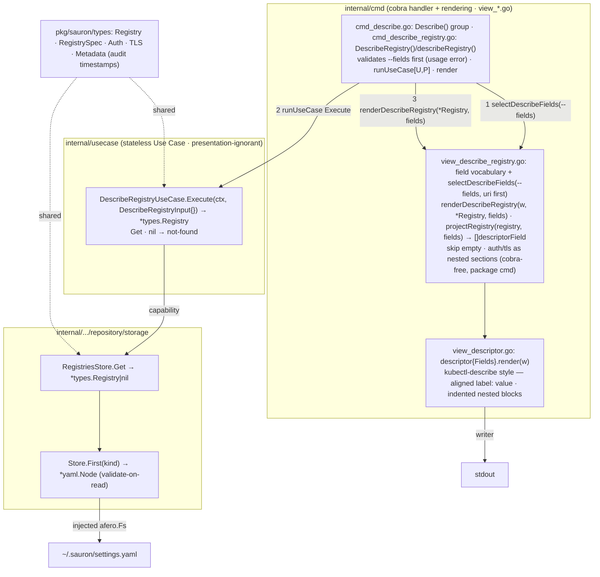

# Implementation Plan — Describe Registry

**Status:** Built

Implementation plan for the [Describe Registry](spec.md) feature, **aligned to
the code as built**. It captures **what** was delivered, **how** the pieces fit,
and the **status** of each checkpoint — not the code itself. It conforms to the
[architecture contract](../contracts/architecture.md), the
[CLI contract](../contracts/cli.md), and the
[state data contract](../contracts/state.md), and realizes the
[`describe registry` command contract](contracts/describe-registry.md). The work
is split into verifiable tasks in [TASKS.md](TASKS.md).

## 1. Goal & scope

`sauron describe registry` reads the single `Registry` document from
`settings.yaml` and prints its full detail as a **`kubectl describe`-style
descriptor** — a vertical view of left-aligned field labels with their values,
and indented nested blocks for structured fields such as `auth` and `tls`, per
the example in the [command contract](contracts/describe-registry.md). The output
is field-selectable (`--fields`), with `uri` always present and first (the single
registry has no name; `uri` is its identity, FR-003). The command is read-only:
it persists nothing. Credential fields render as their stored environment
reference, never a resolved secret (FR-002). The registry's audit timestamps
(`creationTimestamp`, `lastUpdatedTimestamp`) display by default when populated
(FR-006). When no registry is configured the command fails with a runtime error
(exit 1, FR-004).

The feature also establishes the **shared descriptor renderer** every later
`describe`-style feature reuses:

- `internal/cmd`'s `view_descriptor.go` — a dependency-free, cobra-free
  descriptor renderer over the standard library (`package cmd`), producing the
  [CLI contract](../contracts/cli.md) detail rendering. It sits beside the
  `view_table.go` table renderer — `describe` is to a descriptor what `list` is
  to a table — and owns alignment and nesting but no registry semantics.

**Delivered (this feature):**

- The `describe registry` command, the describe use case (read → not-found), the
  shared descriptor renderer, the `view_describe_registry.go` field vocabulary +
  selection + projection, and the e2e scenarios.

**Out of scope — deferred to later features (YAGNI):**

- Any new store read method — the single-record read `RegistriesStore.Get` ships
  from [set registry](../0001-set-registry/plan.md) and is reused as-is.
- Resolving credential references to secret values — Sauron never reads secrets
  at rest; the env reference is the value shown (FR-002).

## 2. Pre-requirements

Before executing the tasks in [TASKS.md](TASKS.md):

- **[Set Registry](../0001-set-registry/plan.md) is in place** — the singleton
  `RegistriesStore` (`Get`), the `usecase.Error{Type, Reason}` model and the
  single `cmd` `exitCode` site, the `runUseCase[U, P]` fx bootstrap, the cobra
  root, the `view_*.go` rendering convention in `package cmd`, and the `test/e2e`
  godog harness all ship.
- **No new dependency** — the descriptor renderer uses the standard library, so
  the approved-dependency list on the
  [architecture contract](../contracts/architecture.md) is untouched.
- **Toolchain** — Go `1.26`, the [Task](https://taskfile.dev) runner, and the
  existing `gate-lint` / `gate-coverage` / `gate-security` / `gate-integration`
  gates.

## 3. Component & dependency flow (as built)



The handler validates the `--fields` selection **at the boundary, before the use
case runs** — `selectDescribeFields` checks the request against the view's fixed
field vocabulary (`uri` always present and first, dedup), rejecting an unknown
field as a usage error (exit 2). It then runs the use case, which reads the one
registry through `RegistriesStore.Get`, classifies the absence as not-found, and
returns the bare `*types.Registry`. The handler renders that record through the
`view_*.go` files: `renderDescribeRegistry` projects the validated fields
(skipping empty ones, nesting `auth`/`tls`) and `view_descriptor.go` lays them
out. **The use case knows nothing of presentation — not which fields are shown,
not even that `--fields` exists; field selection is a client/view concern.**

## 4. Runtime sequence

```text
User            cmd            UseCase           Store         view
 │ describe registry (1)        │                  │             │
 │──────────────▶│              │                  │             │
 │               │ selectDescribeFields(--fields) — bad value → usage (2)
 │               │ Execute(ctx, DescribeRegistryInput{})         │
 │               │─────────────▶│                  │             │
 │               │              │ Get()            │             │
 │               │              │─────────────────▶│             │
 │               │              ◀─ ─ ─ ─ ─ ─ ─ ─ ─ │ *Registry|nil
 │               │              │ nil → not-found (exit 1)        │
 │               ◀─ ─ ─ ─ ─ ─ ─ │ *types.Registry  │             │
 │               │ renderDescribeRegistry: projectRegistry · descriptor.render ─▶│
 │               ◀─ ─ ─ ─ ─ ─ ─ ─ ─ ─ ─ ─ ─ ─ ─ ─ ─│ descriptor → stdout
 ◀─ ─ ─ ─ ─ ─ ─ │ exit 0        │                  │             │
```

Solid `──▶` is a synchronous call, dashed `◀─ ─` a return. The pipeline stops at
the first failing step, with the exit code shown.

- `(1)` `sauron describe registry --fields uri,transport,auth`
- a `--fields` value outside its fixed set → **usage (2)**, rejected at the
  handler (`selectDescribeFields`) before the use case runs
- `Get` read, parse, or schema-validation failure → **io (1, "read registry: …")**
- no registry configured → **not-found (1, "no registry is configured")**
- success → writes the descriptor to stdout, **exit 0**

## 5. Interfaces (as built)

```go
// internal/usecase — reads the single registry and returns the bare record;
// renders nothing and takes no field selection.
type DescribeRegistryUseCase struct{ /* registries, logger */ }
func (uc *DescribeRegistryUseCase) Execute(ctx context.Context, in DescribeRegistryInput) (*types.Registry, error)

// DescribeRegistryInput is the per-invocation input. Describing the single
// configured registry takes no business input; field selection is a presentation
// concern resolved by the caller.
type DescribeRegistryInput struct{}

// internal/cmd (view_descriptor.go, package cmd) — the shared, record-agnostic
// renderer. A pure, cobra-free value type; no fx wiring.
type descriptor       struct { Fields []descriptorField }
type descriptorField  struct { Label, Value string; Children []descriptorField } // leaf or nested section
func (d descriptor) render(w io.Writer) error

// internal/cmd (view_describe_registry.go, package cmd) — owns the --fields
// vocabulary and projects the validated fields onto descriptor fields.
//
// selectDescribeFields validates the requested fields against the fixed set,
// forcing uri present and first and deduping; an empty request yields every field
// in order. An unknown field is errInvalidFlag → usage (exit 2). Valid set:
// {uri, transport, ref, auth, tls, sshKey, timeout, creationTimestamp,
// lastUpdatedTimestamp}.
func selectDescribeFields(requested []string) ([]string, error)

// renderDescribeRegistry projects the validated fields onto a descriptor and
// writes it, skipping empty values; auth/tls become nested sections; credentials
// are the stored env references, never resolved.
func renderDescribeRegistry(w io.Writer, registry *types.Registry, fields []string) error
func projectRegistry(registry types.Registry, fields []string) []descriptorField

// internal/.../storage — REUSED unchanged from set registry; no new method.
type RegistriesStore interface {
    Get(ctx context.Context) (*types.Registry, error) // nil when none set
    Set(ctx context.Context, r types.Registry) error
    Remove(ctx context.Context) error
}
```

## 6. Delivered file layout

### `internal/`
| Path | Holds |
|---|---|
| `usecase/usecase_describe_registry.go` (+ test) | `DescribeRegistryUseCase` (`Get` → not-found), the empty `DescribeRegistryInput`, `DescribeRegistryUseCaseParams`, the ECS-logged outcome. Returns the bare `*types.Registry`; no field selection, no result type. |
| `usecase/fx.go` | `NewDescribeRegistryUseCase` registered in `NewFxOptions` |
| `cmd/cmd_describe.go` | the `Describe()` group, attaching `DescribeRegistry()` |
| `cmd/cmd_describe_registry.go` (+ test) | the `DescribeRegistry()` builder + `describeRegistry()` handler — validates `--fields` first, `runUseCase`, render |
| `cmd/view_descriptor.go` (+ test) | the shared `descriptor`/`descriptorField` renderer — kubectl-describe-style alignment and nesting, standard library only |
| `cmd/view_describe_registry.go` (+ test) | the `--fields` vocabulary (`describeFieldOrder` + constants), `selectDescribeFields` (boundary validation), `renderDescribeRegistry` / `projectRegistry` — maps the selected fields onto descriptor fields, skipping empty, nesting `auth`/`tls` as env references |
| `cmd/cmd_root.go` | `root.AddCommand(Describe())` wiring (the command list) |

## 7. Checkpoints

Ordered, verifiable milestones — each met when its single command passes (these
back the tasks in [TASKS.md](TASKS.md)):

| Milestone | Verify | Status |
|---|---|---|
| Shared descriptor renderer | `go test ./internal/cmd/...` | Built |
| Describe use case | `go test ./internal/usecase/...` | Built |
| cmd surface + `--fields` validation + registry projection | `go test ./internal/cmd/...` | Built |
| Lint / format / coverage / security | `task gate-lint && task gate-coverage && task gate-security` | Built |
| e2e scenarios | `task build && task gate-integration` | Built |
| Full gate | `task all` | Built |

## 8. Key decisions

1. **Reuse the singleton read path; add no store method.** The use case reads
   through the existing `RegistriesStore.Get(ctx)` from
   [set registry](../0001-set-registry/plan.md); no new storage surface is built.
2. **Shared `descriptor` renderer in `internal/cmd` — a `kubectl describe`-style
   view, not a table.** A pure, cobra-free formatter in `package cmd` over the
   standard library, producing the [CLI contract](../contracts/cli.md) detail
   rendering: left-aligned labels with their values and indented nested blocks for
   `auth`/`tls`. It is distinct from the column-aligned `view_table.go` renderer
   (single-record detail is a descriptor, as `kubectl describe` differs from
   `kubectl get`) and owns no registry semantics, so later describe features reuse
   it unchanged. No third-party dependency.
3. **Field selection is a client/view concern — validated at the handler boundary
   and projected by the view; the use case is ignorant of presentation.** The
   `--fields` vocabulary and ordering live in `view_describe_registry.go`. The
   handler runs `selectDescribeFields` **before** the use case (forcing `uri`
   first, deduping; an unknown value is `errInvalidFlag` → usage, exit 2, rejected
   before any read), then renders the use case's `*types.Registry` through
   `renderDescribeRegistry`, which projects the validated fields onto the
   descriptor and skips empty values so the default view shows only populated
   detail (FR-003). The use case takes an **empty `DescribeRegistryInput`** and
   returns the **bare `*types.Registry`** — it knows nothing of which fields are
   shown. There is no `DescribeRegistryResult` and no field-selection helper in
   `internal/usecase`.
4. **Secrets are a pure pass-through (FR-002).** `spec.auth.*` renders as the
   stored `${env:VAR}` reference; Sauron holds no resolved secret at rest, so
   "never display a secret" is satisfied by printing the stored value verbatim —
   no redaction step.
5. **Not-found is its own error class — `TypeNotFound`, exit 1.** "No registry is
   configured" (FR-004) maps to a `TypeNotFound` use-case error (`NewNotFoundError`),
   which the single `exitCode` site resolves to exit 1, distinct from a usage error
   (exit 2). `TypeNotFound` joins the existing non-usage classes that already
   resolve to exit 1, so no new mapping arm is introduced; the type is reused by
   later `describe`/`get`-style features.
6. **Audit timestamps are part of the default detail (FR-006).**
   `metadata.creationTimestamp` and `metadata.lastUpdatedTimestamp` are leaf
   fields in the default selection, rendered verbatim from `registry.Metadata`,
   omitted when empty like any other unpopulated field.

## 9. Tasks

The work is split into independently **verifiable** tasks in [TASKS.md](TASKS.md)
— each names the files it owns and the single command that confirms it.
Dependency order:

`T1 descriptor renderer` runs alongside `T2 use case`; then
`→ T3 cmd + --fields validation + projection → T4 e2e → T5 full gate`.
