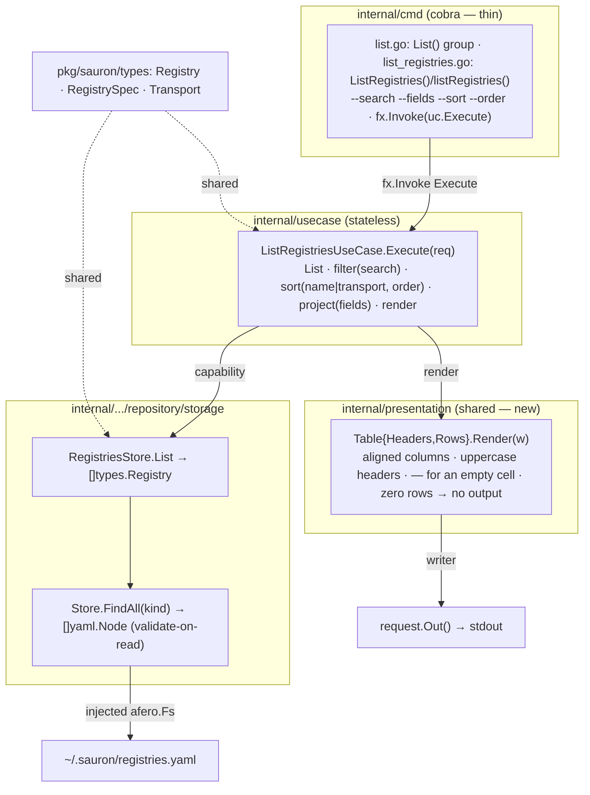

# Implementation Plan — List Registries

Implementation plan for the [List Registries](spec.md) feature. It conforms to
the [architecture contract](../contracts/architecture.md), the
[CLI contract](../contracts/cli.md), and the
[state data contract](../contracts/state.md), and realizes the
[`list registries` command contract](contracts/list-registries.md). The work is
split into verifiable tasks in [TASKS.md](TASKS.md).

## 1. Goal & scope

`sauron list registries` reads `registries.yaml` and prints the registered
registries as a table — aligned columns with uppercase headers and `—` for an
absent optional value, per the [CLI contract](../contracts/cli.md). The listing
is filterable (`--search`), column-selectable (`--fields`), and sortable
(`--sort`/`--order`). The command is read-only: it persists nothing. The default
columns are **name, transport, uri**; an empty registry set prints **no output**
and exits `0`.

The feature also establishes the foundations every later listing feature reuses:

- `internal/presentation` — a shared, dependency-free **table renderer** over the
  standard library, producing the [CLI contract](../contracts/cli.md) table
  rendering. The `list catalogue` ([0005](../0005-list-catalogue/spec.md)),
  `list artifacts` ([0010](../0010-list-artifacts/spec.md)), and
  `describe provider` ([0013](../0013-describe-provider/spec.md)) features reuse
  it unchanged.
- The store's **listing read path** — `Store.FindAll` and `RegistriesStore.List`,
  deferred by [0001](../0001-add-registry/plan.md).

**Delivered (this feature):**

- The `list registries` command, the store listing read path, the shared table
  renderer, and the black-box and seeded `test/e2e` scenarios.

**Out of scope — deferred to later features (YAGNI):**

- Pagination (`--offset`/`--limit`): catalogue-only per the
  [CLI contract](../contracts/cli.md); `list registries` is unpaginated.
- Sorting by `uri`, `ref`, or `timeout`: `--sort` accepts `name` and `transport`
  only (FR-004), though those fields may still be displayed via `--fields`.
- The `describe` and `delete` registry verbs ([0003](../0003-describe-registry/spec.md),
  [0004](../0004-delete-registry/spec.md)).

## 2. Pre-requirements

Before executing the tasks in [TASKS.md](TASKS.md):

- **[Add Registry](../0001-add-registry/plan.md) is in place** — the `storage`
  engine and typed `RegistriesStore`, the `usecase.Error{Type,Reason}` model and
  single `cmd/main.go` error site, the cobra root with its uberfx bootstrap, and
  the `test/e2e` godog harness all ship.
- **No new dependency** — the table renderer uses the standard library, so the
  approved-dependency list on the
  [architecture contract](../contracts/architecture.md) is untouched.
- **Toolchain** — Go `1.26`, the [Task](https://taskfile.dev) runner, and the
  existing `gate-lint` / `gate-coverage` / `gate-security` / `gate-integration`
  gates.

## 3. Component & dependency flow (as designed)



The use case depends on the typed `RegistriesStore` (the capability) and the
`presentation.Table` (the renderer); it owns every list decision — filtering,
sorting, and column projection — while the renderer stays a pure formatter that
knows nothing of registries.

## 4. Runtime sequence

```text
User            cmd            UseCase           Store         Presentation
 │ list registries (1)          │                  │              │
 │──────────────▶│              │                  │              │
 │               │ Execute(req) │                  │              │
 │               │─────────────▶│                  │              │
 │               │              │ List()           │              │
 │               │              │─────────────────▶│              │
 │               │              ◀─ ─ ─ ─ ─ ─ ─ ─ ─ │ []Registry   │
 │               │              │ filter · sort · project          │
 │               │              │ Render(headers, rows)            │
 │               │              │────────────────────────────────▶│
 │               │              ◀─ ─ ─ ─ ─ ─ ─ ─ ─ ─ ─ ─ ─ ─ ─ ─ ─│ table → Out()
 │               ◀─ ─ ─ ─ ─ ─ ─ │ stdout           │              │
 ◀─ ─ ─ ─ ─ ─ ─ │ exit 0        │                  │              │
```

Solid `──▶` is a synchronous call, dashed `◀─ ─` a return. The pipeline stops at
the first failing step, with the exit code shown.

- `(1)` `sauron list registries --sort transport --order desc --fields name,transport,uri`
- a `--fields`, `--sort`, or `--order` value outside its fixed set -> **usage (2)**
- `FindAll` read, parse, or schema-validation failure -> **io (1, "registries.yaml is unreadable")**
- an empty `[]Registry` -> the renderer writes nothing -> **exit 0**
- success -> writes the table to stdout, **exit 0**

## 5. Interfaces (as designed)

```go
// internal/presentation — the shared, registry-agnostic table renderer.
type Table struct {
    Headers []string
    Rows    [][]string
}
func (t Table) Render(w io.Writer) error // aligned; "" cell → "—"; zero rows → no output

// internal/.../repository/storage — the listing read path (validate-on-read,
// all-or-nothing: one invalid document fails the read).
func (s *Store) FindAll(ctx context.Context, kind string) ([]*yaml.Node, error)
type RegistriesStore interface {
    FindByName(ctx context.Context, name string) (*types.Registry, error) // 0001
    Add(ctx context.Context, r types.Registry) error                      // 0001
    List(ctx context.Context) ([]types.Registry, error)                   // this feature
}

// internal/usecase
type ListRegistriesUseCase struct{ /* registries, logger */ }
func (uc *ListRegistriesUseCase) Execute(request *ListRegistriesRequest) error

type ListRegistriesRequest struct {
    context.Context
    Search string   // case-insensitive substring on metadata.name
    Fields []string // validated against {name,transport,uri,ref,timeout}; name forced first
    Sort   string   // name (default) | transport
    Order  string   // asc (default) | desc
    // Out() io.Writer — the command's output writer
}
```

## 6. Delivered file layout

### `internal/`
| Path | Holds |
|---|---|
| `presentation/{table.go, doc.go}` (+ `table_test.go`) | the shared `Table` renderer over the standard library — **new module**; a pure value type, so no fx wiring |
| `infrastructure/repository/storage/{store.go, registries_store.go, mock_based_registries_store.go}` (+ tests) | `FindAll` on the engine; `List` on the typed facade; the regenerated mock |
| `usecase/{usecase_list_registries.go, fx.go}` (+ test) | `ListRegistriesUseCase` and `ListRegistriesRequest`; provided through `NewFxOptions` |
| `cmd/{list.go, list_registries.go, helper_flags.go, root.go}` (+ tests) | the `List()` group, the `ListRegistries()` builder and handler, the `--search`/`--fields`/`--sort`/`--order` flag groups, and `root.AddCommand(List())` |

### Specification & governance
| Path | State |
|---|---|
| `spec.md`, `data/state.md` | FR-002 default columns and the field→requirement realization corrected to the resolved decisions |
| `../contracts/architecture.md` | registers `internal/presentation` alongside `internal/config`, `internal/telemetry`, and `internal/cmd` |
| `../../test/e2e/CONSTITUTION.md` | amends Chapter I to de-scope Article 2 from a single command and to admit the graybox-arrange exception in Article 1 |

## 7. Checkpoints

Ordered, verifiable milestones — each met when its single command or criterion
passes (these back the tasks in [TASKS.md](TASKS.md)):

| Milestone | Verify |
|---|---|
| Spec, contract, and constitution corrections land | FR-002 lists `name, transport, uri`; `data/state.md` realizes `spec.uri`; `architecture.md` lists `internal/presentation` |
| e2e suite authored | `task gate-integration` resolves every step, failing only on the not-yet-built command |
| Shared table renderer | `go test ./internal/presentation/...` |
| Store listing read path (`FindAll` + `List`) | `go test ./internal/infrastructure/repository/storage/...` |
| List use case | `go test ./internal/usecase/...` |
| cmd surface (the e2e suite turns green) | `go test ./internal/cmd/...` |
| Lint / format / coverage / security | `task gate-lint && task gate-coverage && task gate-security` |
| e2e scenarios | `task build && task gate-integration` |
| Full gate | `task all` |

## 8. Key decisions

1. **Shared table renderer in `internal/presentation`.** A pure formatter over
   the standard library, producing the [CLI contract](../contracts/cli.md) table
   rendering — aligned columns, uppercase headers, `—` for an absent optional
   value. It owns alignment and the empty-cell substitution; it owns no registry
   semantics, so the later listing features reuse it unchanged. No third-party
   dependency is introduced.
2. **`FindAll` validates on read, all-or-nothing.** A single schema-invalid
   document fails the whole listing (`io`, exit 1), consistent with `FindOne`;
   this realizes FR-006. A missing file is an empty listing (exit 0), not a
   failure.
3. **Filtering, sorting, and projection live in the use case**, never the
   renderer. `--sort` accepts `name` and `transport` only (FR-004); a `transport`
   tie breaks on `name` ascending for deterministic output; `--order` applies
   independently of `--sort` (the default sort is `name`).
4. **Default columns are `name, transport, uri`.** `--fields` selects and
   reorders from `{name, transport, uri, ref, timeout}` with `name` always
   present and first.
5. **An empty registry set prints no output and exits `0`** (FR-005): the use
   case skips the renderer when there are no rows.
6. **Error model is reused.** A `--fields`, `--sort`, or `--order` value outside
   its fixed set is `usage` (exit 2); an unreadable or invalid state file is `io`
   (exit 1). Classification stays in the use case; `cmd/main.go` remains the
   single error site.
7. **The e2e suite arranges by seeding `registries.yaml`** under the
   graybox-arrange exception ([CONSTITUTION](../../test/e2e/CONSTITUTION.md)
   Chapter I, Article 1), keeping one black-box `add registry` → `list registries`
   scenario so the write-then-read path stays exercised.

## 9. Tasks

The work is split into independently **verifiable** tasks in
[TASKS.md](TASKS.md), authored **TDD-first**: the e2e suite is written before the
product and stays red until the command lands. Dependency order:

`T1 spec → T2 e2e (red)`; `T3 renderer` and `T4 store` run alongside; then
`→ T5 use case → T6 cmd` (which turns the e2e suite green) `→ T7 full gate`.
