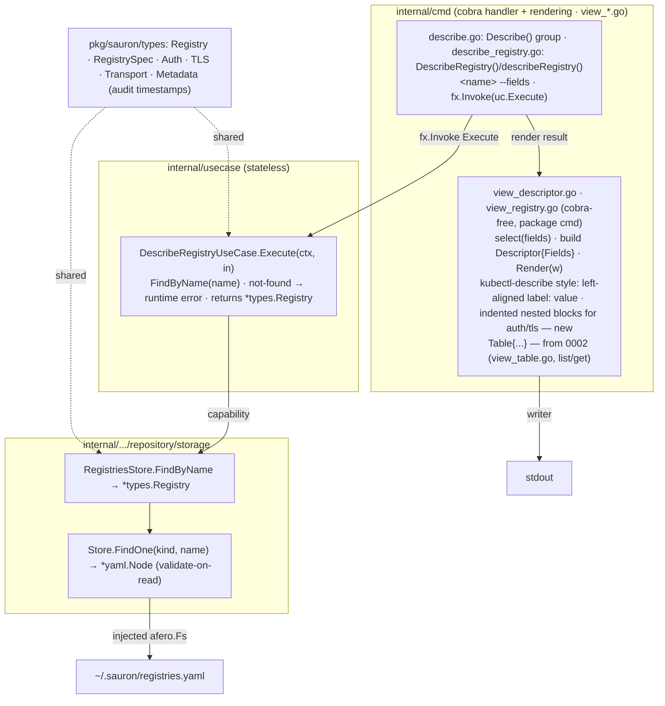

# Implementation Plan — Describe Registry

Implementation plan for the [Describe Registry](spec.md) feature. It conforms to
the [architecture contract](../contracts/architecture.md), the
[CLI contract](../contracts/cli.md), and the
[state data contract](../contracts/state.md), and realizes the
[`describe registry` command contract](contracts/describe-registry.md). The work
is split into verifiable tasks in [TASKS.md](TASKS.md).

## 1. Goal & scope

`sauron describe registry <name>` reads `registries.yaml`, finds the one named
registry, and prints its full detail as a **`kubectl describe`-style descriptor**
— a vertical view of left-aligned field labels with their values, and indented
nested blocks for structured fields such as `auth`, per the
[CLI contract](../contracts/cli.md) and the example in the
[command contract](contracts/describe-registry.md). This is deliberately *not*
the column-aligned `Table` that [0002](../0002-list-registries/plan.md) uses for
list output: just as `kubectl describe <resource>` differs from `kubectl get`,
single-record detail is a descriptor, not a row in a table. The output is
field-selectable (`--fields`). The command is read-only: it persists nothing.
Credential fields render as their stored environment reference, never a resolved
secret (FR-002). The registry's audit timestamps (`creationTimestamp`,
`lastUpdatedTimestamp`) display by default when populated (FR-006). A name that
matches no registry fails with a runtime error (exit 1, FR-004).

The feature also establishes the foundation every later **describe** feature
reuses:

- `internal/cmd`'s `view_*.go` rendering — a dependency-free **descriptor
  renderer** (`view_descriptor.go`) over the standard library, living in
  `package cmd` (cobra-free files), producing the [CLI contract](../contracts/cli.md)
  detail rendering. The `describe artifact`
  ([0011](../0011-describe-artifact/spec.md)) and `describe provider`
  ([0013](../0013-describe-provider/spec.md)) features reuse it unchanged. It
  sits beside the `Table` renderer (`view_table.go`) that
  [0002](../0002-list-registries/plan.md) introduced — `describe` is to
  `Descriptor` what `list` is to `Table`.

**Delivered (this feature):**

- The `describe registry` command, the describe use case, the shared descriptor
  renderer, and the black-box and seeded `test/e2e` scenarios.

**Out of scope — deferred to later features (YAGNI):**

- Any new store read method: the single-record read path
  `RegistriesStore.FindByName` already ships from
  [0001](../0001-add-registry/plan.md) and is reused as-is.
- Resolving credential references to secret values — Sauron never reads secrets
  at rest; the env reference is the value shown (FR-002).
- The `delete` registry verb ([0004](../0004-delete-registry/spec.md)).
- Describing artifacts ([0011](../0011-describe-artifact/spec.md)) and providers
  ([0013](../0013-describe-provider/spec.md)), which reuse the descriptor
  renderer this feature delivers.

## 2. Pre-requirements

Before executing the tasks in [TASKS.md](TASKS.md):

- **[Add Registry](../0001-add-registry/plan.md) and
  [List Registries](../0002-list-registries/plan.md) are in place** — the
  `storage` engine and typed `RegistriesStore` (including
  `FindByName(ctx, name)`), the `usecase.Error{Type, Reason}` model and single
  `cmd/main.go` error site, the cobra root with its uberfx bootstrap, the
  `internal/cmd` rendering (the `view_table.go` `Table` renderer in `package cmd`),
  and the `test/e2e` godog harness all ship.
- **No new dependency** — the descriptor renderer uses the standard library, so the
  approved-dependency list on the
  [architecture contract](../contracts/architecture.md) is untouched.
- **Toolchain** — Go `1.26`, the [Task](https://taskfile.dev) runner, and the
  existing `gate-lint` / `gate-coverage` / `gate-security` / `gate-integration`
  gates.

## 3. Component & dependency flow (as designed)



The use case depends only on the typed `RegistriesStore` (the capability): it
locates the record and classifies a miss, returning the `*types.Registry` (or
`nil` → not-found). The cobra handler then renders the result through its
`view_*.go` files (in `package cmd`), which own field selection and build the
`Descriptor`; the rendering knows nothing of storage and the use case knows
nothing of presentation.

## 4. Runtime sequence

```text
User            cmd            UseCase           Store         Presentation
 │ describe registry acme (1)   │                  │              │
 │──────────────▶│              │                  │              │
 │               │ validate --fields (usage 2 on a bad value)
 │               │ Execute(ctx, in)                │              │
 │               │─────────────▶│                  │              │
 │               │              │ FindByName(name) │              │
 │               │              │─────────────────▶│              │
 │               │              ◀─ ─ ─ ─ ─ ─ ─ ─ ─ │ *Registry|nil│
 │               │              │ not-found → runtime error (exit 1)
 │               ◀─ ─ ─ ─ ─ ─ ─ │ *types.Registry  │              │
 │               │ select(fields) · build Descriptor · Render
 │               │────────────────────────────────▶│
 │               ◀─ ─ ─ ─ ─ ─ ─ ─ ─ ─ ─ ─ ─ ─ ─ ─ ─│ descriptor → stdout
 ◀─ ─ ─ ─ ─ ─ ─ │ exit 0        │                  │              │
```

Solid `──▶` is a synchronous call, dashed `◀─ ─` a return. The pipeline stops at
the first failing step, with the exit code shown.

- `(1)` `sauron describe registry acme --fields name,transport,uri`
- a `--fields` value outside its fixed set -> **usage (2)**, rejected at the handler/presentation boundary before `Execute`
- `FindByName` read, parse, or schema-validation failure -> **io (1, "registries.yaml is unreadable")**
- no registry of that name -> **runtime error (1, "registry \"acme\" does not exist")**
- success -> writes the descriptor to stdout, **exit 0**

## 5. Interfaces (as designed)

```go
// internal/cmd (view_descriptor.go, package cmd) — the shared, registry-agnostic
// descriptor renderer (beside the existing Table in view_table.go). A `kubectl
// describe`-style vertical view, not a column-aligned table. A pure, cobra-free
// value type; no fx wiring.
type Descriptor struct {
    Fields []Field
}
// Field is a label with either a leaf Value or a nested block of sub-Fields
// (never both meaningfully): a leaf renders "label: value"; a section renders
// "label:" followed by its Children indented one level (e.g. auth).
type Field struct {
    Label    string
    Value    string  // leaf value; rendered "label: value"
    Children []Field // nested section, indented under "label:" (e.g. auth)
}
func (d Descriptor) Render(w io.Writer) error // left-aligned labels; nested blocks indented

// RegistryDetailOptions carries the field selection. Validate() runs at the
// handler/presentation boundary before the use case runs; an out-of-set value is
// a usage error. The default (no --fields) shows every populated field.
// RenderRegistryDetail projects the registry onto the selected fields and writes
// the descriptor.
type RegistryDetailOptions struct {
    Fields []string // validated against {name,transport,uri,ref,auth,tls,sshKey,timeout,creationTimestamp,lastUpdatedTimestamp}; name forced first
}
func (o RegistryDetailOptions) Validate() error
func RenderRegistryDetail(w io.Writer, registry types.Registry, opts RegistryDetailOptions) error

// internal/.../repository/storage — REUSED unchanged from 0001; no new method.
type RegistriesStore interface {
    FindByName(ctx context.Context, name string) (*types.Registry, error) // 0001
    Add(ctx context.Context, r types.Registry) error                      // 0001
    List(ctx context.Context) ([]types.Registry, error)                   // 0002
}

// internal/usecase — returns the record, renders nothing.
type DescribeRegistryUseCase struct{ /* registries, logger */ }
func (uc *DescribeRegistryUseCase) Execute(ctx context.Context, in DescribeRegistryInput) (*types.Registry, error)

type DescribeRegistryInput struct {
    Name string // the registry to describe (required positional arg)
}
```

## 6. Delivered file layout

### `internal/`
| Path | Holds |
|---|---|
| `usecase/{usecase_describe_registry.go, fx.go}` (+ test) | `DescribeRegistryUseCase` and `DescribeRegistryInput`, returning `*types.Registry`; provided through `NewFxOptions` |
| `cmd/{describe.go, describe_registry.go, view_descriptor.go, view_registry.go, root.go}` (+ tests) | the `Describe()` group, the `DescribeRegistry()` builder and `describeRegistry()` handler (which renders the result through its `view_*.go` files), the cobra-free `view_descriptor.go` `Descriptor` renderer (kubectl-describe style) plus the `view_registry.go` registry view (field selection) — pure value types in `package cmd`, so no fx wiring; sitting beside the existing `view_table.go` — the `--fields` flag, and `root.AddCommand(Describe())` |

### Specification & governance
| Path | State |
|---|---|
| `spec.md`, `data/state.md`, `contracts/describe-registry.md` | unchanged unless T1 finds genuine drift; the detail-rendering decisions are recorded here |

## 7. Checkpoints

Ordered, verifiable milestones — each met when its single command or criterion
passes (these back the tasks in [TASKS.md](TASKS.md)):

| Milestone | Verify |
|---|---|
| Spec/contract drift (if any) reconciled | the not-found error class is resolved in §8; `data/state.md` field table matches the command contract's `--fields` set (inspection) |
| e2e suite authored | `task gate-integration` resolves every step, failing only on the not-yet-built command |
| Shared descriptor renderer | `go test ./internal/cmd/...` |
| Describe use case | `go test ./internal/usecase/...` |
| cmd surface (the e2e suite turns green) | `go test ./internal/cmd/...` |
| Lint / format / coverage / security | `task gate-lint && task gate-coverage && task gate-security` |
| e2e scenarios | `task build && task gate-integration` |
| Full gate | `task all` |

## 8. Key decisions

1. **Reuse the single-record read path; add no store method.** The use case
   reads through the existing `RegistriesStore.FindByName(ctx, name)` from
   [0001](../0001-add-registry/plan.md). Unlike
   [0002](../0002-list-registries/plan.md), which added `List`/`FindAll`, this
   feature needs no new storage surface.
2. **Shared `Descriptor` renderer in `internal/cmd` (the `view_descriptor.go`
   file) — a `kubectl describe`-style view, not a table.** A pure, cobra-free
   formatter in `package cmd` over the standard library, producing the
   [CLI contract](../contracts/cli.md) detail rendering —
   left-aligned field labels with their values and indented nested blocks for
   structured fields like `auth` and `tls`. It is a distinct renderer from the
   column-aligned `Table` ([0002](../0002-list-registries/plan.md) owns that for
   list/`get` output): single-record detail is a descriptor, the way `kubectl
   describe` differs from `kubectl get`. It owns alignment and nesting; it owns
   no registry semantics, so the later describe features reuse it unchanged. No
   third-party dependency is introduced.
3. **Field selection lives in `internal/cmd` (the `view_*.go` files)**, never the
   use case. The use case returns the whole record; the view files select and reorder
   `--fields` from `{name, transport, uri, ref, auth, tls, sshKey, timeout,
   creationTimestamp, lastUpdatedTimestamp}` with `name` always present and first;
   a value outside the set is `usage` (exit 2), rejected at the
   handler/presentation boundary before `Execute`. The default (no `--fields`)
   shows every populated field.
4. **Secrets are a pure pass-through (FR-002).** `spec.auth.*` is rendered as the
   stored environment reference. Sauron never holds a resolved secret at rest, so
   "never display a secret" is satisfied by printing the stored value verbatim;
   no redaction step is required.
5. **Error model is reused.** A `--fields` value outside its fixed set is `usage`
   (exit 2), rejected at the handler/presentation boundary before `Execute`; an
   unreadable or invalid state file is `io` (exit 1), and a missing record is
   *not-found* (exit 1) — both classified in the use case. `cmd/main.go` remains
   the single error site.
6. **Not-found is its own error class — `TypeNotFound`, exit 1 (resolved).** "No
   registry of that name exists" (FR-004) maps to exit 1, distinct from a `usage`
   error (exit 2). None of the existing `usecase.Error` types
   (`usage`/`conflict`/`unreachable`/`validation`/`io`) names a *not-found*, so T4
   adds a `TypeNotFound` constant to the error model and `cmd/main.go` maps it to
   exit 1 alongside the other non-usage types (the single error site is unchanged
   in shape — only one mapping arm is added). The type is reused by the later
   `describe`/`get`-style features rather than re-derived per feature.
7. **Audit timestamps are part of the default detail (FR-006).**
   `metadata.creationTimestamp` and `metadata.lastUpdatedTimestamp` join the
   `--fields` set and display by default when populated, rendered verbatim as
   their stored values (the view reads them from `registry.Metadata`). They are
   leaf fields, omitted when empty like any other unpopulated field.

## 9. Tasks

The work is split into independently **verifiable** tasks in
[TASKS.md](TASKS.md), authored **TDD-first**: the e2e suite is written before the
product and stays red until the command lands. Dependency order:

`T1 spec recon → T2 e2e (red)`; `T3 descriptor renderer` runs alongside; then
`→ T4 use case → T5 cmd` (which turns the e2e suite green) `→ T6 full gate`.
