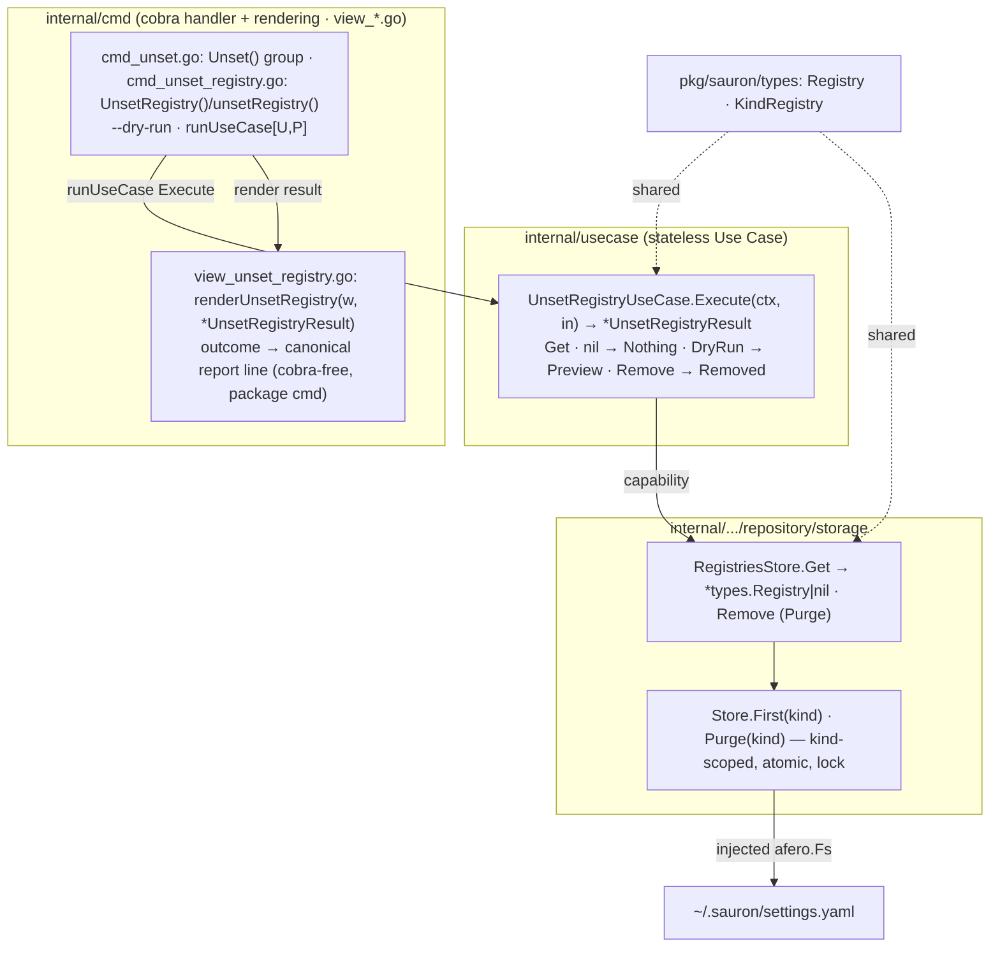

# Implementation Plan — Unset Registry

Implementation plan for the [Unset Registry](spec.md) feature, **aligned to the
code as built**. It captures **what** was delivered, **how** the pieces fit, and
the **status** of each checkpoint — not the code itself. It conforms to the
[architecture contract](../contracts/architecture.md), the
[CLI contract](../contracts/cli.md), and the
[state data contract](../contracts/state.md), and realizes the
[`unset registry` command contract](contracts/unset-registry.md). The work is
split into verifiable tasks in [TASKS.md](TASKS.md).

## 1. Goal & scope

`sauron unset registry` removes the single `Registry` document from
`settings.yaml`, leaving **every already-installed artifact in place** — removing
the source does not remove what it delivered (FR-001, FR-002). With `--dry-run`
it reports what would be unset without changing state (FR-004). With no registry
configured it exits successfully and reports that nothing was unset (FR-005). The
black-box `test/e2e` BDD suite covers every `unset registry` scenario.

**Delivered (this feature):**

- The `unset registry` command, the unset use case (get → dry-run → remove with
  a classified outcome), the `view_unset_registry.go` report rendering, and the
  e2e scenarios.

**Out of scope — deferred to later features / explicitly removed (YAGNI):**

- **No artifact cascade.** Unsetting the registry never uninstalls anything; the
  earlier design's cascade — and the shared cleaning step it depended on — are
  gone (see [spec](spec.md) `## Notes`). Installed artifacts are removed only with
  uninstall.
- Any new store read method — `RegistriesStore.Get` and `Remove` ship from
  [set registry](../0001-set-registry/plan.md) and are reused as-is.

## 2. Pre-requirements

Before executing the tasks in [TASKS.md](TASKS.md):

- **[Set Registry](../0001-set-registry/plan.md) is in place** — the singleton
  `RegistriesStore` (`Get`, `Remove`) over `settings.yaml`, the
  `usecase.Error{Type, Reason}` model and the single `cmd` `exitCode` site, the
  `runUseCase[U, P]` fx bootstrap, the cobra root, the `view_*.go` rendering
  convention in `package cmd`, and the `test/e2e` godog harness all ship.
- **No new dependency** — the report is a single stdout line, so the
  approved-dependency list on the
  [architecture contract](../contracts/architecture.md) is untouched.
- **Toolchain** — Go `1.26`, the [Task](https://taskfile.dev) runner, and the
  existing `gate-lint` / `gate-coverage` / `gate-security` / `gate-integration`
  gates.

## 3. Component & dependency flow (as built)



The use case reads the one registry through `RegistriesStore.Get`, and on a
configured registry either previews (`--dry-run`) or removes it through
`RegistriesStore.Remove`, returning a classified `*UnsetRegistryResult{Outcome}`
— `Nothing` / `Preview` / `Removed`. The handler renders the outcome's canonical
report line through `view_unset_registry.go`. `Remove` purges only the `Registry`
documents from `settings.yaml`, preserving every other kind; no `track.yaml`,
provider, or installed artifact is touched (FR-002).

## 4. Runtime sequence

```text
User            cmd            UseCase           Store         view
 │ unset registry [--dry-run] (1)│                 │             │
 │──────────────▶│              │                  │             │
 │               │ Execute(ctx, in)                │             │
 │               │─────────────▶│                  │             │
 │               │              │ Get()            │             │
 │               │              │─────────────────▶│             │
 │               │              ◀─ ─ ─ ─ ─ ─ ─ ─ ─ │ *Registry|nil
 │               │              │ nil → Nothing (exit 0)          │
 │               │              │ DryRun → Preview (exit 0, no write)
 │               │              │ Remove() ────────▶│             │
 │               │              ◀─ ─ ─ ─ ─ ─ ─ ─ ─ │ ok → Removed
 │               ◀─ ─ ─ ─ ─ ─ ─ │ *UnsetRegistryResult{Outcome}   │
 │               │ renderUnsetRegistry(stdout, result) ──────────▶│
 ◀─ ─ ─ ─ ─ ─ ─ │ exit 0        │                  │             │
```

Solid `──▶` is a synchronous call, dashed `◀─ ─` a return. The pipeline stops at
the first failing step, with the exit code shown.

- `(1)` `sauron unset registry` or `sauron unset registry --dry-run`
- `Get` read, parse, or schema-validation failure → **io (1, "settings.yaml is unreadable")**
- no registry configured → **Nothing**, "no registry configured; nothing was unset", **exit 0** (FR-005)
- `--dry-run` with a registry configured → **Preview**, no write, **exit 0** (FR-004)
- `Remove` write failure → **io (1)**
- success → **Removed**, "registry unset; installed artifacts preserved", **exit 0**

## 5. Interfaces (as built)

```go
// internal/usecase — returns a classified outcome; renders nothing.
type UnsetRegistryUseCase struct{ /* registries, logger */ }
func (uc *UnsetRegistryUseCase) Execute(ctx context.Context, in UnsetRegistryInput) (*UnsetRegistryResult, error)

type UnsetRegistryInput  struct { DryRun bool }
type UnsetRegistryResult struct { Outcome UnsetOutcome } // presentation-agnostic

type UnsetOutcome string
const (
    UnsetNothing UnsetOutcome = "nothing" // none configured; nothing unset
    UnsetPreview UnsetOutcome = "preview" // dry-run; no state change
    UnsetRemoved UnsetOutcome = "removed" // the configured registry was removed
)

// internal/cmd (view_unset_registry.go, package cmd) — outcome → canonical line.
func renderUnsetRegistry(w io.Writer, result *usecase.UnsetRegistryResult) error

// internal/.../storage — REUSED unchanged from set registry; no new method. Remove
// purges only the Registry documents, preserving every other kind in the file.
type RegistriesStore interface {
    Get(ctx context.Context) (*types.Registry, error) // nil when none set
    Set(ctx context.Context, r types.Registry) error
    Remove(ctx context.Context) error                 // absent → no-op
}
func (s *Store) Purge(ctx, kind) error                // drop kind's docs; keep other kinds; absent → no-op
```

## 6. Delivered file layout

### `internal/`
| Path | Holds |
|---|---|
| `usecase/usecase_unset_registry.go` (+ test) | `UnsetRegistryUseCase` (`Get` → `Nothing` / `Preview` / `Remove` → `Removed`), `UnsetRegistryInput`/`UnsetRegistryResult`, the `UnsetOutcome` enum |
| `cmd/{cmd_unset.go, cmd_unset_registry.go}` (+ tests) | the `Unset()` group, the `UnsetRegistry()` builder + `unsetRegistry()` handler (`--dry-run`, `runUseCase`, render) |
| `cmd/view_unset_registry.go` (+ test) | `renderUnsetRegistry` / `unsetMessages` — the outcome → report-line map |

The singleton `RegistriesStore.Remove` (the `Store.Purge` kind-scoped removal)
ships from [set registry](../0001-set-registry/plan.md) and is reused unchanged.

## 7. Checkpoints

Ordered, verifiable milestones — each met when its single command passes (these
back the tasks in [TASKS.md](TASKS.md)):

| Milestone | Verify |
|---|---|
| Unset use case (3 outcomes) | `go test ./internal/usecase/...` |
| cmd surface + view rendering | `go test ./internal/cmd/...` |
| Lint / format / coverage / security | `task gate-lint && task gate-coverage && task gate-security` |
| e2e scenarios | `task build && task gate-integration` |
| Full gate | `task all` |

## 8. Key decisions

1. **Reuse the singleton remove path; add no store method.** The use case reads
   through `RegistriesStore.Get` and removes through `RegistriesStore.Remove`,
   both shipped by [set registry](../0001-set-registry/plan.md). `Remove` is the
   `Store.Purge` kind-scoped removal that drops only the `Registry` documents from
   `settings.yaml` and preserves every other kind.
2. **No cascade — artifacts are preserved.** Unsetting the registry never
   uninstalls anything (FR-002); removing the source leaves what it delivered in
   place, unmanaged until a new registry is set. The earlier design's
   cascade-uninstall and the shared cleaning step it depended on are gone, so this
   feature builds no `track.yaml`, provider port, or track store.
3. **A classified outcome, not a rendered string.** `Execute` returns
   `*UnsetRegistryResult{Outcome}` with `Nothing` / `Preview` / `Removed`; the
   `view_unset_registry.go` file maps each outcome to its canonical report line.
   The use case never writes to an `io.Writer`.
4. **Idempotent unset succeeds.** With no registry configured the use case returns
   `Nothing` and the command exits 0, reporting that nothing was unset (FR-005) —
   not a not-found error.
5. **`--dry-run` short-circuits before the write.** A configured registry under
   `--dry-run` yields `Preview` and returns before `Remove`, so no state changes
   (FR-004).
6. **Error model + single exit-code site reused.** A read or write failure is
   `io` (exit 1); a malformed flag is caught in the handler as `errInvalidFlag` →
   exit 2 (FR-006). `cmd`'s `exitCode` remains the single mapping site.

## 9. Tasks

The work is split into independently **verifiable** tasks in [TASKS.md](TASKS.md)
— each names the files it owns and the single command that confirms it.
Dependency order:

`T1 use case → T2 cmd + view → T3 e2e → T4 full gate`.
