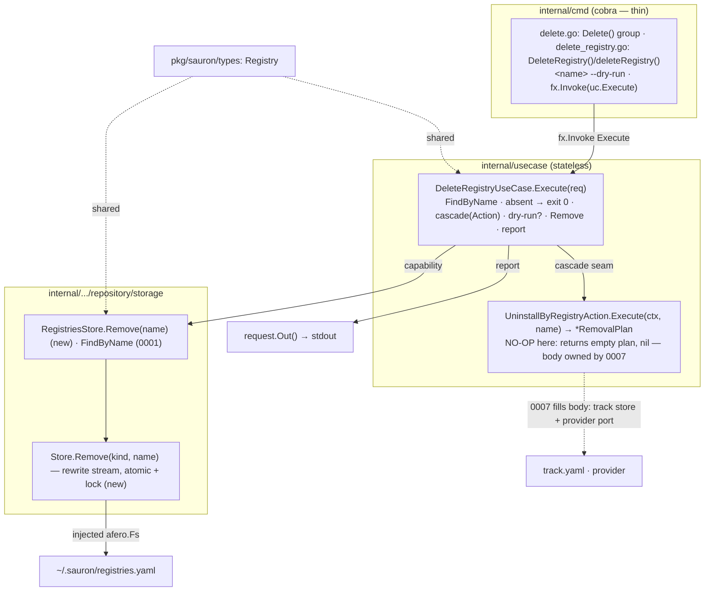

# Implementation Plan — Delete Registry

Implementation plan for the [Delete Registry](spec.md) feature. It conforms to
the [architecture contract](../contracts/architecture.md), the
[CLI contract](../contracts/cli.md), and the
[state data contract](../contracts/state.md), and realizes the
[`delete registry` command contract](contracts/delete-registry.md). The work is
split into verifiable tasks in [TASKS.md](TASKS.md).

## 1. Goal & scope

`sauron delete registry <name>` removes the named registry's `Registry` document
from `registries.yaml` and, conceptually, **cascade-uninstalls every artifact it
delivered**. Deleting a registry that does not exist reports that nothing was
deleted and exits `0` (FR-005). `--dry-run` previews the plan without changing any
state (FR-004). On success the command prints the removal report — kind headings
`skills:` / `agents:` / `personas:` with a `-`-prefixed entry each, followed by a
summary count line — per the [CLI contract](../contracts/cli.md) plan/report
discipline (FR-003).

This feature introduces the **cascade seam** that the cascade is built on: a
single shared cleaning **Action** — `UninstallByRegistryAction` — that both this
feature and [`uninstall artifacts` (0007)](../0007-uninstall-artifacts/spec.md)
call to remove every tracked artifact sourced from a registry.

**Delivered (this feature):**

- The `delete registry` command, the registry-removal write path
  (`Store.Remove` + `RegistriesStore.Remove`), the `DeleteRegistryUseCase`
  orchestration (find → cascade → remove → report), the shared
  `UninstallByRegistryAction` **as a no-op seam**, and the black-box and seeded
  `test/e2e` scenarios.

**Out of scope — deferred to [`uninstall artifacts` (0007)](../0007-uninstall-artifacts/spec.md) (YAGNI):**

The artifact cascade itself is **not implemented here**. The machinery it needs —
a track store over `track.yaml`, a provider-removal port, and the per-artifact
removal logic with its provenance handling — is **owned by
[0007](../0007-uninstall-artifacts/spec.md)** and is not built by this feature.
Concretely, the following requirements are realized only once 0007 fills the
shared Action's body:

- **FR-002** — uninstalling every tracked artifact whose `spec.registry` matches
  (removing it from the provider and from `track.yaml`).
- **FR-003** — the *content* of the grouped plan (the `skills:` / `agents:` /
  `personas:` entries). While the Action is a no-op the plan is empty, so only the
  summary line prints (`registry "X" removed; 0 artifacts removed`).
- **FR-007** — reporting an individual artifact-removal failure and continuing the
  cascade; with no removals there is nothing to fail.

This is the **smallest plan that delivers the goal**: 0004 ships the command, the
registry removal, and the seam; 0007 ships the seam's body. No `TrackStore`, no
provider port, and no `track.yaml` access is introduced by this feature. The
implementation order therefore **reverses the numbering** — 0004's seam lands
first, 0007 fills it later.

## 2. Pre-requirements

Before executing the tasks in [TASKS.md](TASKS.md):

- **[Add Registry](../0001-add-registry/plan.md) and
  [List Registries](../0002-list-registries/plan.md) are in place** — the
  `storage` engine (`Store` with `FindOne`/`FindAll`/`Append`/`writeAtomic` under
  the write lock) and the typed `RegistriesStore` (`FindByName`), the
  `usecase.Error{Type, Reason}` model and single `cmd/main.go` error site, the
  cobra root with its uberfx bootstrap, and the `test/e2e` godog harness (the
  `listController` seed step, the `stateController` file assertions) all ship.
- **No new dependency** — the removal write path reuses the engine's existing
  `writeAtomic` + lock; the report is rendered over the standard library. The
  approved-dependency list on the
  [architecture contract](../contracts/architecture.md) is untouched.
- **Toolchain** — Go `1.26`, the [Task](https://taskfile.dev) runner, and the
  existing `gate-lint` / `gate-coverage` / `gate-security` / `gate-integration`
  gates.

## 3. Component & dependency flow (as designed)



The use case owns every delete decision — resolving the target, classifying a
miss, honoring `--dry-run`, and shaping the report. It calls the shared
`UninstallByRegistryAction` for the cascade (a no-op today) and
`RegistriesStore.Remove` for the registry document; the dashed edge is the
foundation **0007** will supply behind the seam.

## 4. Runtime sequence

```text
User            cmd            UseCase          Action(no-op)   Store
 │ delete registry acme (1)     │                  │              │
 │──────────────▶│              │                  │              │
 │               │ Execute(req) │                  │              │
 │               │─────────────▶│                  │              │
 │               │              │ FindByName(name) │              │
 │               │              │────────────────────────────────▶│
 │               │              ◀─ ─ ─ ─ ─ ─ ─ ─ ─ ─ ─ ─ ─ ─ ─ ─ ─│ *Registry|nil
 │               │              │ nil → "nothing was deleted" → exit 0 (FR-005)
 │               │              │ cascade(name)    │              │
 │               │              │─────────────────▶│ (empty plan) │
 │               │              ◀─ ─ ─ ─ ─ ─ ─ ─ ─ │ *RemovalPlan │
 │               │              │ --dry-run → print plan, write nothing → exit 0 (FR-004)
 │               │              │ Remove(name)     │              │
 │               │              │────────────────────────────────▶│ rewrite (atomic+lock)
 │               │              ◀─ ─ ─ ─ ─ ─ ─ ─ ─ ─ ─ ─ ─ ─ ─ ─ ─│
 │               │              │ report (FR-003)  │              │
 │               ◀─ ─ ─ ─ ─ ─ ─ │ stdout           │              │
 ◀─ ─ ─ ─ ─ ─ ─ │ exit 0        │                  │              │
```

Solid `──▶` is a synchronous call, dashed `◀─ ─` a return. The pipeline stops at
the first failing step, with the exit code shown.

- `(1)` `sauron delete registry acme [--dry-run]`
- missing/invalid args or flags -> **usage (2)** (FR-006)
- `FindByName` returns `nil` (no such registry) -> print "nothing was deleted" -> **exit 0** (FR-005)
- `--dry-run` -> print the (empty) plan, write nothing -> **exit 0** (FR-004)
- `Remove` (or a state read) fails -> **io (1, "registries.yaml could not be written")**
- success -> remove the document, print `registry "acme" removed; 0 artifacts removed`, **exit 0**

## 5. Interfaces (as designed)

```go
// internal/usecase — the shared cleaning Action (the cascade seam). 0004 ships
// the NO-OP body below; 0007 replaces it with the real track-store + provider
// removal. Both delete-registry and uninstall compose this one Action.
type RemovalPlan struct {
    Skills   []string
    Agents   []string
    Personas []string
}
func (p RemovalPlan) Total() int // len(Skills)+len(Agents)+len(Personas)

type UninstallByRegistryAction struct{ /* logger; 0007 adds track store + provider */ }
func (a *UninstallByRegistryAction) Execute(ctx context.Context, registry string) (*RemovalPlan, error) {
    return &RemovalPlan{}, nil // no-op: 0007 owns the real body
}

// internal/.../repository/storage — the registry-removal write path (new).
// Remove rewrites the kind's file without the matched document, atomically and
// under the write lock (reusing writeAtomic); removing an absent document is a
// no-op success (FR-005 idempotency).
func (s *Store) Remove(ctx context.Context, kind, name string) error // new
type RegistriesStore interface {
    FindByName(ctx context.Context, name string) (*types.Registry, error) // 0001
    Add(ctx context.Context, r types.Registry) error                      // 0001
    List(ctx context.Context) ([]types.Registry, error)                   // 0002
    Remove(ctx context.Context, name string) error                        // this feature
}

// internal/usecase
type DeleteRegistryUseCase struct{ /* registries, cascade, logger */ }
func (uc *DeleteRegistryUseCase) Execute(request *DeleteRegistryRequest) error

type DeleteRegistryRequest struct {
    context.Context
    Name   string // the registry to delete (required positional arg)
    DryRun bool   // print the plan without changing state
    // Out() io.Writer — the command's output writer
}
```

## 6. Delivered file layout

### `internal/`
| Path | Holds |
|---|---|
| `usecase/{action_uninstall_by_registry.go, action_uninstall_by_registry_test.go}` | the shared `UninstallByRegistryAction` and `RemovalPlan`; the **no-op** body and the test asserting the empty-plan/`nil` contract; a `// 0007 owns the real body` note |
| `usecase/{usecase_delete_registry.go, fx.go}` (+ test) | `DeleteRegistryUseCase` and `DeleteRegistryRequest`; the find → cascade → dry-run → remove → report orchestration; the grouped-report helper; the `usage`/`io`/not-found-as-success classification; provided through `NewFxOptions` |
| `infrastructure/repository/storage/{store.go, registries_store.go, mock_based_registries_store.go}` (+ tests) | `Store.Remove` (rewrite, atomic + lock); `RegistriesStore.Remove`; the regenerated mock |
| `cmd/{delete.go, delete_registry.go, root.go}` (+ tests) | the `Delete()` group, the `DeleteRegistry()` builder and `deleteRegistry()` handler, the `--dry-run` flag, and `root.AddCommand(Delete())` |

### Specification & governance
| Path | State |
|---|---|
| `spec.md`, `data/state.md`, `contracts/delete-registry.md` | the deferral of FR-002/FR-003/FR-007 to [0007](../0007-uninstall-artifacts/spec.md) recorded in the spec `## Notes`; reconciled only where a genuine drift is found |

## 7. Checkpoints

Ordered, verifiable milestones — each met when its single command or criterion
passes (these back the tasks in [TASKS.md](TASKS.md)):

| Milestone | Verify |
|---|---|
| Deferral recorded in the spec | the spec `## Notes` defers FR-002/FR-003/FR-007 to 0007 (inspection) |
| e2e suite authored | `task gate-integration` resolves every step, failing only on the not-yet-built command; the artifact-removal-verification scenario is commented out, pointing at 0007 |
| Registry-removal write path (`Store.Remove` + `RegistriesStore.Remove`) | `go test ./internal/infrastructure/repository/storage/...` |
| Shared no-op cascade Action | `go test ./internal/usecase/...` (the action test asserts the empty-plan/`nil` contract) |
| Delete use case | `go test ./internal/usecase/...` |
| cmd surface (the implemented e2e scenarios turn green) | `go test ./internal/cmd/...` |
| Lint / format / coverage / security | `task gate-lint && task gate-coverage && task gate-security` |
| e2e scenarios | `task build && task gate-integration` |
| Full gate | `task all` |

## 8. Key decisions

1. **The cascade is a shared, no-op Action — the seam, not the body.** Both
   `delete registry` and [`uninstall artifacts` (0007)](../0007-uninstall-artifacts/spec.md)
   remove the artifacts of a registry; that logic lives once, in
   `UninstallByRegistryAction` (the [`Action[R,P]`](../contracts/architecture.md)
   pattern). In this feature the Action **returns an empty `RemovalPlan` and
   `nil`** — nothing more. 0004 owns the seam and its no-op body; 0007 replaces the
   body with the real track-store + provider removal. This is what keeps 0004
   small and lets it land before 0007 despite the numbering.
2. **0004 introduces no `track.yaml`, no provider port, no track store.** Those
   are 0007's to design and own (spec locality). Building them here would
   pre-empt 0007's decisions and inflate this feature past its goal (YAGNI). The
   `Store.files` map keeps only `registries.yaml`.
3. **Registry removal reuses the engine's atomic, lock-guarded write.**
   `Store.Remove` reads the document stream, drops the matched document, and
   rewrites the file through the existing `writeAtomic` under the write lock —
   the same guarantees as `Append`. Removing an absent document is a no-op success
   (FR-005 idempotency); the "nothing was deleted" message is decided by the
   use case's prior `FindByName`, not by the store.
4. **Not-found is success, not an error (FR-005).** `FindByName` returning `nil`
   makes the use case print that nothing was deleted and return no error → exit 0
   — the [idempotent-deletion boilerplate](../contracts/cli.md). This differs from
   [`describe registry` (0003)](../0003-describe-registry/spec.md), where a missing
   registry is a runtime error.
5. **The report is shaped in the use case (FR-003).** A small grouped-report
   helper prints only the **non-empty** kind groups (`skills:` / `agents:` /
   `personas:`) followed by the summary count, per the
   [CLI contract](../contracts/cli.md). While the cascade is a no-op every group
   is empty, so only `registry "X" removed; 0 artifacts removed` prints — and
   `--dry-run` prints the same plan while writing nothing. The helper stays inline
   (not in `internal/presentation`) until 0007 makes the groups non-empty; 0007
   may then promote it to a shared report renderer. Classification stays in the
   use case; `cmd/main.go` remains the single error site (usage → 2; io → 1).
6. **The e2e suite runs; one scenario is commented out.** Every scenario this
   feature can arrange and verify — registry removal, the `0 artifacts removed`
   summary, FR-005 not-found, FR-004 `--dry-run`, FR-006 usage — is a live scenario
   that goes green when the command lands (T6). The **single** scenario that asserts
   *installed artifacts were actually removed* by the cascade (FR-002/FR-003/FR-007)
   cannot be arranged at all until install and the Action's body exist, so it is
   **commented out** in `delete_registry.feature` with an inline note —
   `# Deferred to 0007: requires install + the Action body; uncomment when artifact
   removal lands`. No `@deferred` tag, no `godog.Options.Tags` filter, and no
   constitution amendment is introduced — the deferral is one commented block, not
   harness governance.

## 9. Tasks

The work is split into independently **verifiable** tasks in
[TASKS.md](TASKS.md), authored **TDD-first**: the e2e suite is written before the
product and stays red until the command lands. Dependency order:

`T1 spec deferral note → T2 e2e (red)`; `T3 removal write path` and `T4 no-op
Action` run alongside (either may be worktree-isolated); then `→ T5 use case
→ T6 cmd` (which turns the e2e scenarios green) `→ T7 full gate`.
