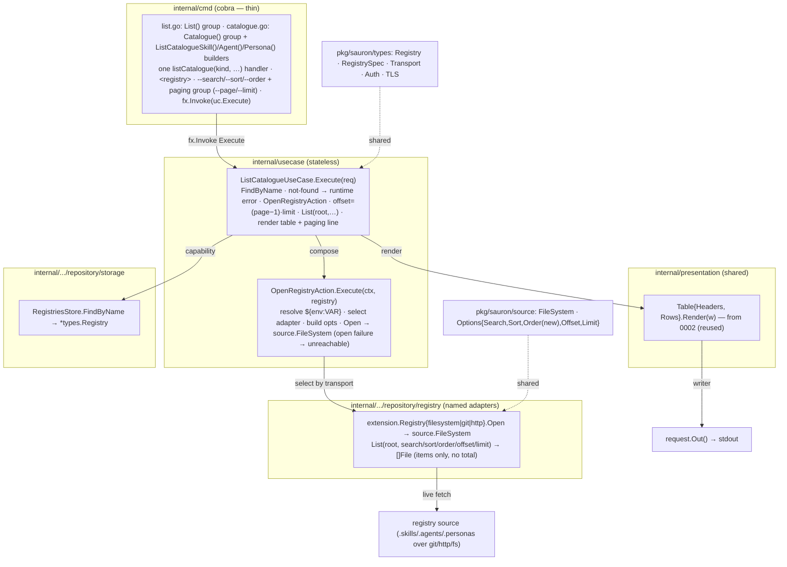

# Implementation Plan — List Catalogue

Implementation plan for the [List Catalogue](spec.md) feature. It conforms to the
[architecture contract](../contracts/architecture.md), the
[CLI contract](../contracts/cli.md), and the
[state data contract](../contracts/state.md), and realizes the
[`list catalogue agent`](contracts/list-catalogue-agent.md),
[`list catalogue persona`](contracts/list-catalogue-persona.md), and
[`list catalogue skill`](contracts/list-catalogue-skill.md) command contracts. The
work is split into verifiable tasks in [TASKS.md](TASKS.md).

## 1. Goal & scope

`sauron list catalogue <kind> <registry>` resolves a named registry from
`registries.yaml`, opens its source **live** over the registry's transport, and
prints the artifacts of the selected kind — `skill`, `agent`, or `persona` — as a
column-aligned `Table` followed by **one paging line**, per the
[CLI contract](../contracts/cli.md) and the per-kind command contracts. The
catalogue is **never persisted**: it is always fetched fresh, so the command
requires the registry to be reachable and has no offline behavior (FR-005). A name
that matches no registry fails with a runtime error (exit 1, FR-006); missing or
invalid arguments/flags fail before execution (exit 2, FR-007).

Filtering (`--search`, FR-003), ordering (`--sort name` / `--order`, FR-004), and
paging (`--page` / `--limit`, FR-002) are applied **at the source adapter**, not in
the use case: the `source.FileSystem.List` port already accepts
`WithSearch`/`WithSort`/`WithOffset`/`WithLimit`, and each transport (filesystem,
git, http) paginates — the http adapter pushing the query to the marketplace API.
The use case stays a thin orchestrator. **Paging is page-based at the CLI and
offset-based at the port**: the user gives `--page` (1-based) and `--limit` (page
size); the use case computes `offset = (page−1)·limit` and passes `WithOffset`, so
the port and the registry HTTP API keep their existing offset semantics
unchanged. **No total is reported** — the listing carries items only, consistent
with the registry HTTP API's count-less, Zalando-hypermedia pagination
([0001](../0001-add-registry/plan.md) §, Zalando #254); the paging line reports the
applied window, not an `of N` total.

This feature reuses, unchanged, the registry-open machinery and the column
renderer that earlier features delivered, and it establishes two foundations every
later **browse/install** feature reuses:

- `internal/usecase` — a shared **`OpenRegistryAction`**: given a stored
  `types.Registry`, it resolves `${env:VAR}` credential references, selects the
  transport adapter, builds the `extension.Option` set from the registry spec, and
  returns an opened `source.FileSystem` (classifying an open failure as
  *unreachable*). The install ([0006](../0006-install-artifacts/spec.md)),
  list-artifacts ([0010](../0010-list-artifacts/spec.md)), and describe-artifact
  ([0011](../0011-describe-artifact/spec.md)) features open a stored registry the
  same way and reuse it. The adapter-selection and env-resolution logic currently
  inlined in `AddRegistryUseCase` ([0001](../0001-add-registry/plan.md)) is moved
  into this action and both call it.
- The **`--page`/`--limit` paging convention** (replacing `--offset`/`--limit`) is
  established here as the shared paging flag-group, and the
  [CLI contract](../contracts/cli.md) and every paginated spec are reconciled to it
  (§8.10). A page number is friendlier than a raw offset; the offset is an
  implementation detail computed before the request leaves the process.

**Delivered (this feature):**

- The `list catalogue {skill,agent,persona}` commands, the list-catalogue use
  case, the shared `OpenRegistryAction`, the `source.Options.Order` addition, the
  shared `--page`/`--limit` flag-group, and the black-box and seeded `test/e2e`
  scenarios.

**Out of scope — deferred to later features (YAGNI):**

- Persisting the catalogue or any cache — it is fetched live every invocation, by
  design (FR-005).
- Installing what the catalogue lists ([0006](../0006-install-artifacts/spec.md)),
  which reuses `OpenRegistryAction`.
- New transports or registry adapters — the three from
  [0001](../0001-add-registry/plan.md) are reused as-is.
- A total/result count — the registry HTTP API does not return one (Zalando #254),
  so the catalogue does not display one.
- A new error class — *not-found* (`TypeNotFound`, exit 1, from
  [0003](../0003-describe-registry/plan.md)) and *unreachable* (exit 1, from
  [0001](../0001-add-registry/plan.md)) already exist and are reused.

## 2. Pre-requirements

Before executing the tasks in [TASKS.md](TASKS.md):

- **[Add Registry](../0001-add-registry/plan.md),
  [List Registries](../0002-list-registries/plan.md), and
  [Describe Registry](../0003-describe-registry/plan.md) are in place** — the
  `storage` engine and typed `RegistriesStore` (including `FindByName(ctx, name)`),
  the three named `extension.Registry` transport adapters and their fx wiring, the
  `source.FileSystem` port and its `Open()`/`List()` flow, the `presentation.Table`
  renderer, the `usecase.Error{Type, Reason}` model with `TypeNotFound`/unreachable
  and the single `cmd/main.go` error site, the cobra root with its uberfx
  bootstrap, and the `test/e2e` godog harness all ship.
- **No new dependency** — the feature composes existing adapters, the standard
  library, and the established packages; the approved-dependency list on the
  [architecture contract](../contracts/architecture.md) is untouched.
- **Toolchain** — Go `1.26`, the [Task](https://taskfile.dev) runner, and the
  existing `gate-lint` / `gate-coverage` / `gate-security` / `gate-integration`
  gates.

## 3. Component & dependency flow (as designed)



The use case owns every catalogue decision — resolving the registry, classifying a
miss, mapping the kind noun to its source root, translating page→offset, and
emitting the paging line — while `OpenRegistryAction` owns the
open-a-stored-registry step and the renderer stays a pure formatter that knows
nothing of registries.

## 4. Runtime sequence

```text
User          cmd          UseCase         Store      OpenAction   Adapter/Source   Table
 │ list catalogue agent acme --page 1 --limit 20 (1)  │            │             │
 │────────────▶│            │                 │           │             │             │
 │             │ Execute(req)│                 │           │             │             │
 │             │────────────▶│                 │           │             │             │
 │             │            │ FindByName(name) │           │             │             │
 │             │            │────────────────▶│           │             │             │
 │             │            ◀─ ─ ─ ─ ─ ─ ─ ─ ─│*Registry|nil│           │             │
 │             │            │ nil → runtime error (exit 1, FR-006)      │             │
 │             │            │ Execute(ctx, registry)       │           │             │
 │             │            │─────────────────────────────▶│           │             │
 │             │            │            open failure → unreachable (exit 1, FR-005)  │
 │             │            ◀─ ─ ─ ─ ─ ─ ─ ─ ─ ─ ─ ─ ─ ─ ─│ source.FileSystem        │
 │             │            │ offset=(page−1)·limit · List(".agents", search/sort/order/offset/limit)
 │             │            │──────────────────────────────────────────▶│            │
 │             │            ◀─ ─ ─ ─ ─ ─ ─ ─ ─ ─ ─ ─ ─ ─ ─ ─ ─ ─ ─ ─ ─ │ []File (items only)
 │             │            │ rows (name, kind) + paging line · Render  │             │
 │             │            │──────────────────────────────────────────────────────▶│
 │             │            ◀─ ─ ─ ─ ─ ─ ─ ─ ─ ─ ─ ─ ─ ─ ─ ─ ─ ─ ─ ─ ─ ─ ─ ─ ─ ─ ─ ─│ table+line → Out()
 │             ◀─ ─ ─ ─ ─ ─│ stdout          │           │             │             │
 ◀─ ─ ─ ─ ─ ─ │ exit 0      │                 │           │             │             │
```

Solid `──▶` is a synchronous call, dashed `◀─ ─` a return. The pipeline stops at
the first failing step, with the exit code shown.

- `(1)` `sauron list catalogue agent acme --search rev --sort name --order asc --page 1 --limit 20`
- a missing `<registry>` arg, an unknown `--sort`/`--order` value, or a `--page`/
  `--limit` below `1` -> **usage (2, FR-007)** before any source is contacted
- no registry of that name -> **runtime error (1, "registry \"acme\" does not exist", FR-006)**
- the source cannot be opened or listed -> **unreachable (1, FR-005)**
- `registries.yaml` read/parse/schema-validation failure -> **io (1)**
- success -> writes the table then the paging line to stdout, **exit 0**

## 5. Interfaces (as designed)

```go
// pkg/sauron/source — the public port. Additive change only (T3): a sort
// direction so --order is applied before paging. List keeps its signature; no
// total is returned (the registry HTTP API carries none — Zalando #254).
type FileSystem interface {
    List(ctx context.Context, uri string, opts ...Option) ([]File, error) // unchanged
    Describe(ctx context.Context, uri string) (Stat, error)
    Get(ctx context.Context, uri string) (File, error)
}
type Options struct {
    Search *string
    Sort   *string
    Order  *string // NEW: "asc" | "desc"; pairs with Sort
    Offset *int64
    Limit  *int64
}
func WithOrder(order string) Option // NEW

// internal/usecase — the shared open-a-stored-registry step (new; reused by 0006/0010/0011).
type OpenRegistryAction struct{ /* named adapters, logger */ }
func (a *OpenRegistryAction) Execute(ctx context.Context, registry types.Registry) (source.FileSystem, error)

// internal/usecase — the list-catalogue use case.
type ListCatalogueUseCase struct{ /* registries, open action, logger */ }
func (uc *ListCatalogueUseCase) Execute(request *ListCatalogueRequest) error

type ListCatalogueRequest struct {
    context.Context
    Kind     CatalogueKind // skill | agent | persona — fixes the source root and the KIND column
    Registry string        // the registry to browse (required positional arg)
    Search   string        // FR-003 substring filter on the entry name (case-insensitive)
    Sort     string        // FR-004 sort field; {name}, default name
    Order    string        // FR-004 {asc,desc}, default asc
    Page     int64         // FR-002 1-based page number, default 1
    Limit    int64         // FR-002 page size, default 20
    // Out() io.Writer — the command's output writer
    // the use case computes offset = (Page−1)·Limit before calling List
}
```

The kind→root mapping is a use-case constant: `skill → ".skills"`, `agent →
".agents"`, `persona → ".personas"`, each holding `<name>.(yaml|yml)` manifest
files; an entry's catalogue name is its filename with the extension trimmed.
Projection is kind-specific: `skill`/`agent` → `NAME`/`KIND` (no content read);
`persona` → `NAME`/`MEMBERS`, reading each listed persona manifest to summarize its
declared `skills`/`agents`. The paging line reads
`showing <from>–<to> (page <p>, limit <l>)` (from = offset+1, to = offset+len), or
`showing 0 results (page <p>, limit <l>)` for an empty page.

## 6. Delivered file layout

### `internal/`
| Path | Holds |
|---|---|
| `usecase/{action_open_registry.go, usecase_list_catalogue.go, api.go, fx.go}` (+ tests) | the shared `OpenRegistryAction`, the `ListCatalogueUseCase`/`ListCatalogueRequest`, the kind→root map, the `<name>.(yaml\|yml)` name trimming, the page→offset translation, and the paging line; provided through `NewFxOptions` |
| `usecase/usecase_add_registry.go` | refactored to compose `OpenRegistryAction` for its adapter-selection/credential-resolution step (behaviour unchanged) |
| `cmd/{list.go, catalogue.go, helper_flags.go, root.go}` (+ tests) | the `Catalogue()` group under `List()`, the three `ListCatalogue{Skill,Agent,Persona}()` builders sharing one `listCatalogue(kind, …)` handler, the `--search/--sort/--order` flags and a shared **paging** flag-group (`--page` default 1 / `--limit` default 20) |

### `pkg/`
| Path | Holds |
|---|---|
| `sauron/source/source.go` (+ test) | the additive `Order` field on `Options` and the `WithOrder` option; `List`'s signature is unchanged, so the generated mock is untouched |
| `internal/.../repository/registry/{os_filesystem.go, git_filesystem.go, rest_filesystem.go, api/…}` (+ tests) | each adapter honors `WithOrder` (applies direction before paging): the filesystem/git adapters in their local sort; the http adapter maps `Sort`+`Order` onto the registry HTTP API's existing signed `sort=±name` directive (`+name`/`-name`) — **no OAS change** |

### Specification & governance
| Path | State |
|---|---|
| `spec.md`, `data/state.md`, `contracts/list-catalogue-{skill,agent,persona}.md` | FR-002 and the contracts move from `--offset` to `--page`; the on-source layout (`.skills`/`.agents`/`.personas`, `<name>.(yaml\|yml)`) is recorded in the spec `## Notes` (feature-local, per spec-locality); the no-total paging-line wording is reconciled here |
| `spec/contracts/cli.md` *(Ask-first)* | the shared paging flag changes `--offset`→`--page`; the catalogue paging-line example drops `of N` and becomes page-based — a normative-contract change, gated on approval (T1) |
| `spec/0002-list-registries/plan.md` | the cross-reference note (`list registries` is unpaginated) updated `--offset`→`--page` |
| `pkg/sauron/source` *(Ask-first, additive)* | the `Order` option is a public-port addition; non-breaking, but a `pkg/` touch — flagged for approval (T1) |

## 7. Checkpoints

Ordered, verifiable milestones — each met when its single command or criterion
passes (these back the tasks in [TASKS.md](TASKS.md)):

| Milestone | Verify |
|---|---|
| Spec/contract drift reconciled; Ask-first items approved | the `--page` convention is in `cli.md` and the 0005 specs; the catalogue layout is in the state contract; the `source.Options.Order` addition is approved (inspection) |
| e2e suite authored | `task gate-integration` resolves every step, failing only on the not-yet-built command |
| `source.Options.Order` + adapters | `go test ./pkg/sauron/... ./internal/infrastructure/...` |
| Shared `OpenRegistryAction` | `go test ./internal/usecase/...` (add-registry behaviour unchanged) |
| List-catalogue use case | `go test ./internal/usecase/...` |
| cmd surface (the e2e suite turns green) | `go test ./internal/cmd/...` |
| Lint / format / coverage / security | `task gate-lint && task gate-coverage && task gate-security` |
| e2e scenarios | `task build && task gate-integration` |
| Full gate | `task all` |

## 8. Key decisions

1. **Reuse the live source path; add no transport.** The use case opens the
   registry through the existing named `extension.Registry` adapters and lists via
   `source.FileSystem.List` — the same `Open()`/`List()` flow `AddRegistryUseCase`
   already uses to probe a source. No new adapter, store method, or fetch logic.
2. **Reuse the `Table` renderer; columns vary by kind.** Catalogue output is the
   column-aligned `presentation.Table` from
   [0002](../0002-list-registries/plan.md), followed by a paging line. **`skill`
   and `agent` render `NAME`/`KIND`** — name is the entry filename (extension
   trimmed), `KIND` is the queried kind (constant per page), so no manifest content
   is read. **`persona` renders `NAME`/`MEMBERS`** — the persona contract surfaces
   the membership the persona declares, so the persona path reads each listed
   persona manifest's content (`source.File.Read()`) and parses `PersonaSpec.Members`
   into a `skills: …; agents: …` summary. Reading content is transport-agnostic
   (it goes through `source.File`), and is bounded by the page size (`--limit`). No
   new renderer.
3. **Kind→root mapping and entry naming (decided).** A registry exposes its
   offerings under `.skills/`, `.agents/`, and `.personas/`, each holding
   `<name>.(yaml|yml)` manifest files; the catalogue name is the filename with its
   extension trimmed. The kind noun fixes both the source root listed and the
   `KIND` column. This convention is recorded in the spec's `## Notes`
   (feature-local, per spec-locality).
4. **Open-a-stored-registry is a shared `Action` (decided).** Resolving
   `${env:VAR}` references, selecting the transport adapter, building the
   `extension.Option` set from the registry spec, and `Open()`-ing is extracted
   into `OpenRegistryAction`. `AddRegistryUseCase` is refactored to compose it, and
   0006/0010/0011 reuse it rather than re-deriving the open flow. An open failure
   classifies as *unreachable* (exit 1, FR-005).
5. **Paging is offset-based at the port, with no total (decided).**
   `--search`/`--sort`/`--order`/`--limit` and the computed `--offset` are passed to
   `FileSystem.List` so each adapter (and the http marketplace API) pages and
   filters at the source. The listing returns **items only** — the registry HTTP API
   carries no result count (Zalando #254), already recorded in
   [0001](../0001-add-registry/plan.md) — so the paging line reports the applied
   window, never an `of N` total. The one port change is **additive**:
   `source.Options` gains an `Order` field (`WithOrder`) so `--order desc` is
   applied before paging; `List`'s signature and the existing offset semantics are
   unchanged. The registry HTTP API already expresses order through its signed
   `sort` directive (`+name`/`-name`, Zalando #137), and already carries
   `q`/`limit`/`offset`, so the http adapter maps onto existing parameters and
   **no OAS change is needed**.
6. **Error model is reused; no new class.** *not-found* (`TypeNotFound`, exit 1,
   FR-006) ships from [0003](../0003-describe-registry/plan.md); *unreachable*
   (exit 1, FR-005) and *io* (exit 1) ship from
   [0001](../0001-add-registry/plan.md); *usage* (exit 2, FR-007) is the cobra
   arg/flag layer. Classification stays in the use case; `cmd/main.go` remains the
   single error site.
7. **Three commands, one handler.** Each per-kind command contract is a distinct
   leaf command (`list catalogue skill|agent|persona`) under a `Catalogue()` group,
   but the three thin builders share one `listCatalogue(kind, …)` handler
   parameterized by the kind — the kind is the only difference between them.
8. **The paging line is always printed (FR-002).** Unlike list-registries, which
   writes nothing when empty, the catalogue always emits the paging line — the
   applied-paging report FR-002 mandates. A populated page reads
   `showing <from>–<to> (page <p>, limit <l>)`; an empty page (paged past the data)
   reads `showing 0 results (page <p>, limit <l>)`.
9. **e2e exercises the filesystem transport.** Catalogue scenarios seed a
   filesystem-backed registry (`.skills`/`.agents`/`.personas` of
   `<name>.(yaml|yml)`); transport selection across git/http is already covered by
   [0001](../0001-add-registry/plan.md), so the catalogue suite needs no container.
10. **`--page`/`--limit` replaces `--offset`/`--limit` corpus-wide (decided;
    Ask-first).** A 1-based page number is friendlier for a developer than a raw
    offset; the offset is computed on the client (`offset = (page−1)·limit`) before
    the request reaches the port and the backend, which keep their offset
    semantics. Both flags are optional — `--page` defaults to `1`, `--limit` to
    `20`; because the client always sends an explicit limit, the backend's own
    default (50) never engages. This changes the shared [CLI contract](../contracts/cli.md)
    paging flag and ripples to every paginated spec (the 0005 spec and contracts;
    the [0002](../0002-list-registries/plan.md) cross-reference) — the catalogue is
    the only paginated CLI command today, so the corpus touched is small. T1
    reconciles all of it.

## 9. Tasks

The work is split into independently **verifiable** tasks in
[TASKS.md](TASKS.md), authored **TDD-first**: the e2e suite is written before the
product and stays red until the command lands. Dependency order:

`T1 spec recon + Ask-first approvals → T2 e2e (red)`; then `T3 source.Options.Order`
and `T4 OpenRegistryAction` run alongside (independent, worktree-isolated); then
`→ T5 use case → T6 cmd` (which turns the e2e suite green) `→ T7 full gate`.
